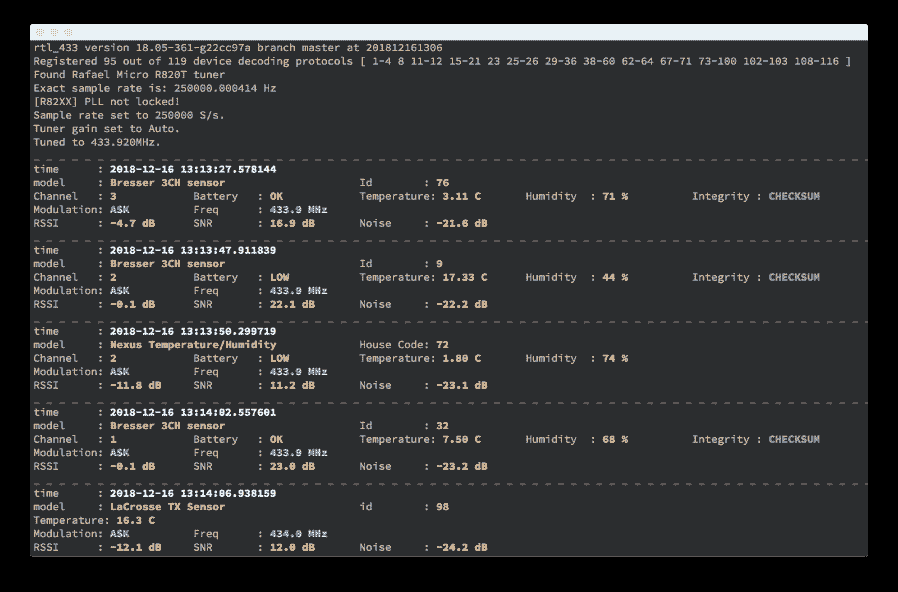

# Rtl_433:对 ISM 频段(和其他频率)设备的无线电传输进行解码的程序

> 原文：<https://kalilinuxtutorials.com/rtl_433-2/>

[")](https://1.bp.blogspot.com/-XevfeO2-33g/YQQLx9WG48I/AAAAAAAAKTc/WWNicAuTEe0PV8cmM8IYdThIOwT3V4RdQCLcBGAsYHQ/s996/rtl_433_win%2B%25281%2529.png)

**Rtl_433** (尽管名字如此)是一款通用数据接收机，主要用于 433.92 MHz、868 MHz (SRD)、315 MHz、345 MHz 和 915 MHz ISM 频段。

官方源代码在 https://github.com/merbanan/rtl_433/仓库。有关更多文档和相关项目，请访问 https://triq.org/网站。

它与 RTL-SDR 和/或 SoapySDR 一起工作。经过积极测试和支持的产品包括基于 Realtek RTL2832 的 DVB 加密狗(使用 RTL-SDR)和 LimeSDR(由 MyriadRf 提供的 LimeSDR USB 和 LimeSDR mini 工程样品)、PlutoSDR、HackRF One(使用 SoapySDR 驱动程序)以及 SoapyRemote。

**建筑/安装**

rtl_433 是用可移植 C 语言(C99 标准)编写的，已知可以在 Linux(也是嵌入式的)、MacOS 和 Windows 系统上编译。支持旧的编译器和工具链是一个关键目标。低资源消耗和很少的依赖性使得 rtl_433 可以在嵌入式硬件上运行，如(再利用的)路由器。具有 32 位 i686 和 64 位 x86-64 以及(嵌入式)ARM 的系统，如 Raspberry Pi 和 PlutoSDR，都得到很好的支持。

参见 BUILDING.md

**建设 rtl_433**

rtl_433 目前支持以下输入类型:

*   RTL-SDR(可选，推荐)
*   SoapySDR (optional)
*   文件:CU8、CS16、CF32 I/Q 数据、U16 AM 数据(内置)
*   rtl_tcp 远程数据服务器(内置)

使用 RTL-SDR 或 SoapySDR 支持构建 rtl_433 是可选的，但是强烈建议使用 RTL-SDR。应该预先安装 RTL-SDR 和/或 SoapySDR 的库和头文件。

**每夜构建**

一些发行版提供每夜构建。

**openSUSE**

至少使用 Leap 42.3 或 Tumbleweed 的 openSUSE 用户可以添加每日构建的存储库:

**$ sudo zypper addrepo-f OBS://home:mnhauke:RTL _ 433:每夜/RTL _ 433
RTL _ 433-每夜
$ sudo zypper 安装 rtl_433**

通常的更新机制现在将保持 rtl_433 版本最新。

**软呢帽**

Fedora 用户(31、32 和 Rawhide)可以添加以下 copr 存储库来获得夜间构建:

**$ sudo dnf copr 启用 tvass/rtl_433
$ sudo dnf 安装 rtl_433**

通常的更新机制现在将保持 rtl_433 版本最新。

**Linux / Mac OS X**

根据您的系统，您可能需要安装以下库。

Debian:

**sudo apt-get install libtool libusb-1.0-0-dev librtlsdr-dev RTL-SDR build-essential cmake pkg-config**

Centos/Fedora/RHEL 与使用 cmake 的 EPEL 回购:

*   如果`**dnf**`不存在，使用`**yum**`。

**sudo dnf 安装 libtool libusbx-devel RTL-SDR-devel RTL-SDR cmake**

Mac OS X 和 MacPorts:

**sudo 端口安装 RTL SDR cmake**

自制的麦克 OS X:

**brew 安装 rtl-sdr cmake pkg-config**

**CMake**

使用 CMake 安装:

**cd rtl_433/
mkdir 构建
cd 构建
cmake..
制造
制造安装**

使用带有`**-DENABLE_SOAPYSDR=ON**`(默认:`AUTO`)的 CMake 来要求 SoapySDR(例如带有 Debian 需要包`**libsoapysdr-dev**`)，如果需要的话使用`**-DENABLE_RTLSDR=OFF**`(默认:`**ON**`)来禁用 RTL-SDR。例如，使用:

**cmake -DENABLE_SOAPYSDR=ON..**

**窗户**

**MinGW-w64**

您可能需要 librtlsdr 和 libusb。

libusb 有针对 windows 的预建二进制，librtlsdr 需要构建(至少对于最新版本来说，老版本的一些二进制看起来是浮动的)

**librtlsdr**

摘自:https://www . one transistor . eu/2017/03/compile-librtlsdr-windows-mingw . html

*   安装 MinGW-w64 和 CMake
    *   如果您选择将 CMake 包含在您的路径中，这是最简单的，否则您将需要手动执行此操作
*   从 https://sourceforge.net/projects/libusb/files/libusb-1.0/或 https://libusb.info/下载 libusb 二进制文件
    *   获取最新版本，然后下载. 7z 文件，另一个文件包含源代码(或。信息网站)
*   提取存档并打开提取的文件夹
*   将包含文件夹的内容复制到`**<mingw_installation_folder>/include**`
*   将`**mingw64/dll/libusb-1.0.dll.a**`文件复制到`<mingw _ installation _ folder>/lib
*   将`**mingw64/dll/libusb-1.0.dll**`文件复制到`**<mingw_installation_folder>/bin**`
*   下载 https://github.com/steve-m/librtlsdr 图书馆的源代码
*   进入 librtlsdr 文件夹
*   用知道 unix 行尾的编辑器打开 CMakeLists.txt
*   转到`**# Find build dependencies**`(第 65 行周围)，用`**find_package(Threads)**`注释/删除该行
*   改为添加以下行

**SET(CMAKE _ THREAD _ LIBS _ INIT "-LP THREAD)
SET(CMAKE _ HAVE _ THREADS _ LIBRARY 1)
SET(THREADS _ FOUND TRUE)**

*   进入 cmake/modules 文件夹，用文本编辑器打开 FindLibUSB.cmake
*   查找包含以下文本的行

**/usr/include/libusb-1.0
/usr/include
/usr/local/include**

*   添加一些额外的行，指向您提取 libusb-1.0 的 MinGW include 文件夹，如下所示
    *   请注意文件夹名称两边的""，如果文件夹名称中有空格，则需要这些符号
    *   您需要为您的系统找出确切的路径

**/usr/include/libusb-1.0
/usr/include
/usr/local/include
" C:/Program Files/mingw-w64/x86 _ 64-8 . 1 . 0-POSIX-seh-rt _ V6-rev 0/mingw 64/include "
" C:/Program Files/mingw-w64/x86 _ 64-8 . 1 . 0-POSIX-seh-rt _ V6-rev 0/mingw 64**

*   在 librtlsdr 文件夹中打开一个 MinGW 终端
*   创建构建文件夹并进入其中:`**mkdir build && cd build**`
*   为 MinGW 生成 makefiles】
*   构建 librtlsdr 库: **`mingw32-make`**

**rtl_433**

*   克隆 rtl_433 储存库和光盘到其中
*   创建一个构建文件夹并进入其中:`**mkdir build && cd build**`
*   在构建目录中运行`**cmake -G "MinGW Makefiles" .. **`
*   运行 cmake-gui(这是最简单的)
*   设置源(rtl_433 源代码目录)和构建目录(可以在源目录中创建一个构建目录)
*   单击配置
*   选择分组和高级复选框
*   进入 librtlsdr 配置组
*   将`**LIBRTLSDR_INCLUDE_DIRS**`指向 librtlsdr 源文件的 include 文件夹
*   将 **`LIBRTLSDR_LIBRARIES`** 指向<librtlsdr _ source>/build/src 文件夹中的`**librtlsdr.dll.a**`文件
    *   这是你之前做的那个
*   启动 MinGW 终端并运行`**mingw32-make**`进行构建
    *   当测试文件夹中的东西没有编译时，你可以通过注释掉 rtl_433 的源文件夹中 CMakeLists.txt 文件中的`**add_subdirectory(tests)**`来禁用它
*   rtl_433.exe 现在应该建好了
*   你需要把它和 librtlsdr.dll 和 libusb-1.0.dll 放在同一个文件夹里(现在你应该已经看到他们两个了)
*   祝你好运！

**Visual Studio 2017 CMake MSBuild**

**CD RTL _ 433
mkdir build
CD build
cmake-G《Visual Studio 15 2017 win 64》..【MSBuild.exe RTL 433 . SLN**

*   -或者-打开`**rtl433.sln**`

**Visual Studio 2017 提供的项目/解决方案**

*   从 **`vs15`** 文件夹中打开**`rtl_433.sln`**-或者-

**CD RTL _ 433
CD vs15
MSBuild.exe RTL _ 433 . SLN**

如果您的系统丢失或您发现这些步骤已经过时，请更新或打开一个问题。

在 Debian (sid)或 Ubuntu (19.10+)上，`**apt-get install rtl-433**`对于其他发行版检查 https://repology.org/project/rtl-433/versions

在 FreeBSD 上，`**pkg install rtl-433**`。

在 MacOS 上， **`brew install rtl_433`。**

带有 rtl_433 的 Docker 图片可以在 hertzg 的 github 页面上找到。

**如何为不受支持的传感器添加支持**

**投稿指南**

rtl_433 项目是建立在许多贡献者对设备支持进行分析、记录和编码的基础上的。我们很高兴接受您提供的另一个传感器！

请检查您的贡献是否遵循了这些指南，以改善反馈循环并减轻维护人员的负担。

**提交消息**

PRs 将被添加为挤压提交，并且提交消息将可能被更新以遵循该格式。

提交消息应该遵循

<area_of_work>:<commit_message></commit_message></area_of_work>

工作领域是可选的，可以是以下内容之一:

*   构建:用于构建/构建系统相关工作
*   docs:用于与文档相关的工作，在代码和 readme/docs 文件夹中
*   ci:用于与持续集成相关的工作
*   测试:用于测试相关工作
*   deps:用于与(外部)依赖项相关的更改(例如更新 soapysdr 或更新 mongoose)
*   化妆品:对于家务工作，代码风格的变化

动词可以是下列之一:

*   添加:用于新增功能，例如设备支持
*   修复:对于输入/输出没有任何改变的更改(安全相关的或错误修复)
*   删除:用于删除行为的更改(例如，清除一些旧算法)
*   更改:用于修改输入/输出行为的更改(例如，添加校验和、序言)
*   改进:在不改变正常产出/行为的情况下进行改进

**支持附加设备和测试数据**

默认情况下，一些设备协议解码器是禁用的。当测试你的设备是否被 rtl_433 解码时，使用`-G 4`启用所有设备协议。这可能会产生假阳性，请谨慎使用。

解码新设备的第一步是使用 **`-S`** `unknown`记录信号。这些信号将分别存储在名为 g**NNN**_**FFF**M _**RRR**k . cu8 的文件中:

| 参数 | 描述 |
| --- | --- |
| **NNN** | 信号抓取数 |
| **FFF** | 频率 |
| **RRR** | 抽样率 |

这个文件可以用`**rtl_433 -r gNNN_FFFM_RRRk.cu8**`回放。

这些文件对于理解信号格式和消息数据至关重要。使用两个分析仪`**-a**`和`**-A**`查看记录的信号并确定脉冲特征，例如 **`rtl_433 -r gNNN_FFFM_RRRk.cu8 -a -A`。**

确保您已经记录了代表不同条件的一组适当的测试信号，以及关于信号应该代表的值的任何和所有信息。例如，记下信号编码的温度和/或湿度。理想情况下，捕捉一系列数据值，如不同的温度，以便容易发现消息的哪一部分发生了变化。

添加数据文件、描述捕获信号的文本文件、设备图片和/或制造商页面(最好有规格)到 rtl 测试 github 库的链接。尽可能遵循现有的结构，并发送一个拉请求。

https://github.com/merbanan/rtl_433_tests

请不要为设备支持打开一个新的 github 问题，或者向其他人请求解码帮助，直到你已经将测试信号和描述添加到存储库中。

rtl_433 _ 测试库也用于帮助测试对 RTL _ 433 的更改没有导致任何回归。

**运行中**

**rtl_433 -h**

[-V]输出版本字符串并退出
[-v]增加详细度(可多次使用)。
-v:详细，-vv:详细解码器，-vvv:调试解码器，-vvvv:跟踪解码)。
[-c ]从文件中读取配置选项
= Tuner options =
[-d |:| | RTL _ TCP |帮助】
[-g |帮助](默认:自动)
[-t ]应用 SoapySDR 设备的关键字=值设置列表
例如-t "天线=A，带宽=4.5M，rfnotch_ctrl=false"
[-f ]接收频率(s)(默认:433920000 Hz) 【T10
=解调器选项=
[-R | help]仅启用指定的设备解码协议(可多次使用)
指定负数禁用设备解码协议(可多次使用)
[-G]启用黑名单设备解码协议，仅用于测试。
[-X | help]添加通用解码器(prepend -R 0 禁用所有解码器)
[-Y auto | classic | minmax] FSK 脉冲检测器模式。
[-Y 电平=]用于确定脉冲的手动检测电平(-1.0 至-30.0)(0 =自动)。
[-Y minlevel=]用于确定脉冲的手动最低检测水平(-1.0 到-99.0)。
[-Y minsnr=]确定脉冲的最小信噪比(1.0 到 99.0)。
[-Y autolevel]根据平均估计噪音自动设置最小级别。
[-Y 静噪]跳过低于估计噪声水平的帧，以减少 cpu 负载。
[-Y ampest | magest]选择幅度或量级估计器。
=分析/调试选项=
[-a]分析模式。打印信号的文本描述。
[-A]脉冲分析仪。启用脉冲分析和解码尝试。如果您只想要分析仪输出，用-R 0 禁用所有解码器。
[-y `] Verify decoding of demodulated test data (e.g. "{25}fb2dd58") with enabled devices
= File I/O options =
[-S none | all | unknown | known] Signal auto save. Creates one file per signal.
Note: Saves raw I/Q samples (uint8 pcm, 2 channel). Preferred mode for generating test files.
[-r | help] Read data from input file instead of a receiver
[-w | help] Save data stream to output file (a '-' dumps samples to stdout)
[-W | help] Save data stream to output file, overwrite existing file
= Data output options =
[-F kv | json | csv | mqtt | influx | syslog | null | help] Produce decoded output in given format.
Append output to file with : (e.g. -F csv:log.csv), defaults to stdout.
Specify host/port for syslog with e.g. -F syslog:127.0.0.1:1514
[-M time[:] | protocol | level | noise[:secs] | stats | bits | help] Add various meta data to each output.
[-K FILE | PATH | | =] Add an expanded token or fixed tag to every output line.
[-C native | si | customary] Convert units in decoded output.
[-n ] Specify number of samples to take (each sample is an I/Q pair)
[-T ] Specify number of seconds to run, also 12:34 or 1h23m45s
[-E hop | quit] Hop/Quit after outputting successful event(s)
[-h] Output this usage help and exit
Use -d, -g, -R, -X, -F, -M, -r, -w, or -W without argument for more help
= Supported device protocols =
[01] Silvercrest Remote Control
[02] Rubicson Temperature Sensor
[03] Prologue, FreeTec NC-7104, NC-7159-675 temperature sensor
[04] Waveman Switch Transmitter
[06]* ELV EM 1000
[07]* ELV WS 2000
[08] LaCrosse TX Temperature / Humidity Sensor
[10]* Acurite 896 Rain Gauge
[11] Acurite 609TXC Temperature and Humidity Sensor
[12] Oregon Scientific Weather Sensor
[13]* Mebus 433
[14]* Intertechno 433
[15] KlikAanKlikUit Wireless Switch
[16] AlectoV1 Weather Sensor (Alecto WS3500 WS4500 Ventus W155/W044 Oregon)
[17] Cardin S466-TX2
[18] Fine Offset Electronics, WH2, WH5, Telldus Temperature/Humidity/Rain Sensor
[19] Nexus, FreeTec NC-7345, NX-3980, Solight TE82S, TFA 30.3209 temperature/humidity sensor
[20] Ambient Weather, TFA 30.3208.02 temperature sensor
[21] Calibeur RF-104 Sensor
[22] X10 RF
[23] DSC Security Contact
[24]* Brennenstuhl RCS 2044
[25] Globaltronics GT-WT-02 Sensor
[26] Danfoss CFR Thermostat
[29] Chuango Security Technology
[30] Generic Remote SC226x EV1527
[31] TFA-Twin-Plus-30.3049, Conrad KW9010, Ea2 BL999
[32] Fine Offset Electronics WH1080/WH3080 Weather Station
[33] WT450, WT260H, WT405H
[34] LaCrosse WS-2310 / WS-3600 Weather Station
[35] Esperanza EWS
[36] Efergy e2 classic
[37]* Inovalley kw9015b, TFA Dostmann 30.3161 (Rain and temperature sensor)
[38] Generic temperature sensor 1
[39] WG-PB12V1 Temperature Sensor
[40] Acurite 592TXR Temp/Humidity, 5n1 Weather Station, 6045 Lightning, 3N1, Atlas
[41] Acurite 986 Refrigerator / Freezer Thermometer
[42] HIDEKI TS04 Temperature, Humidity, Wind and Rain Sensor
[43] Watchman Sonic / Apollo Ultrasonic / Beckett Rocket oil tank monitor
[44] CurrentCost Current Sensor
[45] emonTx OpenEnergyMonitor
[46] HT680 Remote control
[47] Conrad S3318P, FreeTec NC-5849-913 temperature humidity sensor
[48] Akhan 100F14 remote keyless entry
[49] Quhwa
[50] OSv1 Temperature Sensor
[51] Proove / Nexa / KlikAanKlikUit Wireless Switch
[52] Bresser Thermo-/Hygro-Sensor 3CH
[53] Springfield Temperature and Soil Moisture
[54] Oregon Scientific SL109H Remote Thermal Hygro Sensor
[55] Acurite 606TX Temperature Sensor
[56] TFA pool temperature sensor
[57] Kedsum Temperature & Humidity Sensor, Pearl NC-7415
[58] Blyss DC5-UK-WH
[59] Steelmate TPMS
[60] Schrader TPMS
[61]* LightwaveRF
[62]* Elro DB286A Doorbell
[63] Efergy Optical
[64]* Honda Car Key
[67] Radiohead ASK
[68] Kerui PIR / Contact Sensor
[69] Fine Offset WH1050 Weather Station
[70] Honeywell Door/Window Sensor, 2Gig DW10/DW11, RE208 repeater
[71] Maverick ET-732/733 BBQ Sensor
[72]* RF-tech
[73] LaCrosse TX141-Bv2, TX141TH-Bv2, TX141-Bv3, TX141W, TX145wsdth sensor
[74] Acurite 00275rm,00276rm Temp/Humidity with optional probe
[75] LaCrosse TX35DTH-IT, TFA Dostmann 30.3155 Temperature/Humidity sensor
[76] LaCrosse TX29IT, TFA Dostmann 30.3159.IT Temperature sensor
[77] Vaillant calorMatic VRT340f Central Heating Control
[78] Fine Offset Electronics, WH25, WH32B, WH24, WH65B, HP1000 Temperature/Humidity/Pressure Sensor
[79] Fine Offset Electronics, WH0530 Temperature/Rain Sensor
[80] IBIS beacon
[81] Oil Ultrasonic STANDARD FSK
[82] Citroen TPMS
[83] Oil Ultrasonic STANDARD ASK
[84] Thermopro TP11 Thermometer
[85] Solight TE44/TE66, EMOS E0107T, NX-6876-917
[86] Wireless Smoke and Heat Detector GS 558
[87] Generic wireless motion sensor
[88] Toyota TPMS
[89] Ford TPMS
[90] Renault TPMS
[91] inFactory, nor-tec, FreeTec NC-3982-913 temperature humidity sensor
[92] FT-004-B Temperature Sensor
[93] Ford Car Key
[94] Philips outdoor temperature sensor (type AJ3650)
[95] Schrader TPMS EG53MA4, PA66GF35
[96] Nexa
[97] Thermopro TP08/TP12/TP20 thermometer
[98] GE Color Effects
[99] X10 Security
[100] Interlogix GE UTC Security Devices
[101]* Dish remote 6.3
[102] SimpliSafe Home Security System (May require disabling automatic gain for KeyPad decodes)
[103] Sensible Living Mini-Plant Moisture Sensor
[104] Wireless M-Bus, Mode C&T, 100kbps (-f 868950000 -s 1200000)
[105] Wireless M-Bus, Mode S, 32.768kbps (-f 868300000 -s 1000000)
[106]* Wireless M-Bus, Mode R, 4.8kbps (-f 868330000)
[107]* Wireless M-Bus, Mode F, 2.4kbps
[108] Hyundai WS SENZOR Remote Temperature Sensor
[109] WT0124 Pool Thermometer
[110] PMV-107J (Toyota) TPMS
[111] Emos TTX201 Temperature Sensor
[112] Ambient Weather TX-8300 Temperature/Humidity Sensor
[113] Ambient Weather WH31E Thermo-Hygrometer Sensor, EcoWitt WH40 rain gauge
[114] Maverick et73
[115] Honeywell ActivLink, Wireless Doorbell
[116] Honeywell ActivLink, Wireless Doorbell (FSK)
[117]* ESA1000 / ESA2000 Energy Monitor
[118]* Biltema rain gauge
[119] Bresser Weather Center 5-in-1
[120]* Digitech XC-0324 temperature sensor
[121] Opus/Imagintronix XT300 Soil Moisture
[122]* FS20
[123]* Jansite TPMS Model TY02S
[124] LaCrosse/ELV/Conrad WS7000/WS2500 weather sensors
[125] TS-FT002 Wireless Ultrasonic Tank Liquid Level Meter With Temperature Sensor
[126] Companion WTR001 Temperature Sensor
[127] Ecowitt Wireless Outdoor Thermometer WH53/WH0280/WH0281A
[128] DirecTV RC66RX Remote Control
[129]* Eurochron temperature and humidity sensor
[130] IKEA Sparsnas Energy Meter Monitor
[131] Microchip HCS200 KeeLoq Hopping Encoder based remotes
[132] TFA Dostmann 30.3196 T/H outdoor sensor
[133] Rubicson 48659 Thermometer
[134] Holman Industries iWeather WS5029 weather station (newer PCM)
[135] Philips outdoor temperature sensor (type AJ7010)
[136] ESIC EMT7110 power meter
[137] Globaltronics QUIGG GT-TMBBQ-05
[138] Globaltronics GT-WT-03 Sensor
[139] Norgo NGE101
[140] Elantra2012 TPMS
[141] Auriol HG02832, HG05124A-DCF, Rubicson 48957 temperature/humidity sensor
[142] Fine Offset Electronics/ECOWITT WH51 Soil Moisture Sensor
[143] Holman Industries iWeather WS5029 weather station (older PWM)
[144] TBH weather sensor
[145] WS2032 weather station
[146] Auriol AFW2A1 temperature/humidity sensor
[147] TFA Drop Rain Gauge 30.3233.01
[148] DSC Security Contact (WS4945)
[149] ERT Standard Consumption Message (SCM)
[150]* Klimalogg
[151] Visonic powercode
[152] Eurochron EFTH-800 temperature and humidity sensor
[153] Cotech 36-7959 wireless weather station with USB
[154] Standard Consumption Message Plus (SCMplus)
[155] Fine Offset Electronics WH1080/WH3080 Weather Station (FSK)
[156] Abarth 124 Spider TPMS
[157] Missil ML0757 weather station
[158] Sharp SPC775 weather station
[159] Insteon
[160] ERT Interval Data Message (IDM)
[161] ERT Interval Data Message (IDM) for Net Meters
[162]* ThermoPro-TX2 temperature sensor
[163] Acurite 590TX Temperature with optional Humidity
[164] Security+ 2.0 (Keyfob)
[165] TFA Dostmann 30.3221.02 T/H Outdoor Sensor
[166] LaCrosse Technology View LTV-WSDTH01 Breeze Pro Wind Sensor
[167] Somfy RTS
[168] Schrader TPMS SMD3MA4 (Subaru)
[169]* Nice Flor-s remote control for gates
[170] LaCrosse Technology View LTV-WR1 Multi Sensor
[171] LaCrosse Technology View LTV-TH Thermo/Hygro Sensor
[172] Bresser Weather Center 6-in-1, 7-in-1 indoor, new 5-in-1, 3-in-1 wind gauge, Froggit WH6000, Ventus C8488A
[173] Bresser Weather Center 7-in-1
[174] EcoDHOME Smart Socket and MCEE Solar monitor
[175] LaCrosse Technology View LTV-R1 Rainfall Gauge
[176] BlueLine Power Monitor
[177] Burnhard BBQ thermometer
[178] Security+ (Keyfob)
[179] Cavius smoke, heat and water detector
[180] Jansite TPMS Model Solar
[181] Amazon Basics Meat Thermometer
[182] TFA Marbella Pool Thermometer
[183] Auriol AHFL temperature/humidity sensor
[184] Auriol AFT 77 B2 temperature sensor
[185] Honeywell CM921 Wireless Programmable Room Thermostat
[186] Hyundai TPMS (VDO)
[187] RojaFlex shutter and remote devices
[188] Marlec Solar iBoost+ sensors
[189] Somfy io-homecontrol
[190] Ambient Weather (Fine Offset) WH31L Lightning-Strike sensor
Disabled by default, use -R n or -G
= Input device selection =
RTL-SDR device driver is available.
[-d ] (default: 0)
[-d :]
To set gain for RTL-SDR use -g to set an overall gain in dB.
SoapySDR device driver is available.
[-d ""] Open default SoapySDR device
[-d driver=rtlsdr] Open e.g. specific SoapySDR device
To set gain for SoapySDR use -g ELEM=val,ELEM=val,… e.g. -g LNA=20,TIA=8,PGA=2 (for LimeSDR).
[-d rtl_tcp[:[//]host[:port]] (default: localhost:1234)
Specify host/port to connect to with e.g. -d rtl_tcp:127.0.0.1:1234
= Gain option =
[-g ] (default: auto)
For RTL-SDR: gain in dB ("0" is auto).
For SoapySDR: gain in dB for automatic distribution ("" is auto), or string of gain elements.
E.g. "LNA=20,TIA=8,PGA=2" for LimeSDR.
= Flex decoder spec =
Use -X to add a flexible general purpose decoder.
is "key=value[,key=value…]"
Common keys are:
name= (or: n=)
modulation= (or: m=)
short= (or: s=)
long= (or: l=)
sync= (or: y=)
reset= (or: r=)
gap= (or: g=)
tolerance= (or: t=)
where:
can be any descriptive name tag you need in the output
is one of:
OOK_MC_ZEROBIT : Manchester Code with fixed leading zero bit
OOK_PCM : Pulse Code Modulation (RZ or NRZ)
OOK_PPM : Pulse Position Modulation
OOK_PWM : Pulse Width Modulation
OOK_DMC : Differential Manchester Code
OOK_PIWM_RAW : Raw Pulse Interval and Width Modulation
OOK_PIWM_DC : Differential Pulse Interval and Width Modulation
OOK_MC_OSV1 : Manchester Code for OSv1 devices
FSK_PCM : FSK Pulse Code Modulation
FSK_PWM : FSK Pulse Width Modulation
FSK_MC_ZEROBIT : Manchester Code with fixed leading zero bit
, , are nominal modulation timings in us,
, , are maximum modulation timings in us:
PCM short: Nominal width of pulse [us]
long: Nominal width of bit period [us]
PPM short: Nominal width of '0' gap [us]
long: Nominal width of '1' gap [us]
PWM short: Nominal width of '1' pulse [us]
long: Nominal width of '0' pulse [us]
sync: Nominal width of sync pulse [us](optional)
common gap: Maximum gap size before new row of bits [us]
reset: Maximum gap size before End Of Message [us]
tolerance: Maximum pulse deviation [us](optional).
Available options are:
bits= : only match if at least one row has bits
rows= : only match if there are rows
repeats= : only match if some row is repeated times
use opt>=n to match at least and opt<=n to match at most
invert : invert all bits
reflect : reflect each byte (MSB first to MSB last)
match= : only match if the are found
preamble= : match and align at the preamble
is a row spec of {}
unique : suppress duplicate row output
countonly : suppress detailed row output
E.g. -X "n=doorbell,m=OOK_PWM,s=400,l=800,r=7000,g=1000,match={24}0xa9878c,repeats>=3"
= Output format option =
[-F kv|json|csv|mqtt|influx|syslog|null] Produce decoded output in given format.
Without this option the default is KV output. Use "-F null" to remove the default.
Append output to file with : (e.g. -F csv:log.csv), defaults to stdout.
Specify MQTT server with e.g. -F mqtt://localhost:1883
Add MQTT options with e.g. -F "mqtt://host:1883,opt=arg"
MQTT options are: user=foo, pass=bar, retain[=0|1], [=topic]
Supported MQTT formats: (default is all)
events: posts JSON event data
states: posts JSON state data
devices: posts device and sensor info in nested topics
The topic string will expand keys like [/model]
E.g. -F "mqtt://localhost:1883,user=USERNAME,pass=PASSWORD,retain=0,devices=rtl_433[/id]"
With MQTT each rtl_433 instance needs a distinct driver selection. The MQTT Client-ID is computed from the driver string.
If you use multiple RTL-SDR, perhaps set a serial and select by that (helps not to get the wrong antenna).
Specify InfluxDB 2.0 server with e.g. -F "influx://localhost:9999/api/v2/write?org=&bucket=,token="
Specify InfluxDB 1.x server with e.g. -F "influx://localhost:8086/write?db=&p=&u="
Additional parameter -M time:unix:usec:utc for correct timestamps in InfluxDB recommended
Specify host/port for syslog with e.g. -F syslog:127.0.0.1:1514
= Meta information option =
[-M time[:]|protocol|level|noise[:]|stats|bits] Add various metadata to every output line.
Use "time" to add current date and time meta data (preset for live inputs).
Use "time:rel" to add sample position meta data (preset for read-file and stdin).
Use "time:unix" to show the seconds since unix epoch as time meta data.
Use "time:iso" to show the time with ISO-8601 format (YYYY-MM-DD"T"hh:mm:ss).
Use "time:off" to remove time meta data.
Use "time:usec" to add microseconds to date time meta data.
Use "time:tz" to output time with timezone offset.
Use "time:utc" to output time in UTC.
(this may also be accomplished by invocation with TZ environment variable set).
"usec" and "utc" can be combined with other options, eg. "time:unix:utc:usec".
Use "protocol" / "noprotocol" to output the decoder protocol number meta data.
Use "level" to add Modulation, Frequency, RSSI, SNR, and Noise meta data.
Use "noise[:secs]" to report estimated noise level at intervals (default: 10 seconds).
Use "stats[:[][:]]" to report statistics (default: 600 seconds).
level 0: no report, 1: report successful devices, 2: report active devices, 3: report all
Use "bits" to add bit representation to code outputs (for debug).
= Read file option =
[-r ] Read data from input file instead of a receiver
Parameters are detected from the full path, file name, and extension.
A center frequency is detected as (fractional) number suffixed with 'M',
'Hz', 'kHz', 'MHz', or 'GHz'.
A sample rate is detected as (fractional) number suffixed with 'k',
'sps', 'ksps', 'Msps', or 'Gsps'.
File content and format are detected as parameters, possible options are:
'cu8', 'cs16', 'cf32' ('IQ' implied), and 'am.s16'.
Parameters must be separated by non-alphanumeric chars and are case-insensitive.
Overrides can be prefixed, separated by colon (':')
E.g. default detection by extension: path/filename.am.s16
forced overrides: am:s16:path/filename.ext
Reading from pipes also support format options.
E.g reading complex 32-bit float: CU32:-
= Write file option =
[-w ] Save data stream to output file (a '-' dumps samples to stdout)
[-W ] Save data stream to output file, overwrite existing file
Parameters are detected from the full path, file name, and extension.
File content and format are detected as parameters, possible options are:
'cu8', 'cs8', 'cs16', 'cf32' ('IQ' implied),
'am.s16', 'am.f32', 'fm.s16', 'fm.f32',
'i.f32', 'q.f32', 'logic.u8', 'ook', and 'vcd'.
Parameters must be separated by non-alphanumeric chars and are case-insensitive.
Overrides can be prefixed, separated by colon (':')
E.g. default detection by extension: path/filename.am.s16
forced overrides: am:s16:path/filename.ext`

一些例子:

| 命令 | 描述 |
| --- | --- |
| `**rtl_433**` | 默认接收模式，使用找到的第一个设备，以 250k 采样速率监听 433.92 MHz。 |
| `**rtl_433 -C si**` | 默认接收模式，也将单位转换为公制。 |
| `**rtl_433 -f 868M -s 1024k**` | 以 868 MHz 和 1024k 采样速率监听。 |
| `**rtl_433 -M hires -M level**` | 报告精确到微秒的时间戳，并添加接收电平(取决于增益)。 |
| `**rtl_433 -R 1 -R 8 -R 43**` | 仅启用所需设备的特定解码器。 |
| `**rtl_433 -A**` | 启用脉冲分析仪。总结了脉冲、间隙和周期的时序。可与`**-R 0**`一起使用，禁用解码器。 |
| `**rtl_433 -S all -T 120**` | 保存所有检测到的信号(`**g###_###M_###k.cu8**`)。跑步 2 分钟。 |
| `**rtl_433 -K FILE -r file_name**` | 读取保存的数据文件，而不是接收实时数据。用文件名标记输出。 |
| `**rtl_433 -F json -M utc &#124; mosquitto_pub -t home/rtl_433 -l**` | 将输出作为 JSON 格式的 MQTT 消息通过管道传输到网络。测试 MQTT 客户端可以在 **`examples/mqtt_rtl_433_test_client.py`中找到。** |
| `**rtl_433 -f 433.53M -f 434.02M -H 15**` | 将以 15 秒的跳跃间隔轮询两个频率。 |

[**Download**](https://github.com/merbanan/rtl_433)