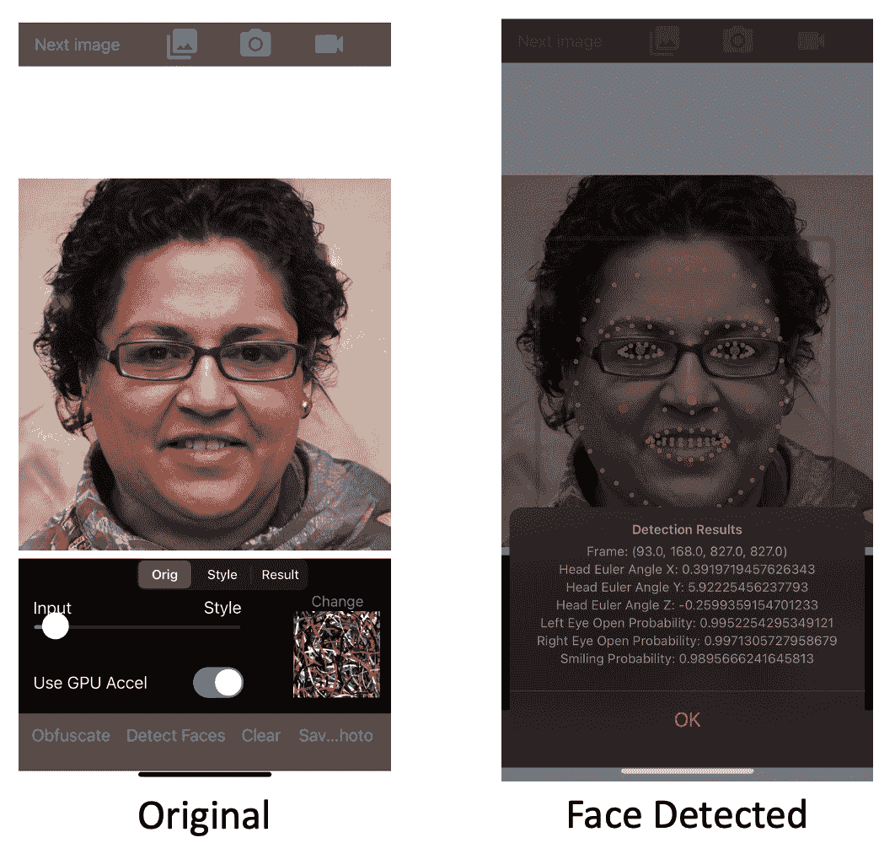

# 诡计:基于移动摄像头的应用程序，试图改变照片以保留其对人类的效用，同时使其无法用于面部识别系统

> 原文：<https://kalilinuxtutorials.com/ruse-2/>

Ruse 是一个基于移动摄像头的应用程序，它试图改变照片，以保留它们对人类的效用，同时使它们无法用于面部识别系统。

**安装**

*   简单的方法:等待并从合适的应用程序商店下载应用程序。

*   通过 XCode 下载并运行 ios 应用程序(有关更多详细信息，请参见开发设置)

**用法举例**

该应用程序是作为一款基于相机的应用程序开发的，允许修改新相机拍摄的人脸或相机胶卷上的当前照片，目标是保持它们对社交媒体和人类消费有用，同时使面部识别系统难以准确有效地利用它们。

这是通过基于先前研究的各种方法完成的。由于手机和 TensorFlow Lite 的限制，在设备本身上学习是不可能的——因此一些更先进的技术还不可能实现(但研发可能会产生未来的结果。)

使用说明和第一次发布的完整视频。

Jupyter 笔记本展示了在手机上可能使用的“任意快速风格”对抗技术:

从长远来看，这种技术将被有选择地应用(就像对照片的片段)，以及在每个图像基础上产生的柏林/单纯形噪声，一个 https://github.com/kieranbrowne/camera-adversaria.

各种方法被用于对商业识别系统隐藏面部(例如，任意文件传输、柏林噪声引入)。在保存到相机胶卷或用于在线目的之前，机载设备会检查是否可以检测到人脸。

然后可以在不需要网络接入的情况下检查这些对抗方法的效果。

(未来版本计划包括对样本识别系统如何与修改后的图像进行比较的类似机载评估(分类，而不仅仅是检测。))

**开发设置**

要求:Xcode 12

作为以下过程的一部分安装的 pod:tensor flow Lite(Swift nightly build)//Google mlkit//gpuimage 3

*   下载 ios 和型号(tflite 型号)目录
*   在下载的目录中运行“pod 安装”
*   打开 Ruse.xcworkspace

安装到设备是留给读者的练习。

[**Download**](https://github.com/derrumbe/Ruse)