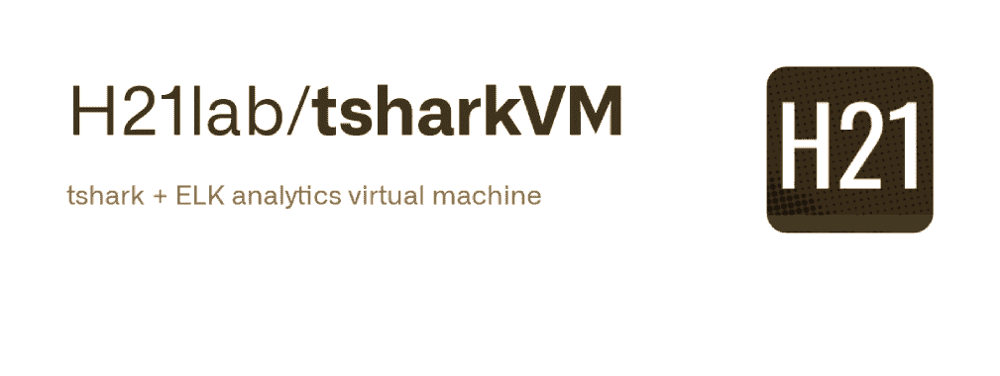
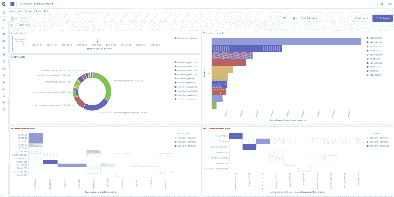

# TSharkVM : TShark + ELK 分析虚拟机

> 原文：<https://kalilinuxtutorials.com/tsharkvm-2/>

tsharkVM ，该项目构建虚拟机，可用于分析 tshark -T ek (ndjson)输出。虚拟设备是使用 vagger 构建的，它使用预安装和预配置的 ELK 堆栈构建 Debian 10。

虚拟机启动后，过程很简单:

*   解码后的 pcap(`**tshark -T ek output**`/nd JSON)通过`**TCP/17570**`发送到虚拟机
*   虚拟机中的 ELK 堆栈将处理和索引数据
*   Kibana 在虚拟机中运行，可以在`**http://127.0.0.1:15601/app/kibana#/dashboards**`访问

**从 Ubuntu 桌面构建虚拟机的指令**

**克隆源代码**

**git 克隆 https://github.com/H21lab/tsharkVM.git**

**构建 tshark 虚拟机**

sudo 更新
sudo 安装 tshark virtualbox 流浪者
bash。/build.sh

**上传 pcaps 到虚拟机**

# **将您的 pcaps 复制到。/Trace
#运行以下脚本
bash upload _ pcaps . sh
#或者直接使用 tshark 朝向 127 . 0 . 0 . 1 17570/TCP
tshark-r Trace . pcapng-x-T ek>/dev/TCP/localhost/17570**

**用浏览器打开基巴纳**

**火狐 http://127 . 0 . 0 . 1:15601/app/ki Bana #/dashboards**

打开主控制面板，将时间窗口增加到例如最近 100 年，以查看 pcaps 示例。

**SSH 到虚拟机**

**光盘。/VM
模糊 ssh**

**删除虚拟机**

**cd。/VM
流浪破坏默认**

**启动虚拟机**

**cd。/VM
流浪起来**

**停止虚拟机**

**cd。/VM
流浪停止**

**SSH 进入虚拟机，检查 ELK 是否正常运行**

**cd。/VM
流浪汉 ssh
sudo system CTL status kibana . service
sudo system CTL status elastic search . service
sudo system CTL status log stash . service**

**弹性搜索映射模板**

项目中包括为`**frame,eth,ip,udp,tcp,dhcp**`协议生成的简单 Elasticseacrh 映射模板。为了有效地处理附加协议，可能需要以下列方式更新映射模板:

*   **创建自定义映射，通过选择所需的协议
    t shark-G elastic-mapping-elastic-mapping-filter frame，eth，ip，udp，tcp，dns >。/ki Bana/custom _ t shark _ mapping . JSON**
*   **对映射进行重复数据删除和后处理，以适应当前的 Elasticsearch 版本
    ruby。/Public/process _ t shark _ mapping _ JSON . Rb**
*   **上传文件到流浪虚拟机
    光盘虚拟机
    流浪上传../ki Bana/custom _ t shark _ mapping _ duplicated . JSON/home/vagger/tsharkVM/ki Bana/custom _ t shark _ mapping _ duplicated . JSON
    CD..**
*   **连接虚拟机并上传 Elasticsearch 中的模板
    cd 虚拟机
    流浪者 ssh
    CD tsharkVM/Kibana
    curl-X PUT " localhost:9200/_ index _ template/packets _ template "-H ' Content-Type:application/JSON '-d @ custom _ tshark _ mapping _ duplicated . JSON**

另一种方法是使用动态映射。参见模板 **`./Kibana/template_tshark_mapping_dynamic.json`。**并根据映射需求和使用的 pcaps 考虑设置 numeric_detection 参数 true/false。以与上述类似的方式将模板上传到 Elasticsearch。

**局限性**

t shark-G elastic-mapping–elastic-mapping-filter 映射可能已经过时，它没有正确地跟随 Elasticsearch 的变化，并且输出可能是重复的。需要对映射模板进行手动配置和后处理。

分发程序是希望它有用，但没有任何保证。

[**Download**](https://github.com/H21lab/tsharkVM)