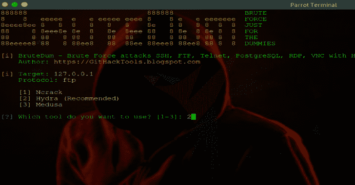

# Domhttpx:一个谷歌搜索引擎工具，带有用 Python 构建的 HTTP 工具包，可以让你更容易快速地一次找到许多 URL/IP

> 原文：<https://kalilinuxtutorials.com/domhttpx/>

domhttpx 是一个用 python 构建的带有 HTTP 工具包的 google 搜索引擎工具包，可以让你更容易快速地一次找到许多 URL/IP。

**安装**

**git 克隆 https://github.com/naufalardhani/domhttpx.git
CD domhttpx
pip 3 install-r requirements . txt
python 3 domhttpx . py–help**

**用途**

**标志**

这将显示该工具的帮助。这里是它支持的所有开关。

| 旗 | 描述 | 例子 |
| --- | --- | --- |
| -ip，–only-IP | 仅将输出显示为 IP | domhttpx-only-IP |
| -od，–only-domain | 仅将输出显示为域 | domhttpx-only-domain |
| -rp，–真实路径 | 提取真实路径 | domhttpx-k[关键字]-a[金额]-真实路径 |
| -p，–路径 | 自定义路径 url | domhttpx-k[关键字]-a[金额]–路径[自定义路径] |
| -sc，–状态代码 | 提取状态代码 | domhttpx-k[关键字]-a[金额]-状态代码 |
| -t, –title | 提取标题页 | domhttpx-k[关键字]-a[金额]-标题 |
| -ws，–网络服务器 | 提取 web 服务器 | domhttpx-k[关键字]-a[数量]-服务器 |
| -cr，–检查结果 | 检查表结果 | domhttpx–检查结果 |
| -sr，–显示结果 | 显示结果内容 | DOM httpx–show-result result . txt |
| -rr，–移除-结果 | 删除结果文件 | domhttpx–remove-result result . txt |
| -o，–输出 | 要写入输出的文件 | domhttpx-k[关键字]-a[金额] -o output.txt |
| -s-无声 | 在输出中只显示子域 | domhttpx-k[关键字]-a[金额]-无声 |
| -v，-版本 | 显示当前程序版本 | domhttpx–版本 |

**基本用法**

**>domhttpx . py–关键字【关键字】–金额【金额】**

**一个关键词**

>**domhttpx . py–关键字 pentesting–金额 5**

**多个关键字**

>**domhttpx . py–关键字“基本测试”-金额 5**

**摘录标题页**

>**domhttpx . py–关键字“基本测试”-金额 5–标题**

**从真实路径中提取标题页**

>**domhttpx . py–关键字“pentest basic”-金额 5–标题–真实路径**

**提取网络服务器**

>**DOM httpx . py–关键字“pentest basic”-数量 5–网络服务器**

**运行实例**

**使用默认命令运行 domHttpx】**

这将使用指定的关键字和数字运行自动搜索工具

**domhttpx . py–印度尼西亚关键字–金额 20

| |*| |*| |*_
/*/*|*| >。*_/*_
| | v 1 . 0 . 0
海难哈尼. com
https://www . suara . com
https://www . suara . com
https://www . suara . com
https://en . Wikipedia . org** 

**将输出显示为 IP**

**➤domhttpx . py–关键字 Indonesia–amount 9–only-IP
_ _ _ _ _
| |*_ | |*_
/*`/_ \ ' |*_ |*|*| '*\ \/
_ _，*_ _*/*|*|*|*|*。*_/*_ \
| _ | v 1 . 0 . 0
naufalardhani.com
54.192.146.34
103.102.166.224
104.93.220.176
104.18.19.221
202.89.117.193
104.18.11.196
172.67.161.37
104 . 93 . 115 . 155
199 . 232 . 44 . 143
【信息】搜索 IP 寻找印尼关键词
【信息】找到 9 个 IP****

**提取真实路径**

**➤domhttpx . py–关键字 Indonesia–amount 9–真实路径
_ _ _ _ _
| |*_ | | |*_
/*`/_ \ ' |*_ |*|*| '*\ \/
_ _，*_ _*/*|*|*|*|*。*_/*_ \
| _ | v 1 . 0 . 0
naufalardhani.com
https://www . suara . com/entertainment/2021/07/01/211333/6-aktor-Indonesia-main-di-film-Hollywood-tak-cuma-and alkan-tam pang
https://en.wikipedia.org/wiki/Indonesia
https://www.indonesia.travel/id/en/home
https://www.britannica.com/place/Indonesia
https://indonesia.go.id/
https://www.garuda-indonesia.com/
https://wikitravel.org/en/Indonesia
https://www.aljazeera.com/where/indonesia/**** 

**提取状态代码**

**➤DOM httpx . py–关键词“印尼篮球联赛”–金额 10–状态码
_ _ _ _ _
| | |*_ | | |*| _ _*_
/*`/_ \ ' |*_ |*|*| | '*\ \/
_ _，*_ _*/*|*|*|*|*|**_/*_ \
| _ | v 1 . 0 . 0
naufalardhani.com
https://en.wikipedia.org【200】
https://iblindonesia.com【200】
https://iblindonesia.com【200】
https://iblindonesia.com【200】
https://iblindonesia.com【200】
https://iblindonesia.com【200】
https://twitter.com【200】
https://Twitter . com【200】
https://en . Wikipedia**

**提取标题页**

**➤domhttpx . py–关键字“ananta dandy”-金额 10–真实路径–标题
_ _ _ _ _
| |*_ | | |*| _ _*_
/*`/_ \ ' |*_ |*|*| '*\ \/
_ _，*_ _*/*|*|*|**_/*_ \
|*| v 1 . 0 . 0 naufalardhani.com https://www.dbl.id/camp/1/campers/98/ananta-dandy【营员–阿南塔丹迪】https://www.dbl.id/u/profile/12379/ananta-dandy【阿南塔丹迪简介| DBL ID】https://www.instagram.com/anantadandy/?hl=en【Page Not Found insta gram】https://play . fiba 3 x 3 . com/players/d3a 6 cc 16-fd25-424d-a3 a4-62515 C5 CD 075【阿南塔丹迪】https://www.youtube.com/watch?v=DghZd7E3YL0【阿南塔丹迪–拉坎–拉菲–萨达姆&泽比金–YouTube]https://www.youtube.com/watch?v=J4oOSmfOlmA[第 12 行的下一位:Ananta Dandy Tentang Bermain melawan Filipin&DBL 的动机。–YouTube]https://www.youtube.com/watch?v=A4xu1aMWCy0[阿南塔·丹迪·丹·穆罕默德·哈菲兹|活力二人组达里 SMAN 71 雅加达–YouTube]https://archive . fiba . com/pages/eng/fa/player/p/PID/137281/sid/13264/tid/302/tid 2//*/2017 _ SEABA _ U16 _ Championship _ for _ Men/index . html[阿南塔·丹迪·普特拉·塔里根的简介| 2017 SEABA U16 锦标赛****

[**Download**](https://github.com/naufalardhani/domhttpx)