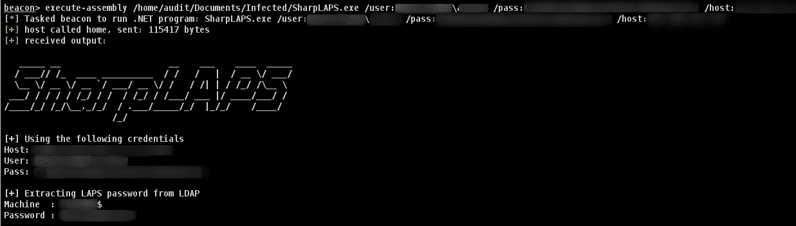

# SharpLAPS:从 LDAP 中检索 LAPS 密码

> 原文：<https://kalilinuxtutorials.com/sharplaps/>

SharpLAPS 是一个从 LDAP 中检索 LAPS 密码的工具。

属性 **ms-mcs-AdmPwd** 存储明文 LAPS 密码。

使用`**execute-assembly**`在 Cobalt Strike 会话中执行该可执行文件。它将从活动目录中检索 **LAPS** 密码。

要求(任一):

*   使用`**ExtendedRight**`或`**Generic All Rights**`的账户
*   域管理权限

**用途**

 ***/*///_***_********///|/*/_ \/***/_*\/***`///*_ \/////|/*/_ \
***//////////////。***/*//|//*//
必需的
/主机:<1.1.1.1>LDAP 主机到目标，很可能是 DC
可选的
/用户:帐户的用户名
/pass:帐户的密码
/out:输出凭证到文件
/ssl 启用 SSL (LDAPS://)
用法:SharpLAPS.exe/用户:域\用户/pass:my/主机:192.168.1.1*

 ***截图**

[**Download**](https://github.com/swisskyrepo/SharpLAPS)*