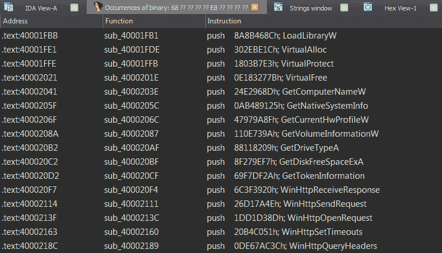

# Uchihash:一个处理恶意软件嵌入散列的小工具

> 原文：<https://kalilinuxtutorials.com/uchihash/>

Uchihash 是一个小工具，可以节省恶意软件分析师处理嵌入式哈希值的时间，这些哈希值用于各种用途，例如:

*   动态导入 API(尤其是在外壳代码中)
*   检查分析师使用的运行流程(反分析)
*   检查虚拟机或防病毒工件(反分析)

Uchihash 可以使用您自己的自定义哈希算法生成哈希，在已经生成的哈希表中搜索哈希列表，还可以生成 IDAPython 脚本，用相应的值来注释哈希，以便于分析。

**安装**

**$ git 克隆 https://github.com/N1ght-W0lf/Uchihash.git
$ pip 安装-r 需求. txt**

**用途**

**用法:uchi hash . py[-h][–algo ALGO][–API][–关键字][–LIST 列表][–SCRIPT 脚本][–SEARCH 搜索][–HASHES 哈希][–IDA]
可选参数:
-h、 –帮助显示此帮助消息并退出
–algo ALGO 散列算法
–API 计算 API 的散列
–关键字计算关键字的散列
–列出计算您自己的单词列表的散列
–包含您的自定义散列算法的脚本脚本文件
–搜索搜索包含映射到单词的散列的 JSON 文件
–散列散列散列文件包含要搜索的散列列表
–IDA 生成 IDAPython 脚本以注释散列值
示例:
* python uchi hash . py–algo crc32–API
* python uchi hash . py–algo mur mur 3–list my words . txt
* python uchi hash . py–search hashmap . txt–hashes my hashes . txt**

**注释**

*   **`--algo`** :可用的哈希算法之一
*   **`--apis`** :散列一个巨大的 windows APIs 列表(见 data/apis_list.txt)
*   **`--keywords`** :哈希分析工具、VM/Antivirus/EDR 等恶意软件家族常用的关键字列表(见 data/keywords_list.txt)
*   **`--list`** :单词之间用换行符隔开(见 examples/mywords.txt)
*   **`--script`** :散列函数必须被调用`**hashme()**`，返回值必须是十六进制格式`**0xDEADBEEF**`(参见 examples/custom_algo.txt)
*   **`--search`** :要搜索的文件必须是 JSON 格式(参见 examples/searchme.txt)
*   **`--hashes`** :哈希值由换行符分隔，并且必须是十六进制格式(参见 examples/myhashes.txt)

请参见示例文件夹了解更多说明

**可用的哈希算法**

*   md4
*   讯息摘要 5
*   sha1
*   sha224
*   sha256
*   sha384
*   sha512
*   ripemd160
*   漩涡
*   crc8
*   crc16
*   crc32
*   crc64
*   djb2
*   sdbm
*   loselose
*   fnv1_32
*   fnv1a_32
*   fnv1_64
*   fnv1a_64
*   murmur3

**例子**

让我们以一个真实的恶意软件家族为例，在这种情况下，我们有 **`BuerLoader`** ，它使用哈希值来动态导入 API，并使用自定义哈希算法。

首先，我们需要用 python 实现哈希算法:

**def ROR4(val，bits，bit _ size = 32):
return((val&(2 * * bit _ size–1))>>bits % bit _ size)| \
(val<<(bit _ size-(bits % bit _ size))&(2 * * bit _ size–1))
def hashme(s):
RES = 0
for c in s:
v3 = ror 4(RES，13**

然后我们计算所有 API 的哈希值:

**$ python uchi hash . py–脚本 custom _ algo . py–API**

最后，我们搜索 BuerLoader 在生成的 hashmap 中使用的哈希值，我们还可以生成一个 IDAPython 脚本，用相应的 API 名称来注释这些哈希值:

**$ python uchi hash . py–搜索输出/hashmap . txt–哈希布尔 _ 哈希. txt–IDA**

我们应该得到 2 个输出文件，一个是 **`"output/search_hashmap.txt"`** ，它将 BuerLoader 的哈希值映射到 API 名称:

**{
" 0 x8a 8b 468 c ":" LoadLibraryW "、
"0x302ebe1c": "VirtualAlloc "、
" 0x 1803 b7e 3 ":" virtual protect "、
"0xe183277b": "VirtualFree "、
" 0x24e 2968d ":" GetComputerNameW "、
" 0x ab 489125 ":" GetNativeSystemInfo "、
。
}**

另一个文件是 **`"output/ida_script.py"`** ，它会将评论添加到您的 idb:

[**Download**](https://github.com/N1ght-W0lf/Uchihash)