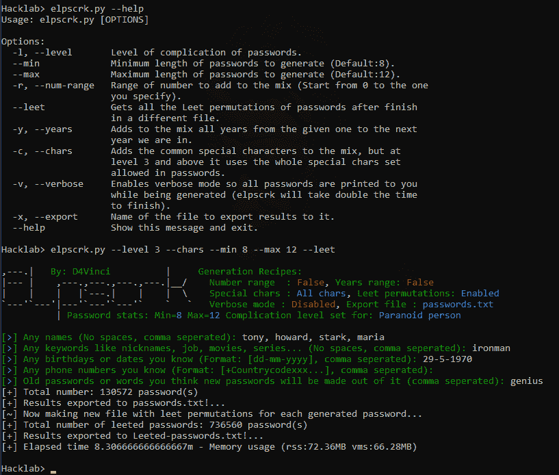

# Elpscrk:一个基于排列和统计的智能通用用户密码分析器

> 原文：<https://kalilinuxtutorials.com/elpscrk/>

Elpscrk 是一个智能的通用用户密码分析器，以机器人先生系列第一季第一集中的相同工具命名。

简而言之，elpscrk 会询问你关于目标的所有信息，然后尝试生成目标能想到的所有可能的密码，这完全取决于你提供的信息、你激活的标志以及你指定的复杂程度。

在 elpscrk 中，每种类型的目标都有 6 个复杂级别，从简单的人(默认为书呆子、偏执狂)到最终的 boss 级别(可以生成 1000000 个或更多密码的核心级别)。

Elpscrk 类似于 cupp，但它基于排列和统计，同时具有内存效率。因此，您将很快获得更多结果，每种类型用户的复杂程度，以及非常可定制的结果，您将在使用部分看到。

**截图**

**用途**

很简单，你只需运行脚本，并会提示询问你关于目标的信息，然后它会制作每个常见数据组合的排列列表，如下所示。

对于更高级的用法和自定义，您需要注意以下几点:

*   复杂程度

它表示您希望生成的密码有多简单。比如说名字:

*   **在 0 级，这是默认的，你给的每个名字将被转换成(大写，小写)，第一个字母将被转换成(大写，小写)，
    和前两个字母将被转换成(大写，小写，大写)。**
*   在第 1 级，你会看到第 0 级的所有东西，而且每个名字都会颠倒，每个名字的前两个字母也会颠倒。

下表解释了所有的复杂程度:

注意:在“总体构思”一栏中，提到的每一件事物都被用于多种(常见/不常见)的混合物中，而不是单独使用

| 水平 | 大意 |
| --- | --- |
| 0–简单的人 | 这是默认级别，在这里你会看到很多东西，如上面解释的姓名排列，日期被分成几组**天，月，年，最后两个年份的数字，如 1990 & 90** ，电话号码被转换为**国家格式，带有常用的前/后四个数字的列表**，等等。 |
| 1–普通人 | 使用这个级别将添加一些有趣的东西，如姓名，**每个姓名颠倒，每个姓名的前两个字母也将颠倒**，对于日期， **0 将被附加到小于 10 的(日，月)**因此 5 将是 05 & 5 当然，**最后 3 个数字的年份将被使用**也因此 1990 将给出 990。 |
| 2–网络意识 | 默认情况下，您给出的旧密码将被使用，任何特殊字符将被删除，但从 2 级开始，每个给定的旧密码将被转换为(大写，小写，大写，反转)形式。 |
| 3–偏执的人 | 默认情况下，如果您使用了`--chars`标志，elpscrk 将使用 10 个最常见的字符，就像您在 0 级或 1 级中一样，但是从 3 级开始，它将使用密码中允许的全部特殊字符集(参见参考资料)。 |
| 4-书呆子 | 对于级别 3 和更低，elpscrk 将使用顺序对来确保排列有序，并在混合中删除许多不常见的密码形式，现在使用级别 4 将使用相同的常见混合，但没有对，因此，例如，不是获得(姓名和日期)的密码，而是获得(姓名和日期，姓名和姓名，日期和日期，…)等的混合 |
| 5–核能！ | 这里是狗屎击中风扇😆对于最复杂的非人类目标，elpscrk 将开始使用不常见和不太现实的结果。 |

**注意:**在这些级别的所有排列开始之前，elpscrk 将使用简单的加法(如 cupp)生成一些最常用的密码形式，以确保它会出现在结果中。

*   Leet 标志

当您启用 leet 标志时，elpscrk 将正常工作，在完成并导出结果后，它将开始获取所有密码的所有 leet 排列，并将它们保存到新文件中。

因此，例如像`**karim**`这样的名字将导致`**['k4r1m', 'k4rim', 'kar1m', 'karim']**`

*   年份和数字范围

使用`**-y/--years**`选项并给它一个像 1980 年这样的年份，将使 elpscrk 将所有密码与从 1980 年到 2022 年(我们目前处于+1 的年份)的所有年份混合，因此您会看到这样的密码:

**卡里姆 1980
1981 卡里姆
……
卡里姆 2022**

以此类推，同样适用于`**-r/--num-range**`选项，给它取 100 这样的数字会把从 0 到 100 的所有数字相加，所以期待像 **`karim99, 99karim, karim100` …** 这样的密码

**安装**

*   它可以在任何操作系统上运行，但需要 python 3.6 及以上版本。
*   克隆 repo 并在它的目录中安装需求，如下所示:`**pip install -r requirements.txt**`或者这个`**python3 -m pip install -r requirements.txt**`，如果你安装了多个版本的话。
*   你已经准备好了

[**Download**](https://github.com/D4Vinci/elpscrk)