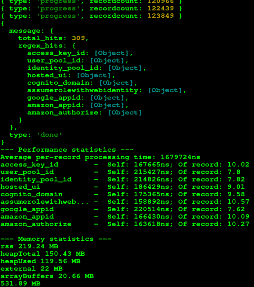

# war cannon:node . js 中的高速/低成本 CommonCrawl RegExp

> 原文：<https://kalilinuxtutorials.com/warcannon/>

WARCannon 的建立是为了简化和降低“浏览互联网”的过程。

使用 WARCannon，您可以:

*   针对真实的常见爬网数据构建和测试正则表达式模式
*   轻松加载通用爬网数据集以进行并行处理
*   扩展计算能力，以不合理的容量异步处理 WARCs。
*   存储并轻松检索结果

**工作原理**

WARCannon 巧妙地利用 AWS 技术来横向扩展到任何容量，通过 spot 车队和同区域数据传输来最大限度地降低成本，以令人难以置信的速度(每节点高达 100Gbps)从 S3 提取数据，跨数百个 CPU 内核进行并行处理，通过 DynamoDB 和 CloudFront 报告状态，并通过 S3 存储结果。

总之，WARCannon 可以在几个小时内处理 400TB 的多个正则表达式模式，花费大约 100 美元。

**安装**

WARCannon 要求您安装以下软件:

*   **awscli**  (v2)
*   **地形** (v0.11)
*   **jq**
*   **JSON nt**
*   **npm** (v12 或 v14)

为了保持整洁，并与你在 AWS 中可能有的其他东西区分开来，强烈建议你在一个新账户中部署 WARCannon。您可以从 AWS 中的“组织”控制台轻松创建新帐户。**我说的‘强烈推荐’是指‘说真的，不要把这个和其他东西放在一起’。**

首先，克隆 repo 并复制示例设置。

**$ git 克隆 git @ github . com:c6fc/war cannon . git
$ CD war cannon
war cannon $ CP settings . JSON . sample settings . JSON**

编辑`**settings.json**`品尝:

*   `**backendBucket**`:存储地形状态的桶。如果不存在，WARCannon 会为您创建。用随机字符替换'< somerandomcharacters >'以使其唯一，或者指定您拥有的另一个存储桶。
*   **`awsProfile`:**`**~/.aws/credentials**`中您希望安装时附带的概要文件名。
*   `**nodeInstanceType**`:用于并行处理的实例类型数组。c '-型最适合这种用途，可以使用任何尺寸。`**["c5n.18xlarge"]**`是真实活动的推荐值。
*   `**nodeCapacity**`:并行处理时请求的节点数。结果节点将是您指定的`**nodeInstanceTypes**`的任意分布。
*   `**nodeParallelism**`:每个 vCPU 同时处理 ***的 WARCs 数。`2`在这里是个好数字。如果节点没有足够的 RAM 来运行这个级别的并行性(就像您可能遇到的“c”类实例)，它们将运行在最高的安全并行性。***
*   `**nodeMaxDuration**`:计算节点的最大寿命，以秒为单位。如果作业仍未完成，节点将在此时间后自动终止。默认值为 24 小时。
*   `**sshPubkey**`:公共 SSH 密钥，方便远程访问节点进行故障排除。
*   `**allowSSHFrom**`:允许宋承宪进入的 CIDR 掩码。通常这将是`**&lt;yourpublicip&gt;/32**`

**登陆互联网**

WARCannon 通过 AWS 开放数据程序由 Common Crawl 提供。Common Crawl 的独特之处在于，其蜘蛛检索的数据不仅捕获网站文本，还捕获其他基于文本的内容，如 JavaScript、TypeScript、full HTML、CSS 等。通过构建能够识别独特组件的合适的正则表达式，研究人员可以通过他们使用的技术来识别网站，而无需接触网站本身。问题是，这需要解析数百万亿字节的数据，无论您有什么资源可以支配，这都是一项艰巨的任务。

**开发正则表达式**

浏览互联网不适合胆小的人，但是从有效的生活开始是第一步。WARCannon 通过对真实的通用爬行数据启用正则表达式的本地验证来支持这一点。首先，打开`**lambda_functions/warcannon/matches.js**`并修改`**regex_patterns**`对象，以包含您希望在`**name: pattern**`格式中使用的正则表达式。以下是默认搜索集的一个示例:

**exports . regex _ patterns = {
" access _ key _ id ":/(\ ' A | " A)(SIA |起亚| IDA | ROA)[JI][A-Z0-9]{ 14 }[AQ][\ ' "]/g，
}；**

匹配此表达式的字符串将保存在结果中相应的键下；`**access_key_id**`在这种情况下。 **Protip:** 使用带有‘JavaScript’格式的 RegExr 来构建和测试已知良好匹配的正则表达式。

您还可以选择仅从指定的域中捕获结果。为此，只需用您希望包含的 FQDNs 填充 **`domains`** 数组。建议您将这个`**[]**`留空，因为它几乎不值得使用(节省的处理工作量非常小)，但是在某些特殊情况下它会很有用。

**exports . domains =[" example 1 . com "，" example 2 . com "]；**

一旦`**matches.js**`被填充，运行以下命令:

**warcannon$。/warcannon testLocal**

WARCannon 将下载 warc，并使用您配置的匹配项解析它。你应该知道 WARCannon 默认做的几件影响生活质量的事情:

*   WARCannon 会在第一次运行时将 warc 下载到`**/tmp/warcannon.testLocal**`中，从那以后即使你改变了 warc_path，也会重用下载的 warc。如果您希望使用不同的 warc，您必须删除此文件。
*   WARCs 很大；大多数都是 1GB 多一点。WARCannon 使用命令行界面进行多线程下载，但是如果你的网速很慢，你第一次就需要耐心等待。

最重要的是，WARCannon 将尝试评估本地运行的正则表达式的总计算成本。这样，您就可以在执行活动前得知给定的正则表达式是否会显著影响性能*。*

**执行定制加工**

有时一个简单的正则表达式模式本身是不够的，您需要一些额外的步骤来确保您返回正确的信息。在这种情况下，只需用相同的键名向`**exports.custom_functions**`对象添加一个函数，就可以执行您认为合适的任何附加处理。

**exports . regex _ patterns = {
" access _ key _ id ":/(\ ' A | " A)(SIA |起亚| IDA | ROA)[JI][A-Z0-9]{ 14 }[AQ][\ ' "]/g，
}；
exports . custom _ functions = {
" access _ key _ id ":function(match){
//忽略文本中与' EXAMPLE '的匹配，因为这在文档中很常见。
if (match.text(/EXAMPLE/)！= null) {
//返回布尔值“false”将放弃匹配。
返回假
}
}
}**

注意:WARCannon 是用来以愚蠢的速度处理文本的。虽然*当然有可能*执行您想要的任何类型的操作，但是添加网络调用等高延迟定制功能会显著增加处理时间和成本。网络呼叫也可能导致大量针对网站的呼叫，这可能会给你带来麻烦。明智地使用这些功能。

**在 AWS 中执行一次性测试**

AWS 的成本可能会让人焦虑，尤其是当你只是想做一些研究的时候。WARCannon 除了允许完整的战役外，还允许一次性执行，所以你可以对你将得到的结果充满信心。一旦您对使用 **`testLocal`、**获得的结果感到满意，您就可以部署更新的匹配，并轻松运行云支持的测试:

**warcannon$。/warcannon deploy
warcannon$。/warcannon 测试**

这将使用您配置的正则表达式同步执行 Lambda 函数，并立即返回结果。这个过程大约需要 2.5 分钟，所以不要害怕等待它发挥它的魔力。

**发起真正的战役**

一旦你对在 Lambda 中得到的结果感到满意，你就准备好真正地在互联网上冲浪了。我们将首先检查一些基本的内务，然后开始。

**清理队列**

WARCannon 使用 AWS 简单队列服务将工作分配给计算节点。为了确保您的结果没有受到任何先前运行的影响，您可以告诉 WARCannon 清空队列:

**warcannon$。/warcannon emptyQueue
[+]从队列**中清除了[ 15 ]条消息

然后，您可以验证队列的状态:

**warcannon$。/warcannon 状态
展开:[是]；SQS 状态:[空]
职务状态:[非活动]
活动职务 URL:https://d201offlnmhkmd.cloudfront.net**

继续之前，请验证以下内容:

1.  SQS 的队列是空的
2.  作业状态为“无效”

**【简单】填充队列**

为了创建计算节点将使用的队列消息，您必须首先用爬网数据填充 SQS。WARCannon 有几个命令可以帮助实现这一点，首先是显示可用扫描的能力。在这种情况下，让我们看看 2021 年可用的扫描:

**warcannon$。/战炮列表 2021
CC-MAIN-2021-04
CC-MAIN-2021-10**

我们有两个匹配字符串“2021”的扫描要处理。我们现在可以指示 WARCannon 基于这些扫描之一来填充队列。这一次，我们需要提供一个唯一标识其中一个扫描的参数。“2021-04”就可以了。我们可以通过指定块的数量和块的大小来选择仅填充部分扫描，但是我们现在将跳过这一步。

**warcannon$。/war cannon populate 2021-04
{从 79840 个可用段中创建了 799 个 100 的块"
"StatusCode": 200，
" executed version ":" $ LATEST "
}**

**通过 Athena(高级)填充队列**

在部署过程中，WARCannon 会自动在 Athena 中提供一个数据库(warcannon_commoncrawl)和工作组(warcannon ),用于快速查询 commoncrawl 中的信息。这对于根据特定查询填充稀疏活动特别有用。例如，以下查询将搜索包含来自“example.com”的响应的 WARCs

**SELECT
warc_filename，
COUNT(URL _ path)as num
FROM
war cannon _ common crawl . ccindex
其中
subset = ' warc ' AND
URL _ host _ registered _ domain IN(' example . com ')AND
crawl = ' CC-MAIN-2021-04 '
GROUP BY warc _ filename
ORDER BY num desc**

您可以使用 Athena 控制台来微调您的结果，但是如果您打算使用它来填充作业，则必须从 WARCannon 命令行运行查询:

**。/war cannon queryAthena " SELECT warc _ filename，COUNT(URL _ path)as num FROM war cannon _ common crawl . ccindex 其中 subset = 'warc '和 URL _ host _ registered _ domain IN(' example . com ')AND crawl = ' CC-MAIN-2021-04 ' GROUP BY warc _ filename ORDER BY num desc "
[+]Query Exec Id:0319486 e-1846-491 c-badf-2e 23 AE 213974..成功了**

WARCannon 然后可以使用查询的结果来填充队列，并基于结果集中的`warc_filename`列来完成。因此，建议你要么`group by`这个专栏，要么使用`distinct()`来避免重复。如果这个字段不存在，WARCannon 将抛出一个错误。通过将查询执行 ID 传递给`populateAthena`命令，用 Athena 结果填充队列。

**。/war cannon populate Athena 0319486 e-1846-491 c-badf-2e 23 AE 213974
{从 251 个可用段中创建了 26 个 10 的块"
"StatusCode": 200，
" executed version ":" $ LATEST "
}**

**注意:虽然为单个领域填充稀疏作业看起来是个好主意，但事实往往并非如此。**来自单个域的响应往往会广泛传播到 WARCs 的一个大子集。使用上面的示例查询可以清楚地看到，在每个 WARC 的大约 150，000 条记录中，中型网站的最大单次点击量可能是个位数。

**鸣响战炮**

队列填充完毕后，我们就可以开始了。WARCannon 会做一些健全性检查，以确保一切正常，然后向你展示战役的配置，并在你最终确定订单之前给你最后一次机会中止。

**warcannon$。/warcannon fire
【！]这将请求[ m5n.24xlarge，m5dn.24xlarge ]
类型的[ 6 ]点实例，持续[ 86400 ]秒。
要更改这一点，请在 settings.json 中编辑您的设置并运行。/战炮部署
–>准备开火？【是】:**

用“是”回答扣动扳机。

**–>准备开火？【是】:是
{
" spotfeetrequestid ":" sfr-03 DD 32 b 8-51f 7-4c8e-802 b-a 702 fc 3c 8 c 95 "
}
[+]Spot 舰队请求已发送，大约 5 分钟内节点应开始上线。
在 https://d201offlnmhkmd.cloudfront.net 监控节点状态和进度**

回复包括一个链接，指向您的唯一状态 URL，您可以在其中监控活动的进度和每个节点的性能。

**获得结果**

WARCannon 结果以 JSON 格式存储在 S3，由负责产生结果的每个节点分解。Athena 结果存储在前缀为`/athena/`的同一个桶中。您可以使用`syncResults`命令将活动结果同步到本地机器上的`./warcannon/results/`文件夹中。

**。/war cannon sync results
sync:S3://war cannon-results-202……
sync:S3://war cannon-results-202……
sync:S3://war cannon-results-202……
……**

然后，您可以使用`clearResults`清空结果桶

**。/war cannon clear results
delete:s3://war cannon-results-202……
delete:S3://war cannon-results-202……
delete:S3://war cannon-results-202……
……
[+]从 S3 删除了[ 21 ]个文件。**

[**Download**](https://github.com/c6fc/warcannon)