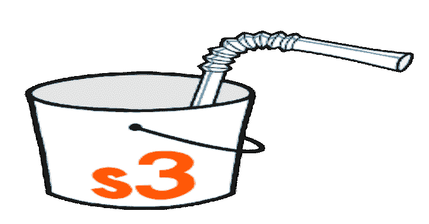

# Solitude:一个隐私分析工具，允许任何人进行自己的隐私调查

> 原文：<https://kalilinuxtutorials.com/solitude/>

**Solitude** 是一款隐私分析工具，任何人都可以进行自己的隐私调查。无论是好奇的新手还是更高级的研究人员，Solitude 让每个人都可以在应用程序中评估用户隐私。

**重要提示**

在安装 Solitude 之前，需要注意的是，Solitude 应该在一个可信的私有网络上运行。Solitude web 应用程序界面目前的构建方式是基于这样一个假设，即用户将在一个私有的可信网络上运行该工具。

如果你正在使用 Solitude 测试移动应用程序(我们希望你是！)那么应该清楚的是，如果您使用的是非越狱设备，如果应用程序或应用程序中包含的第三方 SDK 使用证书锁定，您可能无法捕获所有 HTTP 流量。证书锁定是一种安全机制，可确保应用程序与之通信的服务器是它所期望的服务器。应用程序和 SDK 经常使用证书锁定来保护它们的应用程序，以防证书颁发机构遭到破坏，并且攻击者发布恶意证书，这可能允许攻击者观察或修改从应用程序到应用程序服务器的 TLS 流量。Solitude 不支持证书锁定旁路。我们把这个留给孤独的使用者。也就是说，我们不建议越狱或破解你的个人移动设备。如果你有兴趣使用越狱或 rooted 手机，你应该使用一个带有测试数据的测试设备来测试应用程序。

**为 Mac 安装 OS X**

*   `**git clone https://github.com/nccgroup/Solitude**`
*   安装 Docker
*   `**docker-compose -f docker-compose-prod.yml build**`
*   `**docker-compose -f docker-compose-prod.yml up**`
*   浏览到 http://localhost:5000，按照说明启动 VPN 服务器，并使用 VPN 配置文件和 mitm 代理证书配置您的移动设备。

**在 Mac OS X 上本地安装(没有 docker-compose)**

*   安装 Docker
*   `**brew install mysql**`
*   运行 mysql docker 容器:(在安装 Solitude 之前先这样做，因为容器启动需要一分钟时间)

`**docker run -p 3306:3306 -d --name mysql -e MYSQL_ROOT_PASSWORD=solitude mysql**`(在此处更改默认密码，并参见下面的说明来更改数据库配置)

*   `**git clone https://github.com/nccgroup/Solitude**`
*   `**cd Solitude && python3 -m venv venv**`
*   `**source venv/bin/activate**`
*   `**pip3 install -r requirements.txt**`
*   `**python3 run.py**`
*   浏览到 http://localhost:5000，并将浏览器配置为通过 localhost:8080 代理所有 http 流量

**为 Linux 安装**

*   安装坞站和坞站-合成
*   `**docker-compose -f docker-compose-prod.yml build**`
*   `**docker-compose -f docker-compose-prod.yml up**`
*   浏览到 http://localhost:5000，按照说明启动 VPN 服务器，并使用 VPN 配置文件和 mitm 代理证书配置您的移动设备。

**在 Linux 上本地安装(没有 docker-compose)**

*   安装 Docker
*   运行 mysql docker 容器(在安装 Solitude 之前先这样做，因为容器启动需要一分钟时间)

`**docker run -p 3306:3306 -d --name mysql -e MYSQL_ROOT_PASSWORD=solitude mysql**`(在此处更改默认密码，并参见下面的说明来更改数据库配置)

*   `**git clone https://github.com/nccgroup/Solitude**`
*   `**cd Solitude && python3 -m venv venv**`
*   `**source venv/bin/activate**`
*   `**sudo apt-get install libmysqlclient-dev**`
*   `**pip3 install -r requirements.txt**`
*   `**python3 run.py**`
*   浏览到 http://localhost:5000，并将浏览器配置为通过 localhost:8080 代理所有 http 流量

**数据库配置**

更改默认数据库密码。将`**.env**`文件编辑成您选择的密码。

**配置独处**

在 **`myrules.json`** 文件中配置您想要追踪的任何数据。如果在从 web 应用程序或移动应用程序发出的任何 HTTP 流量中找到匹配项，则配置的数据将显示在 web 界面中，以及与该数据共享数据的域中。

**独处是如何工作的？**

Solitude 在 docker 容器中运行 OpenVPN 服务器，然后通过一个利用 mitmproxy 中的附加 API 的特性，将所有 HTTP 流量转发到 HTTP 交互代理(mitmproxy)。

**孤独搜索是如何工作的？**

Solitude 利用 Yara 规则搜索您通过该工具代理的所有 HTTP 流量。Yara rules 虽然相对容易写，但可能会很乏味，所以 solitude 为你做了一些繁重的工作。在`myrules.json`文件中，定义您想要搜索的数据类型的键和值。`myrules.json`中提供了一些例子，但您可以随意添加自己的数据。关键应该是你要搜索的数据类型，如“我的电话号码”。该键用于找到匹配项时生成的输出。该值应该是您想要匹配的精确数据。考虑到不同的数据格式，因此为每条数据创建更多的条目可能是必要的。例如，电话号码或生日可能有多种格式。1991 年 3 月 3 日或 1991 年 3 月 3 日。如果您想在 JSON 文件中添加新的规则，Solitude 会在您每次启动代理时为您生成 Yara 规则。

示例:`**"phoneNumber": "555-555-5555", "Address": "123 Sutter Street, San Francisco 94105"**`

**独处的特点**

*   **base64 和 url 递归解码(编码为 base64 的请求> url > base64 可以被解码和搜索)**
*   **protobuf 支持(解码任何 protobuf 请求的第一层)**
*   **搜索 myrules.json 中定义的所有数据的 MD5、SHA1、sha 256**
*   **内置 GPS、内部 IP 地址和 Mac 地址正则表达式搜索**

[**Download**](https://github.com/nccgroup/Solitude)