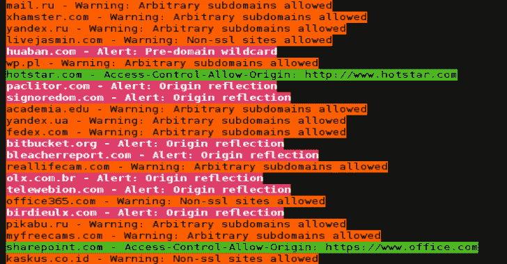
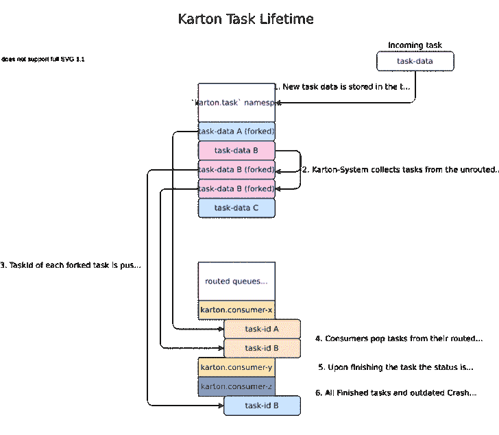
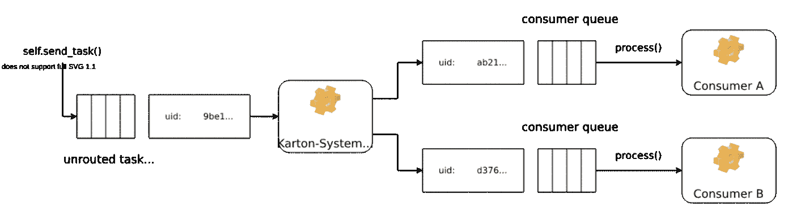
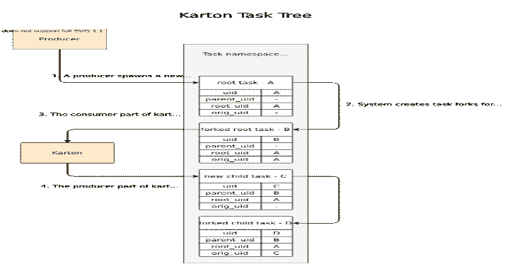
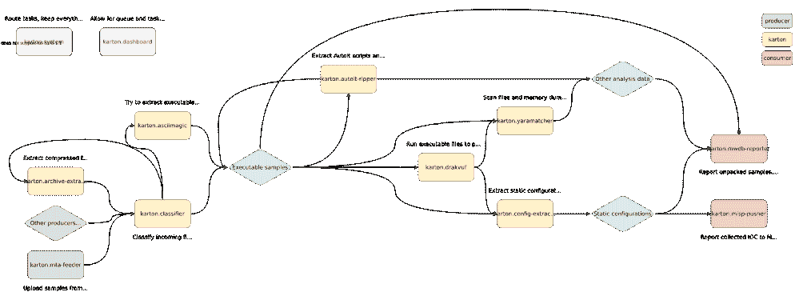

# Karton:基于 Python、Redis 和 MinIO 的分布式恶意软件处理框架

> 原文：<https://kalilinuxtutorials.com/karton/>

**Karton** 是一个健壮的框架，用于创建**灵活**和**轻量级**恶意软件分析后端。它可以轻松地将恶意软件*分析系统连接到强大的管道中。

我们从事自动化业务已经有很长时间了。我们要应对越来越多的威胁，我们必须自动化一切以应对突发事件。正因为如此，我们经常会用胶带和 WD-40 把许多脚本粘在一起。这些脚本是分析师在盛怒之下编写的，脆弱而丑陋——但它们起作用，并产生必须存储、进一步处理、发送到其他系统或与其他组织共享的情报。

我们需要一种方法来获取 PoC 脚本，并轻松地将它们插入到我们的分析管道中。我们还想监控它们的执行，集中日志，提高健壮性，减少开发惰性…正是为了这个目的，我们创建了 **Karton** 。

虽然 Karton 在设计时考虑了恶意软件分析，但它在每个面向微服务的项目中都能很好地工作。

**安装**

安装就像一个简单的`**pip install**`命令一样简单:

**pip3 安装卡顿核心**

为了设置整个后端环境，你还需要 MinIO 和 Redis，详情见文档。

**入门**

**安装**

您可以从 pip 获得 karton 框架:

**python -m pip 安装卡顿-core**

或者，如果您喜欢冒险，可以使用 git 下载源代码并手动安装。

除了 karton，您还需要安装 MinIO 和 Redis-server。

**配置**

每个 Karton 子系统都需要一个包含 Redis 和 MinIO 连接参数的`**karton.ini**`文件。

您还可以使用该文件存储自定义字段，并通过覆盖配置等方式使用它们。

默认情况下，config 类将在几个地方查找配置文件，但是让我们从在新的 karton 子系统的根目录中放置一个开始。

**【minio】
secret _ key = minioadmin
access _ key = minioadmin
address = localhost:9000
bucket = karton
secure = 0
【redis】
host = localhost
port = 6379**

如果一切都配置正确，您现在应该能够运行`**karton-system**`代理并获得`**"Manager karton.system started"**`信号，表明它能够正确地连接到 Redis 和 MinIO。

**Docker-compose 开发设置**

如果你只是尝试卡顿或者你想要一个快速简单的开发环境设置，检查一下卡顿根目录下的 **`dev`** 文件夹。

它包含一个小的 docker-compose 安装程序，将为您设置最小开发环境。

你要做的就是跑

**坞站-复合 up–build**

然后使用`**karton.ini.dev**`配置文件连接附加的卡顿系统。

**编写你的第一个生产者和消费者**

因为所有伟大的例子都是从 foobar 开始的，这正是我们要做的。让我们从编写一个产生新任务的生成器开始。

**从 karton.core 导入 Producer，Task
if name = = " main ":
foo _ Producer = Producer(identity = " foobar-Producer ")
for I in range(5):
Task = Task(headers = { " type ":" foobar " }，payload = { " data ":I })
foo _ Producer . send _ Task(Task)**

太短了！现在对于时间稍长一点的消费者来说:

**从 karton.core 导入消费者，Task
类 FooBarConsumer(消费者):
identity = " foobar-Consumer "
filters =[
{
" type ":" foobar "
}

def process(self，Task:Task)->None:
num = Task . get _ payload(" data ")
print(num)
如果 num % 3 = = 0:
print(" Foo ")
loop()**

如果我们现在运行消费者并生成几个“foobar”任务，我们应该得到几个 foobar 日志作为回报:

**[信息]服务 foo-消费者启动
[信息]服务绑定已创建。
【信息】绑定于:{'type': 'foobar'}
【信息】收到新任务–884880 E0-e5fc-4a 71-a93a-08f 0 CAA 92889
0
Foo
栏
【信息】任务完成–884880 E0-e5fc-4a 71-a93a-08f 0 CAA 92889
【信息】收到新任务–60be 2 EB 5-9e 7 收到新任务-050 cdace-05b 0-4648-a070-BC 4a 7 A8 de 702
4
【信息】任务完成-050 cdace-05b 0-4648-a070-BC 4a 7 A8 de 702
【信息】收到新任务-d3a 39940-d64c-4033-a7da-80 EAE 9786631
5
栏【T24**

**例题**

这里有几个常见的卡顿系统模式的例子。

**制作人**

**从 karton.core 导入 sys
导入 Config，Producer，Task，Resource
Config = Config(" karton . ini ")
Producer = Producer(Config)
filename = sys . argv[1]
with open(filename，" Rb ")as f:
contents = f . read()
Resource = Resource(OS . path . basename(filename)，contents)
Task = Task({ " type ":" sample "，" kind ":" raw " })
Task . add _ 1**

**消费者**

消费者必须定义 **`identity`** ，这是一个在 RMQ 用于识别和绑定的名称，以及`**filters**`——一个决定服务想要处理什么类型任务的字典列表。

列表中的元素是“或”的，字典中的条目是“与”的。

**import sys
from karton . core 导入 Config，Consumer，Task，Resource
class Reporter(消费者):
identity = " karton . Reporter "
filters =[
{
" type ":" sample "，
"stage": "recognized"
}，
{
"type": "sample "，
"stage": "analyzed"
}，
{
"type": "config**

上述示例接受如下标题:

**{
"type": "sample "、
、" stage": "recognized "、
、" kind": "runnable "、
、" platform": "win32 "、
、" extension": "jar"
}**

或者

**{
“类型”:“配置”，
“种类”:“咕咕 1”
}**

但不能

**{
“类型”:“样本”，
“舞台”:“某样东西”
}**

下一步是定义过程方法，这是与我们的过滤器匹配的传入任务的处理程序。

**def process(self，Task:Task)->None:
if Task . headers[" type "]= " sample ":
return self . process _ sample(Task)
else:
return self . process _ config(Task)
def process _ sample(self，Task:Task)->None:
sample = Task . get _ resource(" sample ")
#……
def process _ config(self，task: Task) - > None: 【T9**

给你关于为什么任务被路由的信息，像 get_resource 或 get_payload 这样的方法允许你从任务中获取资源或元数据。

最后，我们需要运行我们的模块，我们用循环方法来完成这个任务，它阻塞监听新任务，在需要时运行进程。

**if name = = " main ":
c = Reporter()
c . loop()**

**卡顿**

卡顿类只是生产者和消费者捆绑在一起。

如 karton/core/karton.py 中所定义:

**类卡顿(消费者，生产者):
"""
这将消费者和生产者粘合在一起——这是最常见的用例
"""**

接收数据的过程与消费者完全一样。使用 producer 也没有什么不同，只是使用 **`self.send_task`。**

下面是一个完整的例子。

**从 karton.core 导入 karton，Task
类 SomeNameKarton(Karton):
#像在消费者类中一样定义身份和过滤器
identity = " Karton . somename "
过滤器= [
{
"type": "config "，
}，
{
，" type": "analysis "，
"kind": "cuckoo1"
}，
]
#方法)
……
#发送我们的结果以便进一步处理或报告
#生产者部分
t =任务({ " type ":" sample " })
t . add _ resource(" sample "，Resource(文件名，内容))
self.send_task(任务)**

**覆盖配置**

除了 karton 工作所需的配置之外，流行的用例是拥有另一个定制配置。

这可以通过覆盖 Config 类并将其用于 Karton 初始化来轻松实现。

**导入 mwdblib
类 MWDBConfig(Config):
def init(self，path=None) - > None:
super()。init(path)
self . mwdb _ config = dict(self . config . items(" mwdb "))
def mwdb(self)->mwdblib。MWDB:
API _ key = self . MWDB _ config . get(" API _ key ")
API _ URL = self . MWDB _ config . get(" API _ URL "，mwdblib . API . API _ URL)
MWDB = mwdblib。MWDB(api_key=api_key，api_url=api_url)
如果不是 API _ key:
MWDB . log in(
self . MWDB _ config[" username "]，
self . MWDB _ config[" password "])
返回 mwdb**

**记录消费者**

默认情况下，在 Karton 系统中创建的所有日志都使用 Redis `**PUBSUB**`模式发布给专门的日志消费者。

这是一个非常简单的系统示例，它实现了`**LogConsumer**`接口并将日志打印到 stderr。

**从 karton.core.karton 导入 sys
log consumer
类 stdout logger(log consumer):
identity = " karton . stdout-logger "
def process _ log(self，event: dict) - > None:
#有“log”和“operation”事件
if event . get(" type ")= = " log ":
print(f " { event[' name ']}:{ event[' message ']} "，file=sys.stderrloop()**

**报头、有效载荷和资源**

任务由两个元素组成:**报头**和**有效载荷**。

**任务标题**

标题指定了任务的目的，并决定了 karton-system 将如何路由任务。它们是由键和值的平面集合定义的。

示例:

Task = Task(
headers = {
" type ":" sample "，
"kind": "runnable "，
"platform": "win32 "，
"extension": "dll"
}
)

消费者监听由过滤器定义的一组特定的报头。

**类 generic unpacker(Karton):
" " "
执行样本解包
" " "
identity = " Karton . generic-un packer "
filters =[
{
" type ":" sample "，
"kind": "runnable"
}，
{
"type": "sample "，
"kind": "script "，
"platform": "win32"
。**

如果 Karton-System 发现一个任务匹配由消费者队列过滤器定义的任何子集，那么该任务将被路由到该队列。

遵循上面例子中提出的约定，这意味着`GenericUnpacker`将获得所有包含样本的任务，这些样本可以直接在沙箱(不管目标平台)或 Windows 32 位脚本中运行。

根据样品的种类，标题可用于以不同方式处理我们的输入:

**类 generic unpacker(Karton):
……
def process(self，Task:Task)->None:
# Get incoming Task headers
headers = Task . headers
if headers[" kind "]= " runnable ":
self . process _ runnable()
elif headers[" kind "]= " script ":
self . process _ script()**

很少有标题有特殊的含义，由 Karton 自动添加到接收/输出任务中。

*   `**{"origin": "<identity>"}**`指定任务发送者的身份。它可用于监听仅来自预定义身份的任务。
*   当任务被路由到消费者队列时，`**{"receiver": "<identity>"}**`由 Karton 添加。在接收器端，值总是等于`**self.identity**`

**任务有效载荷**

Payload 也是一个字典，但是它不需要像 headers 那样是一个平面结构。它的内容不影响路由，所以任务语义必须由头定义。

**task = Task(
headers = …，
payload = {
" entry points ":[
" _ example function @ 12 "
]，
"matched_rules": {
…
}，
" sample ":Resource(" original _ name . dll "，path = " uploads/original _ name . dll ")
}
)**

消费者可以使用`**Task.get_payload()**`方法访问有效负载

**类卡顿服务(Karton):
……
def 进程(self，task: Task) - >无:
entry points = Task . get _ payload(" entry points "，默认=[])**

但是 payload dictionary 本身仍然必须是轻量级的和 JSON 可编码的，因为它和整个任务定义一起存储在 Redis 中。

如果 task 操作二进制 blob 或复杂结构(这可能是最常见的用例),那么 payload 仍然可以用来存储对该对象的引用。唯一要求是对象必须放在生产者和消费者都可以使用的单独的共享存储中。这正是`**Resource**`对象的工作方式。

**资源对象**

资源是有效负载的一部分，表示对文件或其他二进制大型对象的引用。所有这类对象都存储在 MinIO 中，MinIO 用作 Karton 子系统之间的共享对象存储。

**task = Task(
headers = …，
payload = {
" sample ":Resource(" original _ name . dll "，path = " uploads/original _ name . dll ")
}
)**

由 producer ( `**LocalResource**`)创建的资源对象被上传到 MinIO 并被转换成`**RemoteResource**`对象。RemoteResource 是一个惰性对象，允许通过`**RemoteResource.content**`属性下载对象内容。

**class generic unpacker(Karton):
……
def unpack(self，packed _ content:bytes)——>bytes:
……
def process(self，Task:Task)->None:
# Get sample Resource
sample = Task . Get _ Resource(" sample ")
# Do the job
unpacked = self . unpack(sample . content)
# Publish 结果
Task = Task(
headers = {
)**

如果预期的资源对于内存处理来说太大，或者我们想要启动需要文件系统路径的外部工具，可以使用`**RemoteResource.download_to_file()**`或**或`RemoteResource.download_temporary_file()`下载资源内容。**

**类 KartonService(卡顿):
……
def process(self，Task:Task)->None:
archive = Task . get _ resource(" archive ")
以 archive . download _ temporary _ file()为 f:
# f 为类文件命名对象
archive_path = f.name**

如果您想将原始样本与新任务一起传递，只需将一个引用放回它的有效负载中。

**Task = Task(
headers = {
" type ":" sample "，
"kind": "unpacked"
}，
payload = {
" sample ":Resource(" unpacked "，content=unpacked)，
"parent": sample #引用原始(打包)样本
}
)
self . send _ Task(Task)**

每个资源都有自己的元数据存储，我们可以在其中提供有关文件的附加信息，例如 SHA-256 校验和

**sample = Resource("sample.exe "，
content=sample_content，
metadata = {
" sha 256 ":hashlib . sha 256(sample _ content)。己方文摘()
})**

关于资源的更多信息可以在 API 文档中找到。

**目录资源对象**

资源对象适用于单个文件，但有时我们需要处理一堆工件，例如来自动态分析的进程内存转储。非常常见的方法是使用 Python zipfile 模块工具将它们打包成 Zip 存档。

Karton library 包含了一个用于这类文档的助手方法，叫做`**LocalResource.from_directory()**`。

**Task = Task(
headers = {
" type ":" analysis "
}，
payload = {
" dumps ":local resource . from _ directory(analysis _ id，
directory _ path = f " analyses/{ analysis _ id }/dumps ")，
}
)
self . send _ Task(Task)**

包含在`**directory_path**`中的文件存储在提供的目录路径的相对路径下。默认压缩级别是`**zipfile.ZIP_DEFLATED**`而不是`**zipfile.ZIP_STORED**`。

目录资源被反序列化为通常的`**RemoteResource**`对象，但是与通常的资源相反，它们可以被提取到使用`**RemoteResource.extract_temporary()**`的目录中

**类 KartonService(Karton):
…
def process(self，Task:Task)->None:
dumps = Task . get _ resource(" dumps ")
以 dumps.extract_temporary()作为 dumps_path:
…**

如果我们不想提取所有文件，我们可以直接使用`**zipfile.ZipFile**`对象，它将使用`**RemoteResource.download_temporary_file()**`方法从 MinIO 内部下载到临时文件。

**类 KartonService(卡顿):
…
def process(self，Task:Task)->None:
dumps = Task . get _ resource(" dumps ")
以 dumps.zip_file()为 zipf:
以 zipf.open("sample_info.txt ")为 info:
…**

关于资源的更多信息可以在 API 文档中找到。

**持续有效载荷**

传播到整个任务子树的负载的一部分。常见的用例是保存与单个工件相关的信息，而不是与整个分析相关的信息，因此它们在任何地方都是可用的，即使没有被 Karton 服务显式传递。

**task = Task(
headers=…，
payload=…，
payload _ persistent = {
" uploader ":" PS ROK 1 "
}
)**

传入的持久有效负载(由 Karton 服务接收的任务)由 Karton 库与传出的任务(由 Karton 服务发送的结果任务)合并。Karton 服务不能覆盖或删除传入的有效负载密钥。

**类 KartonService(卡顿):
……
def process(self，Task:Task)->None:
uploader = Task . get _ payload(" uploader ")
assert Task . is _ payload _ persistent(" uploader ")
Task = Task(
headers =…，
payload=…
)
#传出任务还包含" uploader "键
self.send_task(task)**

常规有效载荷和持久有效载荷关键字具有共同的名称空间，因此持久有效载荷也不能被常规有效载荷覆盖，例如

**task = Task(
headers=…，
payload = {
" common _ key ":"
}，
payload _ persistent = {
" common _ key ":"
}
)**

**高级概念**

**已路由和未路由的任务(任务分叉)**

在其生命周期中，任务将在各种状态之间转移，其引用将通过几个队列传递，理解它的一个简单方法是查看任务状态在各个时刻是如何变化的:

每个新任务通过调用`**karton.Producer.send_task()**`在系统中注册，并在**未路由任务队列**中以`**TaskState.Declared**`状态开始它的生命。

所有实际的任务数据都存储在`**Karton.task**`名称空间中，所有其他的(路由的和未路由的)队列将总是只保存对来自这个位置的记录的引用。

主代理**–`karton.System`**不断查看未路由的(`**karton.tasks**`)队列，保持任务运行，并清除剩余的不需要的数据。

因为任务头可以被不止一个消费者接受，所以任务必须在到达适当的**消费者(路由)队列**之前被分叉。基于**未路由的任务** , `**Karton.System**`生成与匹配队列一样多的**已路由的任务**。这些任务是分开的、独立的实例，因此它们与原始的未路由任务有不同的 **uid** 。

**注**

虽然已路由和未路由任务的 **uid** 不同，但 **parent_uid** 保持不变。 **parent_uid** 总是标识被路由的任务。

对未路由任务的引用称为 **orig_uid** 。

每个注册的消费者监控其(路由的)队列，并对出现在那里的所有任务执行分析。一旦消费者开始处理给定的任务，它就向代理发送一个信号，将任务状态标记为 **`TaskState.Started`。**

如果一切顺利，消费者完成任务并发送类似的信号，这次将任务标记为`**TaskState.Finished**`。如果出现问题，并且在`**self.process**`函数中抛出异常，则使用`**TaskState.Crashed**`来代替。

作为日常管理的一部分，`**Karton.System**`立即删除所有的`**TaskState.Finished**`任务，并在一段宽限期后删除`**TaskState.Crashed**`任务，以便进行检查和可选的重试。

**任务树(分析)和任务生命周期**

每一次分析都是从**初始任务`**karton.Producer**`产生的**开始的。**初始任务**由消费者消费，然后消费者产生下一个任务进行进一步处理。源自初始任务的这些不同的任务可以被分组到一个**任务树**中，代表分析

每个任务由四个标识符的元组来标识:

*   **uid**–唯一的任务标识符
*   **parent _ uid**–作为处理结果产生当前任务的任务的标识符
*   **root _ uid**–任务树标识符(分析标识符，来源于初始**未路由**任务的 uid)
*   **orig _ uid**–被分叉以创建该任务的原始任务的标识符(未路由的任务或重试的崩溃任务)

为了更好地理解这些标识符是如何在任务之间继承和传递的，请看下面的例子:

**处理日志**

默认情况下，所有继承自`**karton.core.KartonBase()**`的系统都有一个定制的`**logging.Logger()**`实例，暴露为 **`log()`。**它将所有记录的消息发布到中央 Redis 数据库上的一个特殊的 PUBSUB 密钥中。

为了将日志存储到像 Splunk 或 Rsyslog 这样的永久存储器中，您必须实现一个服务，该服务将使用日志条目并将它们发送到最终数据库，有关此类服务的示例，请参见日志消费者。

可以使用标准卡顿配置来配置记录级别，并将 **`logging`** 部分中的`**level**`设置为适当的级别，如`**"DEBUG"**`、`**"INFO"**`或`**"ERROR"**`。

**消费者队列持久性**

消费者队列是在消费者第一次注册时创建的，即使所有消费者实例都脱机，它也会获得新任务。它保证即使在部分子系统短暂停机后，分析也能完成。不幸的是，当我们连接一个当前开发的或临时的 Karton 服务时，它也阻止了分析的完成。

我们可以使用 Karton 子系统类中的`**persistent = False**`属性关闭队列持久性。

**类 temporary consumer(Karton):
identity = " Karton . temporary-consumer "
filters =…
persistent = False
def process(self，task: Task) - > None:
…**

这也是从系统中删除持久队列的(最简单的)方法。只需启动带有您要删除的身份的空消费者，等到所有任务都将被消费，然后关闭消费者。

**从 karton.core 导入 Karton
类 deleteshisconsumer(Karton):
identity = " Karton . identity-to-be-removed "
filters = { }
persistent = False
def process(self，Task:Task)->None:
pass
deleteshisconsumer()。loop()**

**优先任务**

卡顿允许设置任务树的优先级:`**TaskPriority.HIGH**`、`**TaskPriority.NORMAL**`(默认)或`**TaskPriority.LOW**`。优先级由生成初始任务的生产者决定。

**Producer = Producer()
Task = Task(
headers =…，
priority=TaskPriority。高
)
producer.send_task(任务)**

同一任务树中的所有任务都具有相同的优先级，这是从初始任务的优先级派生出来的。如果消费者试图为衍生任务设置不同的优先级，新的优先级设置将被忽略。

**扩展配置**

在处理过程中，我们可能需要从外部服务获取数据，或者使用需要预先配置的库。最简单的方法是使用单独的配置文件，但这有点麻烦。

卡顿配置由特殊对象`**karton.Config**`表示，它可以作为参数显式地提供给卡顿构造函数。配置是基于 **`configparser.ConfigParser`，**的，所以我们可以用自定义配置的附加部分来扩展它。

例如，如果我们需要与 MWDB 通信，我们可以通过`**self.config.mwdb**`使 MWDB 绑定可用

**导入 mwdblib
类 MWDBConfig(Config):
def init(self，path=None) - > None:
super()。init(path)
self . mwdb _ config = dict(self . config . items(" mwdb "))
def mwdb(self)->mwdblib。MWDB:
API _ key = self . MWDB _ config . get(" API _ key ")
API _ URL = self . MWDB _ config . get(" API _ URL "，mwdblib . API . API _ URL)
MWDB = mwdblib。MWDB(api_key=api_key，API _ URL = API _ URL)
if not API _ key:
MWDB . log in(
self . MWDB _ config[" username "]，
self . MWDB _ config[" password "])
return MWDB
class generic unpacker(Karton):
…
def process(self，Task:Task)->None:
file _ hash = Task . getquery _ file(file _ hash)
if name = = " main ":
generic unpacker(MWDBConfig())。loop()**

并在 karton.ini 文件中提供附加部分:

**【minio】
secret _ key =
access _ key =
address = 127 . 0 . 0 . 1:9000
bucket = karton
secure = 0
【redis】
host = 127 . 0 . 0 . 1
port = 6379
【mwdb】
API _ URL = http://127 . 0 . 0 . 1:5000/API
API _ API**

**卡顿级和实例级配置**

默认情况下，在以下位置搜索配置(按搜索顺序):

*   `**/etc/karton/karton.ini**`
*   `**~/.config/karton/karton.ini**`
*   `**./karton.ini**`
*   环境变量

每个下一级都会覆盖并合并从上一个路径加载的值。这意味着我们可以提供卡顿范围的配置和特定于子系统的特定实例范围的扩展配置。

**`/etc/karton/karton.ini`内容:**

**【minio】
secret _ key =
access _ key =
address = 127 . 0 . 0 . 1:9000
bucket = karton
secure = 0
【redis】
host = 127 . 0 . 0 . 1
port = 6379**

并在工作目录中专门配置 **`./karton.ini`**

**【mwdb】
API _ URL = http://127 . 0 . 0 . 1:5000/API
API _ key =**

**将任务传递到外部队列**

Karton 可用于将任务委派给单独的队列，例如外部沙箱。外部沙箱通常有自己的并发和排队机制，因此 Karton 子系统需要:

*   将任务分派给外部服务
*   等待服务结束处理
*   获取结果并生成结果任务，保留 root_uid 和 parent_uid

我们试图使用异步任务来解决这个问题，但结果证明这很难正确实现，也不适合卡顿模型。

**忙着等待**

最简单的方法是在`process()`方法中同步执行所有这些动作。

**def process(self，Task:Task)->None:
sample = Task . get _ resource(" sample ")
#分派任务，获取 sample.download_temporary_file()为 f 的 analysis _ id
:
analysis _ id = sandbox . push _ file(f)
#等待分析完成
同时 sandbox . is _ finished(analysis _ id):
#每 5 秒检查一次
time . sleep(5)
#如果分析已经完成:获取**

**编写单元测试**

**基本单元测试**

所以你想测试你的卡顿系统，这很好！karton core 实际上附带了一些辅助方法来使它变得简单一些。

所有卡顿测试的积木都是 **`karton.core.test.KartonTestCase()`** 。这是一个漂亮的类，它包装了你的 karton 系统，允许你在其上运行任务，而不需要创建一个生产者。然而更重要的是，它运行时没有任何 Redis 或 MinIO 交互，因此不会产生任何副作用。

**from math _ karton import MathKarton
from karton . core . Test import KartonTestCase
类 MathKartonTestCase(KartonTestCase):
“测试一个在“numbers”有效载荷中接受整数数组的卡顿，
在“result”中返回它们的和。
" "
karton _ class = MathKarton
def test _ add(self)->None:
#准备一个与生产格式相匹配的假测试任务
Task = Task({
" type ":" math-Task "，
}，payload={
"numbers": [1，2，3，4]，
})
#在包装好的 karton 系统上模拟运行假任务
results = .**

**测试资源**

这很简单，但是如何测试接受并产生包含资源的有效载荷的 karton 系统呢？

已经帮你照顾好他们了。像平常一样使用普通的`**karton.core.Resource()**`。

**从反向导入 ReverserKarton
从 Karton.core.test 导入 KartonTestCase
从 karton.core 导入资源
类 ReverserKartonTestCase(KartonTestCase):
" "测试一个在“文件”键中需要一个 KartonResource 的 karton，并生成一个包含该文件反向的新
任务。
" " "
karton _ class = ReverserKarton
def test _ reverse(self)->None:
#从 testcase 文件中加载数据
用 open("testdata/file.txt "，" rb ")作为 f:
input_data = f . read()
#创建假的、迷你独立的资源
input _ sample = Resource(" sample . txt "，input _ data)
output _ sample = Resource(" sample . txt "，input _ data payload = {
" file ":input _ sample
})
#在包装好的卡顿系统上模拟运行假任务
results = self . run _ Task(Task)
#准备一个预期的输出任务，并检查它是否与产生的任务相匹配
expected _ Task = Task(
" type ":" reverse-result "
}，payload = {
" file ":output _ sample，
})
self . asserttaskseque**

**示例用法**

要使用 karton，你必须提供从 Karton 继承的类。

**从 karton.core 导入 karton，Task，Resource
类 generic unpacker(Karton):
" " "
执行样本解包
" " "
identity = " Karton . generic-un packer "
filters =[
{
" type ":" sample "，
"kind": "runnable "，
" platform ":" win32 "
}

def process(self，task: Task)
…
#发送我们的结果以便进一步处理或报告
Task = Task(
{
" type ":" sample "，
"kind": "raw"
}，payload = {
" parent ":packed _ sample，
"sample": Resource(filename，unpacked)
})
self . Send _ Task(Task)
if name = " main ":
#主的来了 loop()**

**卡顿系统**

有些卡顿系统是通用的，对每个人都有用。我们决定与社区分享它们。

**卡顿**

这个仓库。它包含`**karton.system**`服务——主服务，负责在系统内调度任务。它还包含被其他系统用作库的`**karton.core**`模块。

**卡顿-仪表盘**

用于任务和队列管理和监控的小型 Flask 仪表板。

**卡顿分类器**

“路由器”。它可以识别样本/文件，并根据文件格式生成各种任务类型。由于这一点，其他系统可能只监听特定格式的任务(例如，只有 **`zip`** 档案)。

**卡顿-档案-提取器**

通用档案解包器。上传到系统的档案将被提取，每个文件将被单独处理。

**卡顿-配置-提取器**

恶意软件提取器。它使用 Yara 规则和 Python 模块从恶意软件样本和分析中提取静态配置。这是鱼竿，不是鱼——我们不共享模块本身。但是自己写很容易！

**卡顿-mwdb-记者**

管道中非常重要的一部分。报告人向 MWDB 提交分析过程中产生的所有文件、标签、评论和其他信息。如果您还没有使用 MWDB 或者只是喜欢其他后端，那么编写自己的报告器很容易。

**卡顿-亚拉马赫**

自动对管道中的所有文件运行 Yara 规则，并适当标记样本。不包括规则；).

**卡顿-阿斯麦**

卡顿系统，解码用普通方法编码的文件，如`hex`、`base64`等。(你不会相信这有多普遍)。

**卡顿自动开膛手**

围绕 AutoIt-Ripper 的一个小包装器，从编译的 AutoIt 可执行文件中提取嵌入的 AutoIt 脚本和资源。

龙卷沙盒

自动黑盒恶意软件分析系统，内置 DRAKVUF 引擎，不需要客户操作系统上的代理。

即将推出:

#### 卡顿-米斯普-推动器

向 MISP 提交观察到的事件的记者。

这就是如何使用这些系统来形成一个基本的恶意软件分析管道:

[**Download**](https://github.com/CERT-Polska/karton)