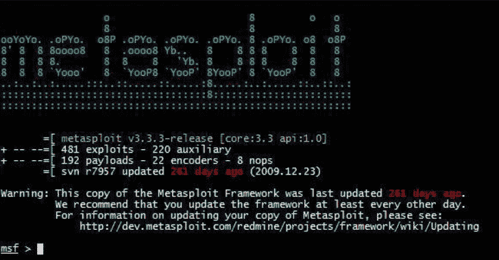

# AlanFramework:一个后开发框架

> 原文：<https://kalilinuxtutorials.com/alanframework/>

AlanFramework 是一个在红队活动中有用的后期开发框架。

**变更日志**

**2021 年 3 月 0 日至 2021 年 5 月 15 日**

*   将代理外壳`**quit**`命令重命名为`**exit**`
*   通过`**migrate**`命令实现代理迁移
*   修复了检索操作系统版本时的错误
*   在创建向导中添加了代理格式的 DLL。
*   执行`**ps**`命令，列出当前正在运行的进程
*   执行`**download**`命令以本地下载文件或整个目录
*   实施了`**upload**`命令，将文件上传到受损主机
*   将`**SuccessRequest**`实现为 HTTP 服务器响应选项，以定制 http/s 监听器响应
*   实现了`**ErrorRequest**`来定制 http/s 监听器对错误请求的响应
*   实现了将`**prepend**`和`append`作为 HTTP 服务器请求选项在代理 prof 中指定

2021 年 3 月 20 日至 20 日

*   执行代理`**detach**`命令，以临时退出已加入的代理
*   执行 shell `**detach**`命令以临时退出命令 shell
*   执行了`**listeners**`命令来列出可用的监听器
*   实现了通过 TLS 与代理通信的 HTTPS 监听器
*   执行`**get-config**`命令下载当前代理配置
*   执行了`update`命令来更新代理配置
*   现在支持 Windows7

**2021 年 1 月 0 日至 22 日**

*   首次发布

[**Download**](https://github.com/enkomio/AlanFramework)