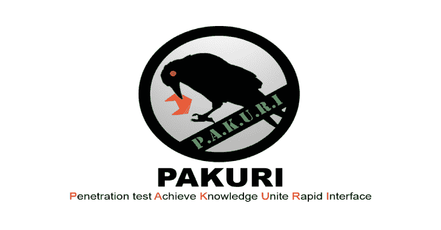

# Http-请求-走私:HTTP 请求走私检测工具

> 原文：<https://kalilinuxtutorials.com/http-request-smuggling/>

**Http-Request-straighting**是一种高严重性漏洞，攻击者通过走私模糊的 Http 请求来绕过安全控制并获得未经授权的访问以执行恶意活动，该漏洞早在 2005 年就由 watchfire 发现，后来在 2019 年 8 月由 James Kettle-(albino wax)重新发现，并在 DEF CON 27 和 Black-Hat USA 上展示，要了解有关该漏洞的更多信息，您可以参考他在 Portswigger 网站上记录完善的研究博客。因此，这个安全工具背后的想法是检测给定主机的 HRS 漏洞，检测是基于给定许可的时间延迟技术进行的，因此，要了解更多关于该工具的信息，我强烈建议您阅读我关于该工具的博客帖子。

*   https://portswigger.net/web-security/request-smuggling
*   https://portswigger.net/web-security/request-smuggling/finding
*   https://portswigger.net/web-security/request-smuggling/exploiting

[https://www.youtube.com/embed/ANIRMVwyz5o?feature=oembed](https://www.youtube.com/embed/ANIRMVwyz5o?feature=oembed)

**如何检测 HRS 漏洞？**

根据早期的研究，检测 HRS 漏洞最常见的方法是检查应用程序的响应时间，如果漏洞存在，那么响应将会有时间延迟。所以有两种不同的方法来检测这个漏洞。

*   CL。大调音阶的第 7 音
*   TE.CL

**检测(CL。TE)使用时间延迟**

检测(CL。TE)应用程序中的漏洞您需要偷偷发送如下请求，这会导致响应延迟。

**POST / HTTP/1.1
主持人:vulnerable-website.com
内容-长度:5
传输-编码:chunked
1
Z
Q**

在上面的 HTTP 请求中，前端服务器使用长度为 5 的 content-length 头，这意味着它将只处理 Z 以内的请求正文，并且它不会在第一个请求中包括 Q，后端服务器使用 Transfer-Encoding 头，它将处理请求的第一个块，并等待下一个块到达，这导致响应延迟，因为根据前端服务器的 Content-Length，它只处理长度为 5 的请求正文。

**检测(TE。CL)使用时间延迟**

察觉(TE。CL)应用程序中的漏洞您需要偷偷发送如下请求，这会导致响应延迟。

**POST / HTTP/1.1
主持人:vulnerable-website.com
内容-长度:6
传输-编码:chunked
0
G**

在上面的 HTTP 请求中，前端服务器使用 Transfer-Encoding 报头，并且在请求主体中，它发送 0，随后是表示在第一个请求中它将终止请求直到 0，并且转发请求和请求主体的剩余内容，并且后端服务器使用长度为 6 的 Content-Length 报头，其等待更多内容到达，这导致响应延迟。

**HRS 检测工具**

通过跟踪 portswigger research academy，我使用 python 开发了一个检测工具，通过使用该工具，我们可以识别应用程序是否容易受到(CL。TE)或(TE。CL ),并且为了更准确地检测漏洞，该工具具有内置的有效载荷，该有效载荷具有大约 37 个置换和检测有效载荷。TE)和(TE。CL)变体，该工具支持扫描一个单一的网址或多个网址。最重要的是，它有(–retry)选项，这意味着您可以根据重试值重试相同的有效负载，这为我们提供了一个更准确地检测此漏洞的选项。

**使用该工具前需要获得安全许可**

在扫描任何目标之前，了解一些法律免责声明是非常重要的，您应该在扫描任何目标之前获得适当的授权，否则我建议不要使用该工具扫描未经授权的目标，因为为了检测漏洞，它会通过使用(–retry)选项多次发送多个有效负载，这意味着如果出现问题，后端套接字可能会因有效负载而中毒，该特定网站的任何真正访问者可能会看到中毒的有效负载，而不是网站的实际内容。所以我强烈建议在扫描任何目标网站之前采取适当的预防措施，否则你将面临一些法律问题。

**这个工具怎么用？**

要在您的本地机器上安装此工具，您必须至少拥有 Python 版，否则 socket 将无法与目标主机建立 SSL 连接。

**安装**

**git clone https://github . com/anshumanpattnaik/http-request-straighting . git
CD http-request-straighting
pip 3 install-r requirements . txt**

**选项**

**用法:straighty . py[-h][-u URL][-urls URLS][-t time out][-m METHOD]
[-r RETRY]
HTTP 请求走私漏洞检测工具
可选参数:
-h，–help 显示此帮助信息并退出
-u URL，–URL URL 设置目标 url
-urls URLS，–URLS 设置目标 URL 列表，即(urls.txt)
-t TIMEOUT，–time out**

**使用该工具的示例用法**

**扫描一个网址**

**python3 走私. py -u [URL]**

**扫描网址列表**

**python3 走私. py -urls [URLs.txt]**

两者的探测有效载荷(CL。TE)和(TE。CL)非常通用，如果您觉得需要修改，那么您可以更新检测阵列的 payloads.json 文件中的有效负载。基于时间的 HRS 检测逻辑并不总是准确的，为了确认漏洞，我可以建议你用你的有效载荷来玩 burp-suite 涡轮入侵者。我希望你会发现我的 HRS 检测工具很有用，如果你有任何建议或发现任何问题，请随时在我的 GitHub 库中提出问题。
感谢你阅读这篇文章，祝你黑客生涯愉快🙂

[**Download**](https://github.com/anshumanpattnaik/http-request-smuggling)