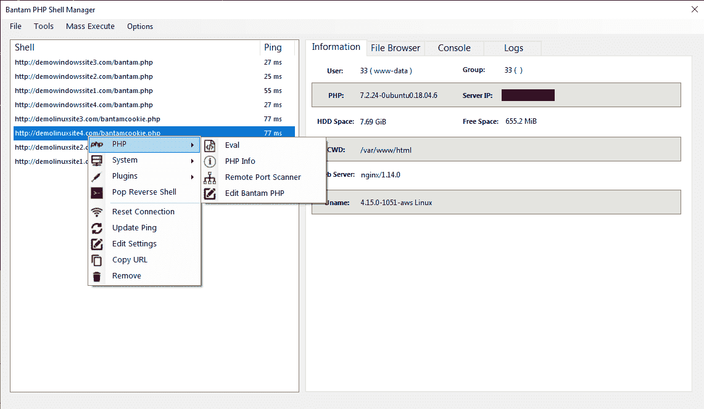

# Bantam:一个 PHP 后门管理和生成工具/C2，具有端到端的加密有效负载流，旨在绕过 WAF、IDS、SIEM 系统

> 原文：<https://kalilinuxtutorials.com/bantam/>

Bantam 是一个先进的 PHP 后门管理工具，具有轻量级服务器、多线程通信和先进的负载生成和混淆工具。具有端到端加密功能，可请求唯一的加密密钥，以及旨在绕过 WAF、IDS、SIEM 系统的有效负载流。它结合了多种有效载荷随机化和混淆技术，有助于在无法加密时防止检测。Bantam 是 linux PHP 后期开发特权的理想工具，使得上传枚举脚本变得轻而易举。Bantam 还有一个插件系统，可以很容易地将脚本和特性添加到 ui 中。它是用 C#编写的，运行在 windows 和 Linux 上，使用 wine。

**特性**

**端到端请求&响应加密——加密流程**

*   使用 openssl 或 mcrypt 对请求和响应数据进行 AES-256 位加密
*   响应加密密钥是新生成的，并嵌入到每个请求的请求有效负载中，使每个响应都是唯一的，从而防止 WAF 和 IDS 系统的检测
*   可以使用预共享密钥/iv 来嵌入请求加密密钥，或者使用带有随机生成的 iv 的预共享密钥，该 IV 通过已知的请求变量传递，使得每个请求签名都是唯一的

**主窗体—【img】**

*   获取外壳信息—[img]
*   添加外壳-[img]
*   eval tool–打开一个文本编辑器，将输入文本作为 php 有效负载进行评估
*   远程端口扫描器–使用 bantam 服务器扫描远程端口
*   PHPInfo viewer–在 html 窗口中打开 PHPInfo 页面
*   自我编辑器–编辑存储在服务器上的 Bantam 代码
*   Linux——有用的命令和文件。从 settings.xml (passwd，ps aux，ifconfig，..等等)
*   w dows–有用的 cmd 和文件。从 settings.xml(网络用户、主机、ipconfig，..等等)
*   Windows 屏幕截图抓取器–抓取当前屏幕的屏幕截图
*   插件——通过在 settings.xml 中设置一个插件，将 php 有效负载动态地包含到要执行的 ui 中
*   重置连接–从 ui 中删除当前外壳和会话信息，重新添加外壳并测试连接
*   更新 ping–更新对选定 shell 的 ping
*   编辑设置–在 ui 中打开当前外壳设置进行修改
*   复制 url–将外壳 URL 复制到剪贴板
*   删除–从用户界面中删除外壳
*   将外壳保存到 xml
*   从 XML 打开保存的 Shells

**反壳-【img】**

*   向指定的 IP/端口生成一个反向外壳
*   支持的方法–perl、netcat、netcat with pipe、telnet with pipe、php、bash、python、弹幕(全部)
*   用 chankro 绕过禁用 _ 函数& open_basedir

**后门生成器-【img】**

*   为您的设置生成一个 php 后门有效负载

**用户代理切换器**

*   随机化或定制请求中使用的用户代理

**代理设置**

*   支持 Socks 和 HTTP 代理

**批量执行**

*   在所有服务器上执行 php 有效负载
*   端口扫描程序–分布式端口扫描，在选定的服务器之间分配工作，端口扫描远程主机–[ img]
*   插件——动态地将 settings.xml 中的自定义负载包含到 gui 中，以便批量执行

**文件浏览器-【img】**

*   遍历文件目录，并在当前会话中保存目录树
*   复制文件
*   读取文件内容
*   删除文件
*   重命名文件
*   上传文件
    *   vectors–linenum . sh/Linux priv checker . sh

**控制台—【img】**

*   使用在选项表单中选择的向量向服务器发送 shell 命令，保存当前会话期间的历史记录

**日志**

*   显示可能由应用程序或服务器生成的各种日志和错误，可在选项表单中调整详细程度。

**选项-【img】**

*   记录
    *   日志级别–确定将显示哪些日志，级别越高，显示的日志越多
    *   启用全局日志
*   请求设置
    *   最大执行时间–允许请求运行最大 php 执行时间
    *   禁用错误日志–禁用请求的错误日志记录
    *   外壳代码向量–外壳代码执行方法(system/exec/Shell _ exec/passthru/popen/backticks)
    *   超时(毫秒)–默认请求超时
    *   最大帖子大小(KiB)-默认最大帖子大小
    *   最大 Cookie 大小(B)–锁定为 4096 字节
*   请求混淆
    *   注入随机评论
        *   将带有随机文本的注释注入 php 有效负载
        *   注释频率–决定将注释注入多少个位置
        *   最大长度–确定注释的最大长度
    *   随机 PHP 变量名
        *   随机选择 php 有效负载中的变量名，始终打开
        *   最大长度–确定了随机 php 文件名的最大长度

[**Download**](https://github.com/gellin/bantam)