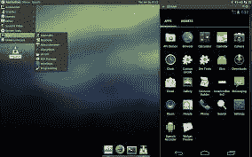

# 用于评估 Android 应用、逆向工程和恶意软件分析的虚拟机——AndroL4b

> 原文：<https://kalilinuxtutorials.com/androl4b/>

AndroL4b 是一个基于 ubuntu 的 android 安全虚拟机，mate 整合了来自各种安全书呆子和研究人员的最新框架、教学练习和实验室的积累，用于计算和恶意软件分析。

## Androl4b v.3 有什么新功能？

1.  工具已更新
2.  包括新工具和实验室
3.  升级至 Ubuntu mate 17.04
4.  一些清理工作

### **工具**

**[radar 2](https://github.com/radare/radare2)**类 Unix 逆向工程框架和命令行工具

**[弗里达](https://www.frida.re)** 注入 JavaScript，探索 Windows、macOS、Linux、iOS、Android、QNX 上的原生应用。

[**ByteCodeViewer**](https://github.com/konloch/bytecode-viewer) 安卓 APK 逆向工程套件(反编译、编辑器、调试器)

**[移动安全框架(MobSF)](https://github.com/ajinabraham/Mobile-Security-Framework-MobSF)** (Android/iOS)自动化测试框架(在此虚拟机中只是静态分析)

**[dro zer](https://github.com/mwrlabs/drozer)**Android 应用安全评估框架

**[APKtool](https://github.com/iBotPeaches/Apktool)** 逆向工程 Android Apks

**[Android studio](http://developer.android.com/tools/studio/index.html)**Android 应用开发 IDE

**[BurpSuite](https://portswigger.net/burp)** 评估应用安全

**[Wireshark](https://www.wireshark.org)** 网络协议分析器

**[马拉](https://github.com/xtiankisutsa/MARA_Framework)** 移动应用逆向工程与分析框架

**[FindBugs-IDEA](http://findbugs.sourceforge.net/)** 静态字节码分析寻找 Java 代码中的 bug

[**Android bugs 框架**](https://github.com/AndroBugs/AndroBugs_Framework) Android 漏洞扫描器，帮助开发者或黑客发现 Android 应用中潜在的安全漏洞

[**Qark**](https://github.com/linkedin/qark) 工具寻找几个与安全相关的 Android 应用程序漏洞

### 实验室:

**[该死的不安全且易受攻击的安卓应用(DIVA)](https://github.com/payatu/diva-android)** 易受攻击的安卓应用

**[InsecureBankv2](https://github.com/dineshshetty/Android-InsecureBankv2)** 易受攻击的 Android 应用

[**安卓安全沙箱**](https://github.com/rafaeltoledo/android-security) 一个展示一些提高安卓应用安全性的技术的应用

**[GoatDroid](https://github.com/jackMannino/OWASP-GoatDroid-Project)** 一个功能齐全的独立培训环境，用于培训开发人员和测试人员关于 [Android](http://kalilinuxtutorials.com/wi-fi-cracking-android-hijacker/) 安全性的知识

