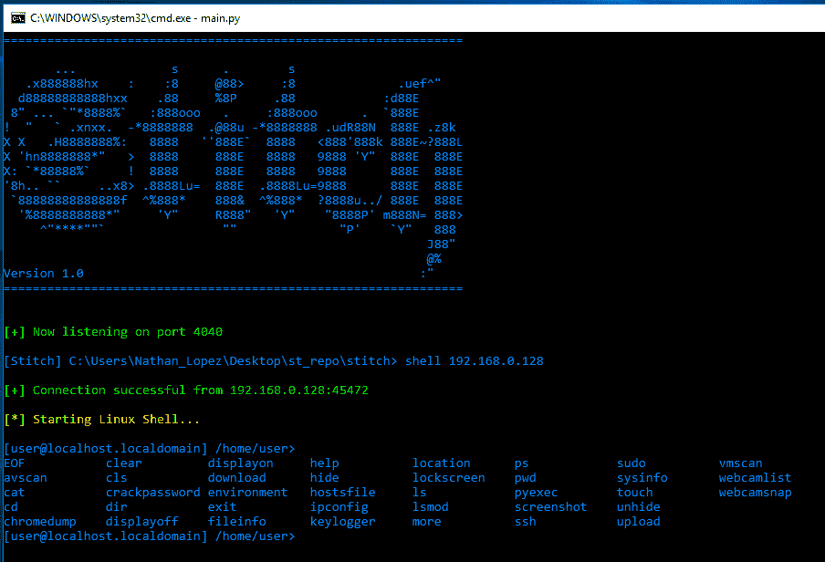
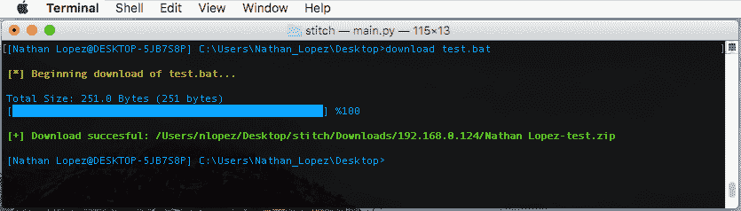

# 缝合一个跨平台 Python 远程管理工具

> 原文：<https://kalilinuxtutorials.com/stitch-a-cross-python-rat/>

[](https://kalilinuxtutorials.com/wp-content/uploads/2018/04/76fdb962-d37c-11e6-9284-093ad065aeca.png)

这是一个跨平台的 python 框架，允许你为 Windows、Mac OSX 和 UNIX 创建定制的有效负载。您可以选择有效负载是否绑定到选定的科学学科和端口，监听端口上的关联，选择在系统启动后发送系统数据的关联度电子邮件，选择在启动时开始键盘记录的关联度。创建的有效负载将 **Python RAT** 只在创建它们的操作系统上运行。

## 特征

### 跨平台支持

*   命令和文件自动完成
*   防病毒检测
*   能够关闭/打开显示器
*   隐藏/取消隐藏文件和目录
*   查看/编辑主机文件
*   查看所有系统环境变量
*   键盘记录器选项，以查看状态，开始，停止和转储日志到您的主机系统
*   查看目标机器的位置和其他信息
*   执行自定义 python 脚本，该脚本返回您打印到屏幕上的任何内容
*   截屏
*   虚拟机检测
*   从目标系统下载/上传文件
*   尝试转储系统密码哈希
*   有效负载的属性被“伪装”成其他已知的程序

### 特定于 Windows

*   显示用户/密码对话框以获取用户密码
*   转储通过 Chrome 保存的密码
*   清除系统、安全和应用程序日志
*   启用/禁用 RDP、UAC 和 Windows Defender 等服务
*   编辑文件的访问、创建和修改属性
*   创建自定义弹出框
*   查看连接的网络摄像头并拍摄快照
*   查看过去连接的 wifi 连接及其密码
*   查看有关已连接驱动器的信息
*   查看注册表值的摘要，如 DEP

### Mac OSX 特定

*   显示用户/密码对话框以获取用户密码
*   在用户的登录屏幕上更改登录文本
*   网络摄像头快照

### Mac OSX/Linux 专用

*   从目标机器到另一台主机的 SSH
*   运行 sudo 命令
*   尝试使用工具/中的密码列表强行获取用户密码
*   网络摄像头快照？(未经 Linux 测试)

## 实现的传输

主机和目标之间的所有通信都经过 AES 加密。每个 Stitch 程序都会生成一个 AES 密钥，然后将其放入所有有效载荷中。要访问有效负载，AES 密钥必须匹配。要从运行 Stitch 的不同系统进行连接，必须使用原始系统中的 showkey 命令和新系统中的 addkey 命令添加密钥。

## 实施有效载荷安装程序

“stitchgen”命令让用户可以选择在 Windows 上创建 [NSIS](http://nsis.sourceforge.net/Main_Page) 安装程序，在 posix 机器上创建 [Makeself](http://stephanepeter.com/makeself/) 安装程序。对于 Windows，安装程序将有效负载和一个 elevation exe 打包，从而阻止防火墙提示并增加持久性，并将有效负载放在系统上。对于 Mac OSX 和 Linux，安装程序会放置有效负载并尝试添加持久性。要创建 NSIS 安装程序，你必须[下载](http://nsis.sourceforge.net/Download)并安装 NSIS。

## 要求

*   [Python 2.7](https://www.python.org/downloads/)

为了便于安装，请运行与您的操作系统相对应的以下命令:

```
# for Windows
pip install -r win_requirements.txt

# for Mac OSX
pip install -r osx_requirements.txt

# for Linux
pip install -r lnx_requirements.txt 
```

*   [Pycrypto](https://pypi.python.org/pypi/pycrypto)
*   [请求](http://docs.python-requests.org/en/master/)
*   [Colorama](https://pypi.python.org/pypi/colorama)
*   [箭](https://pypi.python.org/pypi/PIL)

### 特定于 Windows

*   [Py2exe](http://www.py2exe.org/)
*   [pywin32](https://sourceforge.net/projects/pywin32/)

### Mac OSX 特定

*   [PyObjC](https://pythonhosted.org/pyobjc/)

### Mac OSX/Linux 专用

*   [PyInstaller](http://www.pyinstaller.org/)
*   [p 预期](https://pexpect.readthedocs.io/en/stable/)

## 奔跑

```
python main.py or ./main.py

```

## **截图**



[](https://github.com/nathanlopez/Stitch)