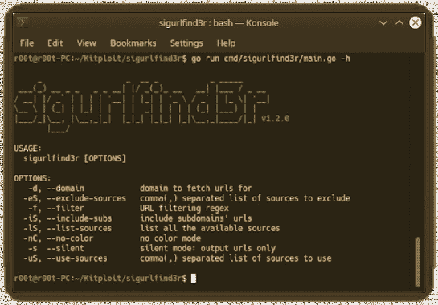

# Sigurlfind3R:从 AlienVault 的 OTX 中获取 URL 的侦察工具

> 原文：<https://kalilinuxtutorials.com/sigurlfind3r/>

**Sigurlfind3R** 是一个被动侦察工具，它从**外星人的 OTX** 、**普通爬虫**、 **URLScan** 、 **Github** 和 **Wayback Machine** 中获取已知 URL。

**用途**

**sigurlfind3r -h**

这将显示该工具的帮助。

***()_ _ _ _ _ | |/*(*)_ |*/_
/| |/*/`| | | | '__| | |_| | '_ \ / _`| |*| ' |
_ _ \ |(*|*|*| |*|*)| |*/*| _*，|__， *|*| |*|*| |*|*| |*| _*，*|/| _ | v 1 . 2 . 0
|*/
用法:
sigurlfind3r【选项】
选项:
-d，–domain 为
提取 URL 的域，-eS，–exclude-sources 逗号(，)分隔的要排除的源列表**

**例题**

**基础**

**sigurlfind3r -d tesla.com**

**包括子域**

**sigurlfind3r-d tesla.com-is**

**正则表达式过滤掉网址**

**sigurlfind3r -d tesla.com -f .】。(jpg | JPEG | gif | png | ico | CSS | eot | TIF | tiff | TTF | woff | woff 2)"**

**安装**

**来自二进制**

您可以从这个库的 releases 页面下载为您的平台预先构建的二进制文件，解压缩，然后将其移动到您的`**$PATH**`中，您就可以开始了。

**来源**

sigurlfind3r 需要 **go1.14+** 才能成功安装。运行以下命令获取 repo

**go 111 module = on go get-u-v github.com/signedsecurity/sigurlfind3r/cmd/sigurlfind3r**

**来自 Github**

**git 克隆 https://github . com/sign security/sigurlfind 3r . git&&
CD sigurlfind 3r/cmd/sigurlfind 3r/&&go build；mv sigurlfind 3r/usr/local/bin/&&
【sigurlfind 3r-h】**

**安装后**

sigurlfind3r 将在安装后工作。然而，要配置 sigurlfind3r 使用某些服务——目前是 github——您需要设置 API 键。API 密钥存储在首次运行时创建的`**$HOME/.config/sigurlfind3r/conf.yaml**`文件中，并使用 YAML 格式。可以为每个服务指定多个 API 键。

示例:

**版本:1.1.0
资料来源:
–common crawl
–github
–otx
–urlscan
–way back
【github】
–d2a 554 BBC 1a bb**

[**Download**](https://github.com/signedsecurity/sigurlfind3r)