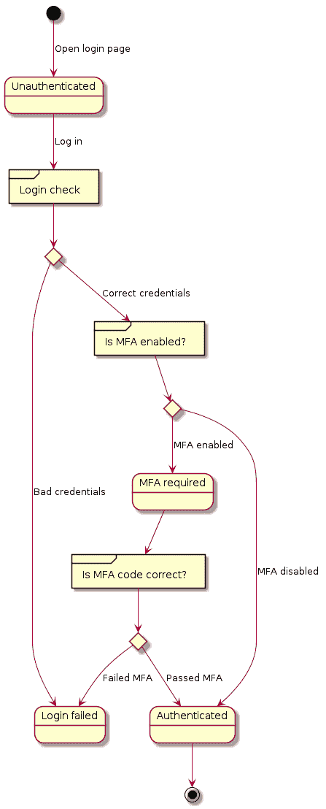
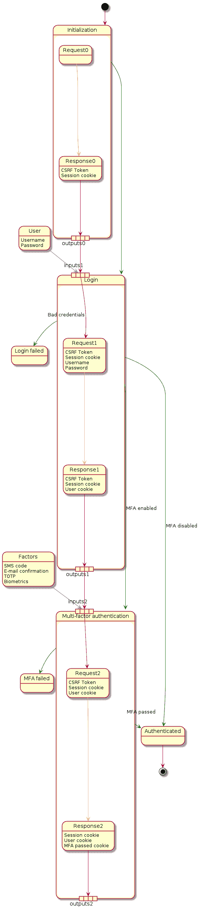
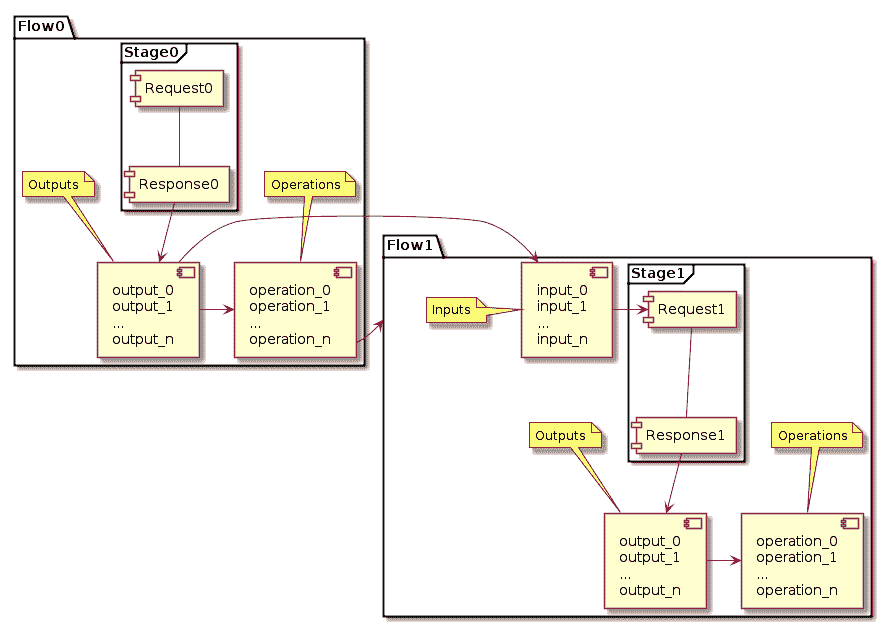

# Raider : Web 认证测试框架

> 原文：<https://kalilinuxtutorials.com/raider/>

**Raiders** 是一个旨在测试 web 应用程序认证的框架。虽然像 ZAProxy 和 Burpsuite 这样的 web 代理允许认证测试，但它们不提供测试认证过程本身的功能，即操纵相关的输入字段来识别被破坏的认证。

大多数身份验证错误都是通过手动测试或编写复制行为的自定义脚本发现的。Raider 旨在通过提供与现代认证系统中所有重要元素进行交互的接口，使测试更加容易。

**特性**

**Raider** 的目标是支持大多数现代认证系统，以下是一些其他工具无法提供的功能:

*   无限制的身份验证步骤
*   每步的输入/输出不受限制
*   有条件决定下一步的能力
*   接收响应时运行任意操作
*   易于编写自定义操作和插件

**工作原理**

**Raider** 将认证视为有限状态机。每个身份验证步骤都是一个不同的状态，有自己的输入和输出。这些可以是 cookies、标头、CSRF 令牌或其他信息。

每个应用程序都需要自己的配置文件才能让**突袭机**工作。配置是用 [Hylang](https://docs.hylang.org/) 写的。语言的选择有多种原因，主要是因为它是嵌入在 Python 中的 Lisp 方言。

使用 Lisp 是必要的，因为有时认证会变得非常复杂，使用静态配置文件不足以涵盖所有细节。Lisp 使得结合代码和数据变得容易，这正是这里所需要的。

通过使用真正的编程语言作为配置文件，赋予了 **Raider** 很大的权力，而伴随着巨大的权力而来的是巨大的责任。理论上，人们可以在应用程序配置文件中编写整个恶意软件，这意味着你应该小心正在执行的内容，并且**不要使用来自你不信任的来源的配置文件**。**攻略**会评估里面的一切。hy 文件，这意味着如果您不小心，您可能会搬起石头砸自己的脚，损坏系统上的某些东西。

**安装**

这个包可以在 Python 包索引中找到，所以要安装最新稳定版的*攻略*只需使用命令`**pip3 install --user raider**`

警告

《突袭者》是在 Python 3.9 上开发的，还没有在旧版本上测试过，所以可能会有不兼容的问题。

如果你喜欢冒险，想要从源代码中构建 *Raider* ，你可以这么做。如果你想为开发做贡献，无论如何你都需要这样做。

首先用以下命令克隆存储库

建议使用 python 虚拟环境，以避免在处理代码时出现 python 不兼容的奇怪问题。然而，您仍然可以使用项目目录中的`**pip3 install .**`在本地安装包。

如果你选择使用虚拟环境，安装诗歌，因为这是如何开发*袭击者*。

一旦安装了诗歌，你就可以准备虚拟环境并切换到它与*袭击者*一起工作:

**cd 攻略
诗歌安装
诗歌外壳**

现在你在虚拟环境中工作，这里应该有*攻略*。

**架构**

**抽象认证过程**

首先，让我们仔细看看 web 身份验证是如何工作的。每个认证过程都可以抽象为一个有限状态机。

在高层次上，我们从未经身份验证的状态开始，用户向应用程序发送他们的凭据，也可以是多因素身份验证(MFA)代码，如果两项检查都通过，我们就进入了经过身份验证的状态。一个典型的现代 web 应用程序将如下图所示:

**攻略中的基本概念**

现在让我们放大来看看细节。我们没有处理状态(*未认证*、*登录失败*、*需要 MFA*和*已认证*)，而是定义了阶段的概念，它描述了包含一个请求和相应响应的客户机和服务器之间的信息交换。

下面的例子展示了一个假想的 web 应用程序的身份验证过程:

为了描述上面定义的例子中的认证过程，我们需要三个**阶段**。第一个，*初始化*，没有任何输入，但是创建了*会话 cookie* 和 *CSRF 令牌*作为输出。

这些输出连同用户凭证一起被传递到下一个**阶段**、*登录*。使用这些信息构建请求，并生成新的输出。在这种情况下，我们有新的 *CSRF 令牌*，更新的*会话 cookie* ，以及标识用户的新 cookie:*用户 cookie* 。

根据 MFA 是否启用，第三**阶段** *多因素认证*可能被跳过或执行。如果启用，来自前一个**阶段**的输出将作为输入传递给这个阶段，用户被要求输入下一个[因子](https://raider.readthedocs.io/en/latest/user/definitions.html#term-Factor)，一个新的 cookie 将被设置，证明用户已经通过检查并被正确认证。

在**攻略**中，使用[流](https://raider.readthedocs.io/en/latest/user/definitions.html#term-Flow)对象实现阶段。认证过程由一系列相互连接的流程组成。每一个都接受输入并产生输出。除此之外，流对象实现了[操作](https://raider.readthedocs.io/en/latest/user/definitions.html#term-Operation)，这些操作可用于在收到响应时运行各种动作，但最重要的是，它们用于通过有条件或无条件地定义下一阶段来控制认证过程。因此，举例来说，如果 HTTP 响应代码是 200，就可以跳到阶段 X，如果是 403，就可以跳到阶段 Y。

输入和输出通常是同一个对象，您可能希望从一个流到下一个流更新它的值(例如，CSRF 令牌在每个阶段都会发生变化)。这是在 Raider 中使用插件实现的。

插件是一些代码，可以作为要发送的 HTTP 请求的输入，和/或作为 HTTP 响应的输出。它们用于促进流之间的信息交换。**攻略**为用户提供了用一小段 hylang 代码编写新插件的选项。

一旦收到响应，操作将被执行。操作的主要功能是定义下一个流。但是他们可以做任何事情， *Raider* 让编写新操作变得很容易。

**教程**

**准备**

在使用**攻略**之前，你必须在 [hyfiles](https://raider.readthedocs.io/en/latest/user/definitions.html#term-hyfiles) 里面设置[认证](https://raider.readthedocs.io/en/latest/user/definitions.html#term-Authentication)。为此，您可能需要使用一个 web 代理( [BurpSuite](https://portswigger.net/burp) 、 [ZAProxy](https://www.zaproxy.org/) 、 [mitmproxy](https://mitmproxy.org/) 等)来查看应用程序正在生成的[请求](https://raider.readthedocs.io/en/latest/user/definitions.html#term-Request)，并识别每个请求的所有重要输入和输出。

捕获流量后，可能会有许多与身份验证无关的 HTTP 请求。首先删除所有静态文件(。png，。js，。pdf 等……)。当需要处理的请求越来越少时，是时候深入了解身份验证是如何工作的了。

在这一点上，我们假设*你已经了解了*Python 和 Hylang 的基础知识，所以本文档不会涵盖可以在其他地方找到的信息。

本教程将展示 Reddit 在撰写本文时使用的身份验证。当你读到这篇文章时，未来可能会有所不同，如果他们更新了身份验证的工作方式或改变了 HTML 结构，那么无论如何你都必须自己完成这些工作。

最简单的方法是从一个经过身份验证的请求开始往回走。这应该是某种只在用户已经通过身份验证时才起作用的请求。我为 reddit 选择了“unread_message_count ”,请求如下所示:

**获取 https://s.reddit.com/api/v1/sendbird/unread_message_count HTTP/1.1
用户代理:Mozilla/5.0(X11；Linux x86 _ 64RV:89.0)Gecko/2010 01 01 Firefox/89.0
Accept:application/JSON
Accept-Language:en-US，en；q=0.5
内容类型:应用/json
来源:https://www.reddit.com
DNT:1
授权:无记名【修订令牌】
引用:https://www.reddit.com/
连接:保活
宿主:s.reddit.com**

如您所见，我们通过身份验证发送到此 URL 的唯一信息是不记名令牌。

我们定义了一个新的流程来检查 hy 中的未读消息:

**(setv get_unread_messages
(流
:name " GET _ unread _ messages "
:Request(请求
:method " GET "
:headers[(header . bearer auth access _ token)]
:URL " https://s . Reddit . com/API/v1/sendbird/unread _ message _ count "))**

在 Hy 中，`setv`用于设置新的变量。这里我们创建了变量`get_unread_messages`,它将保存关于这个流的信息。这将保存在 [_](https://raider.readthedocs.io/en/latest/dev/special_variables.html#var-functions) 函数的特殊变量中，该变量存储不影响认证的流。

对于`Flow`对象，唯一需要的参数是名称和请求。名称是一个用于引用目的的字符串，请求包含实际的 HTTP 请求定义作为一个`Request`对象。

请求对象只需要方法和 url。其他参数是可选的。我们将原始请求翻译成**突袭机**配置格式，为了使用访问令牌，我们需要在请求头中定义它。因为这是一个承载报头，我们使用`Header.bearerauth`和`access_token`，我们将在后面创建。

**获取访问令牌**

下一步是找出这个令牌是在哪里生成的，以及我们如何提取它。在之前的响应中搜索这个令牌，我们可以看到它最初出现在对 reddit 主页面的请求中。它位于响应的

**[…]" session ":{ " access TOKEN ":"[redated _ TOKEN]"，" expires ":" 2021-06-23t 19:30:10.000 z "[…]**

使用**突袭机**提取令牌最简单的方法是使用 Regex 模块。该模块搜索您提供的正则表达式，并返回第一个匹配组的值。组是在`(`和`)`字符之间的字符串。我配置的最终对象如下所示:

**(setv access _ token
(regex
:name " access _ token "
:regex " \"accesstoken\":\"([^\"]+)\ " ")**

我们将变量`access_token`设置为`Regex`对象，内部名称为`access_token`，这将返回“accessToken”部分后双引号中的字符串值。

现在我们需要定义获取这个访问令牌的实际请求。为此，我们更仔细地看一下创建此响应的实际请求:

**获取 https://www.reddit.com/ HTTP/1.1
用户代理:Mozilla/5.0(X11；Linux x86 _ 64RV:89.0)Gecko/2010 01 01 Firefox/89.0
接受:text/html，application/xhtml+xml，application/XML；q=0.9，image/webp，*/*；q=0.8
接受-语言:en-US，en；q=0.5
DNT: 1
升级-不安全-请求:1
连接:保活
Cookie:CSV = 1；edgebucket = PPJTEvVRvoolrqFkYwg _ ENABLED _ IDPS =谷歌；loid =[已编辑]；eu _ cookie = { % 22 opted % 22:true % 2C % 22 non essential % 22:false }；token _ v2 =[密文]；Reddit _ session =[redited]
主持人:www.reddit.com**

现在我们可以看到这个请求发送了几个 cookies。他们中的大多数人都在这里。为了查看请求成功需要哪一个，我们逐个删除它们，并查看是否在响应中获得了我们需要的信息。通过这样做，我发现我们唯一需要的 cookie 是`**reddit_session**`。只要我们在请求中提供它，我们就会在响应中得到`access_token`。有了这些信息，我们现在可以编写请求的定义:

**(setv get_access_token
(流
:name“GET _ access _ token”
:Request(请求
:method“GET”
:URL“https://www . Reddit . com/”
:cookies[Reddit _ session])
:outputs[access _ token]
:operations[(Print access _ token)
(next stage“GET _ unread _ messages”)])**

[**Download**](https://github.com/DigeeX/raider)