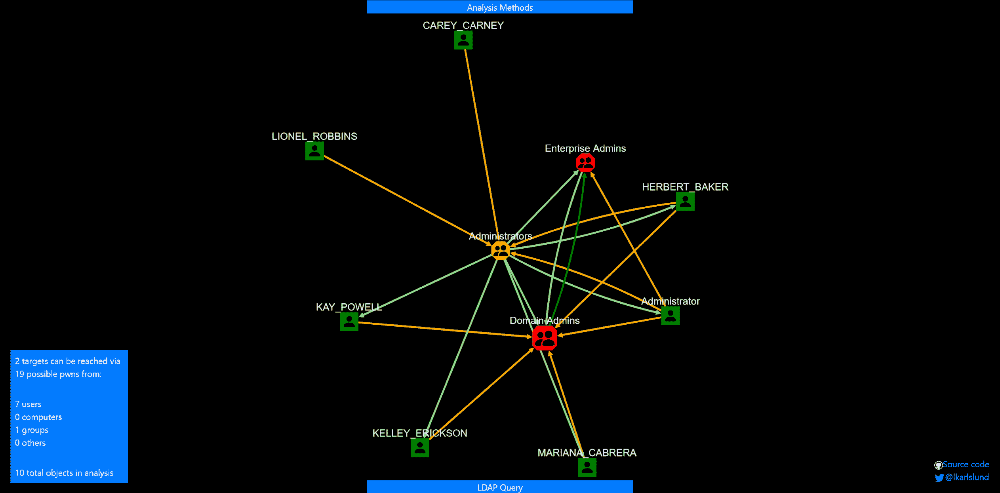
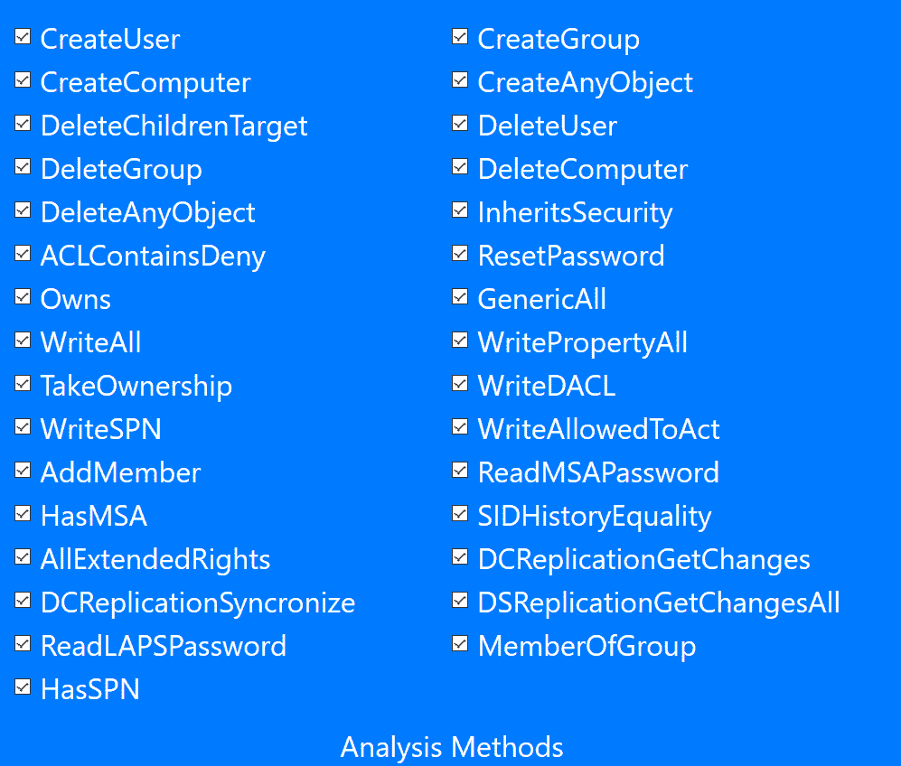
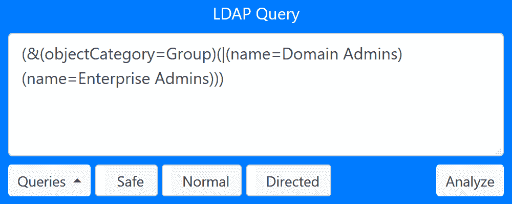
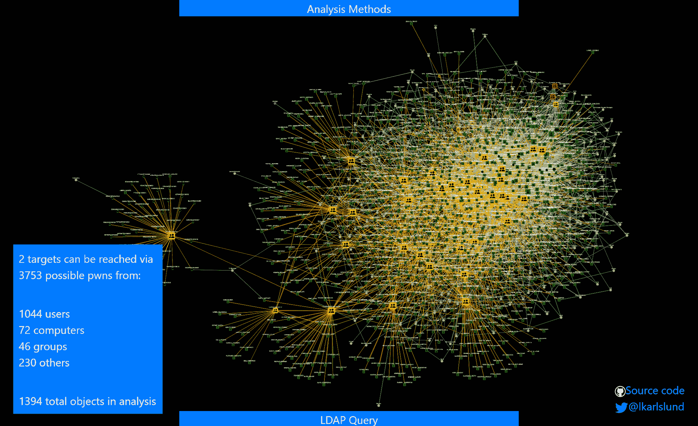
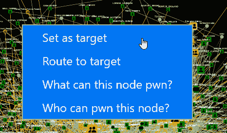
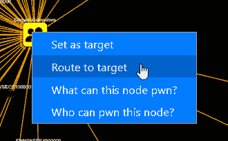
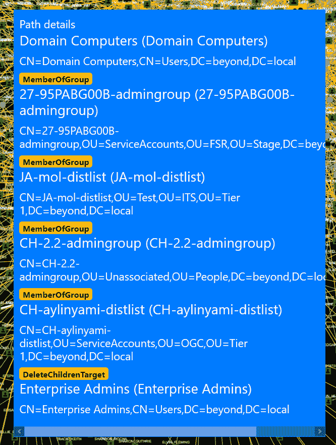

# adalanche:Active Directory ACL Visualizer 和 Explorer

> 原文：<https://kalilinuxtutorials.com/adalanche/>

**adalanche** 是一个活动目录安全是出了名的困难。小型组织通常不知道他们在做什么，而且太多的人只是被添加到域管理员中。在大型组织中，有大量具有不同需求的人，他们在 AD 中被授予不同程度的权力。在某个时候，有人犯了一个错误，那会让你付出沉重的代价。

**在自己的基础设施上运行 adalanche**

在运行之前，您应该确保您拥有权限🙂尽管该软件是无害的，只是使用 LDAP 服务来读取任何用户可以访问的数据，但你的基础设施/SOC 团队可能会对你非常生气。

**快速启动，选择其中一个**:

*   构建您自己的:
    *   安装 go 1.16
    *   你的操作系统将会有一个二进制文件
    *   你将拥有 Windows、Linux 和 OSX 的二进制文件
*   从“actions”选项卡下载任何最近提交的二进制工件
*   从 Releases 下载最新的版本(实际上不是首选，因为所有的版本在几天后都会因为新的提交而过时)

该工具试图尽可能多地自动检测，因此在加入 Windows 域的机器上运行它应该不需要任何参数:`**adalanche.exe**`

如果没有给出命令，该工具将以转储-分析模式运行(转储，然后分析)。有关其他可能性，请参见程序选项。

如果您在一台未加入域的 Windows 机器或另一个操作系统上，您至少还需要-domain 参数。

LDAPS (TLS 通过端口 636)是默认的。如果你在实验室，你还没有设置 CA，你会得到连接错误，因为计算机不信任 AD 证书。用`**adalanche -authmode NoTLS -port 389**`切换到 LDAP

为 contoso.local 创建缓存文件:`**adalanche -domain contoso.local -username joe -p**assword Hunter42 dump`

分析 contoso.local 的缓存文件并启动浏览器:`**adalanche -domain contoso.local analyze**`

**用户界面**

启动后，你可以看到谁可以 pwn“域管理员”和“企业管理员”。查询目标用红色标记。如果你在这个上面有很多对象，恭喜你，你正在运行一个 pwnshop。

下面的例子是从包含域 beyond.local 加载的，这是一个合成域，被 BadBlood 严重破坏了。您可以使用`**adalanche -domain beyond.local analyze**`尝试相同的分析

您的浏览器应该会弹出:

这个合成广告没有真正令人兴奋的结果。是的，有些用户是域管理员和管理员。但是让我们扩大一下搜索范围。

**分析方法**

点击页面底部的“分析方法”选项卡，您会看到:

(从这张截图开始，添加了更多方法)

该工具可以寻找许多场景，但默认情况下是相当简单的场景，可以让您控制一个对象。因为这没有产生任何结果，所以让我们尝试在启用所有方法的情况下进行扩展。检查缺少的框，我们提交另一个查询。

**LDAP 查询弹出**

当您按下页面底部的“LDAP 查询”选项卡时，您会看到搜索界面:

你输入一个你想要搜索的东西的查询。您还可以选择添加一个辅助排除查询，用逗号分隔 include 和 expclude 查询。排除查询中匹配的内容永远不会添加到结果中。

*   “Quieries”按钮只是为了激发灵感，带有一些预定义的查询让你开始。
*   “安全”/“强制”按钮允许您运行返回超过 1000 个对象的请求(可能会使您的浏览器选项卡崩溃)。
*   “最大深度”会限制结果，因为它不会超出目标深度。

分析:

*   普通搜索可以在 LDAP 查询中 pwn 选择的其他对象(即谁可以访问这些对象)
*   反向搜索您的 LDAP 查询目标可以 pwn 的对象(例如，这些对象可以到达什么位置)

当我被警告分析将返回超过 1000 个对象时，我启用了“强制”，并按下了“分析/正常”。

哇——太多了。但是，所有这些对象会突然接管系统吗？不，不一定，这取决于所用的分析方法。我们启用了 CanDelete*、CanCreate*和 InheritsSecurity 方法。

让我们来看看这里发生了什么——右键单击您的一个目标，然后选择“设为目标”。

然后右键单击其他人，并选择“路由到目标”。

然后你会得到一条路线，这条路线显示了到达目标的最佳路径。

因此，这里的问题只是组是其他组的嵌套成员，但是在最后，您会看到有人在父容器上设置了 DELETE_CHILD 标志，从而获得了删除(或可能移动)目标的权利。那看起来确实不对，不是吗？

如果您检查“域用户”对象，您将看到它没有 InheritsSecurity 标志，因此您不能通过移动它来真正地 pwn 它。

所以，在你自己的数据上试试吧——看看你的用户能通过搜索(&(object category = Person)(Name = your log in))得到什么，然后进行反向搜索。也许你最终会加入你所属的团体，也许你能接触到比你想象的更多的东西…

记住，你可能会得到太多的结果。用(&(attribute = something)(_ limit = 10))限制目标的选择，只获得 10 个随机目标(参见下面的 LDAP 查询)

**作战理论**

adalanche 的工作方式与其他工具稍有不同，因为它可以从活动目录服务器转储所有内容，然后保存到高度压缩的二进制缓存文件中以备后用。任何非特权用户都可以进行这种转储，除非 Active Directory 已经被强化以防止这种情况(几乎没有人这样做)。

分析阶段是在缓存文件上完成的，因此在进行分析时不必连接到系统。通过这种方式，你可以探索不同的场景，并提出不容易回答的问题。

**分析/可视化**

该工具在您的浏览器中就像一个交互式地图，默认为 ldap 搜索查询，向您显示如何成为“域管理员”或“企业管理员”(即所述组的成员或接管这些组的直接或间接成员的帐户)。

**LDAP 查询**

该工具有自己的 LDAP 查询解析器，通过使用熟悉的搜索语言，可以很容易地搜索其他要接管的对象。

**查询支持:**

*   所有属性名称的匹配不区分大小写
*   使用星号语法(member=*)检查属性是否存在
*   使用等式(=)匹配字符串值时不区分大小写
*   使用和> =运算符进行整数比较
*   如果搜索值包括，则使用等式进行全局搜索。或者*
*   如果搜索值用正斜杠括起来，则使用等式进行区分大小写的 regexp 搜索:(name=/^Sir.*混合。*lot$/(可以用/(？I)图案/旗帜，参见 https://github.com/google/re2/wiki/Syntax)
*   可扩展匹配:1.2.840.113556.1.4.803(也可以使用:和:)LDAP_MATCHING_RULE_BIT_AND
*   可扩展匹配:1.2.840.113556.1.4.804(也可以使用:或:)LDAP_MATCHING_RULE_BIT_OR
*   可扩展匹配:1.2.840.113556.1.4.1941(也可以使用:dn CHAIN:)LDAP _ MATCHING _ RULE _ IN _ CHAIN
*   自定义可扩展匹配:计数–返回属性值的数量(成员:计数:> 20 表示组的成员数超过 20)
*   自定义可扩展匹配:长度–匹配属性值的长度(名称:长度:> 20 表示对象具有长名称)
*   自定义可扩展匹配:自——将属性解析为时间戳，将值解析为持续时间——pwdLastSet:自:
*   合成属性:_limit (_limit=10)在前 10 次命中时返回 true，在剩余的命中时返回 false，最多输出 10 个项目
*   综合属性:_random100 (_random100<10)允许您返回随机百分比的结果(&(object class = Person)(_ random 100 < 1))为您提供 1%的用户
*   合成属性:_ can pwn–允许您根据他们可以选择的对象直接 pwn*(&(object class = Group)(_ can pwn = reset password))为您提供所有被分配了重置密码权限的组*
*   *合成属性:_ pwn able–允许您根据如何直接对对象进行 pwn 操作来选择对象*(&(object class = Person)(_ pwn able = reset password))为您提供所有可以重置密码的用户**

**[**Download**](https://github.com/lkarlslund/adalanche)**