# PickleC2:一个后开发和横向移动框架

> 原文：<https://kalilinuxtutorials.com/picklec2/>

[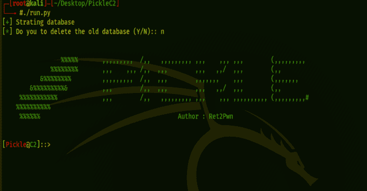](https://1.bp.blogspot.com/-MFx-3qOusmo/YSckZ-rn5PI/AAAAAAAAKkg/gK81AmYmHzoRIKUIDTK8yIfkUDLu4XVUQCLcBGAsYHQ/s728/PickleC2_1_c2-792326%2B%25281%2529.png)

PickleC2 是一个用 python3 编写的简单的 C2 框架，用于帮助社区的渗透测试人员进行 red 团队合作。

PickleC2 能够导入您自己的 PowerShell 模块进行后期开发和横向移动，或者自动执行该过程。

**特性**

有一个为测试版植入的是 powershell。

1.  PickleC2 是完全加密的通信，即使在通过 HTTP 通信时也能保护 C2 流量的机密性和完整性。
2.  PickleC2 可以毫无问题地处理多个监听器和植入
3.  PickleC2 支持任何想要添加自己的 PowerShell 模块的人

**未来特征**

在接下来的更新中，pickle 将支持:

1.  去植入
2.  不使用 System.Management.Automation.dll 的 Powershell-Less 植入物。
3.  将支持可延展的 C2 型材。
4.  HTTPS 通信将得到支持。注意:即使是 HTTP 通信也是完全加密的。

**安装**

PickleC2 是一个开源软件，可以在 Github 上找到。PickleC2 目前只支持 linux，你可以通过 https://github.com/xRET2pwn/PickleC2 下载

**安装和设置**

PickleC2 用 Python3 编写，在 Kali Linux 上开发和测试。

**在 Linux 上安装 pickle C2**

Picklec2 可以在 Github 上找到。

`**git clone https://github.com/xRET2pwn/PickleC2.git**`

`**cd PickleC2**`

安装 Python3 和 pip3

`**sudo apt install python3 python3-pip**`

安装 PickleC2 要求

`**python3 -m pip install -r requirements.txt**`

运行 PickleC2

`**./run.py**`

运筹学

`**python3 run.py**`

**如何使用 PickleC2**

PickleC2 是如此简单易用，你需要的一切都可以在帮助选项中找到

**如何帮助**

help 命令将显示您需要的所有内容，help 可用于通过`**help <Option>**`显示任何选项的帮助

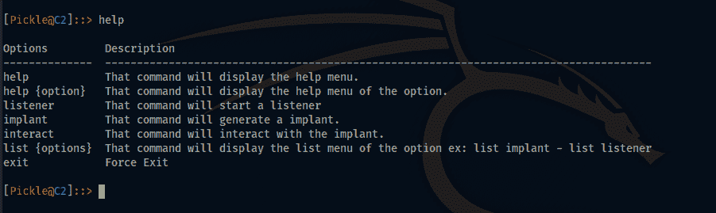

**如何监听**

你可以使用`**help listener**`命令来显示所有的监听器命令。

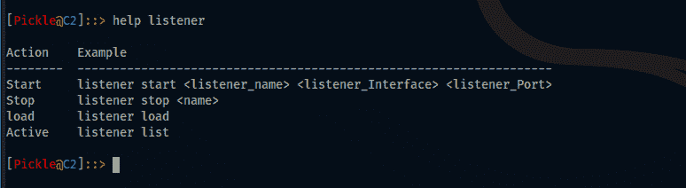

Listeners 构建在 flask 上。

FLASK 是一个流行的 Python web 框架，这意味着它是一个用于开发 web 应用程序的第三方 Python 库。

**启动监听器**

你可以让你的听众通过

**监听器启动[监听器名称][监听器接口][监听器端口]**

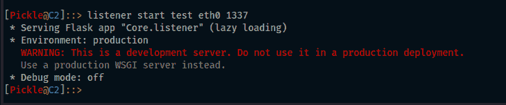

**停止监听器**

你可以阻止你的听众通过

**监听器停止[监听器名称]**

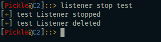

**列表监听器**

您可以通过列出所有侦听器

**听众列表**

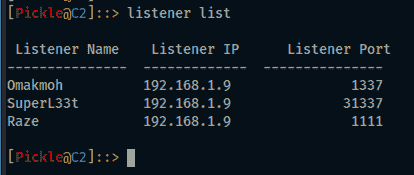

**加载监听器**

如果您有一个不活动的侦听器，并且您需要激活它们，则可以使用 load listener。

**监听器负载**

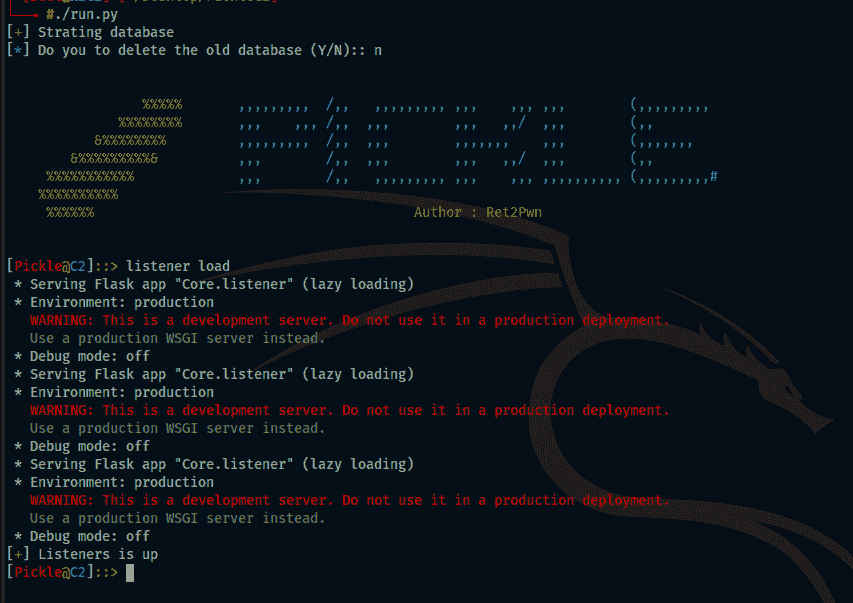

**如何植入**

在本节中，您将能够创建您的植入物。

**生成植入物**

你可以通过。

**植入生成【听众 _ 姓名】【植入 _ 语言】【植入 _ 姓名】**

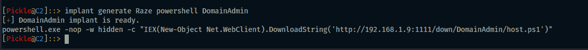

**列出活动植入物**

您可以通过列出所有活动的植入物

`**implant list**`

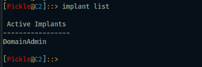

**如何互动**

收到植入外壳后，您可以通过

**互动【植入名称】**

进入交互部分后，您可以使用帮助命令来显示交互命令。

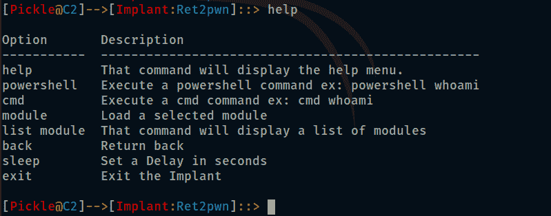

**执行 Powershell**

有一个通过执行 PowerShell 命令的选项

**powershell【命令】**

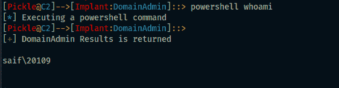

**执行命令**

有一个通过执行 CMD 命令的选项

**cmd【命令】**

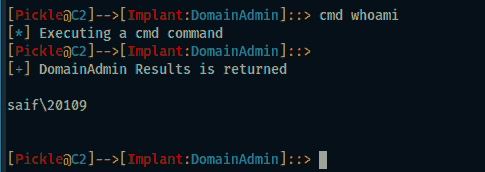

**调用模块**

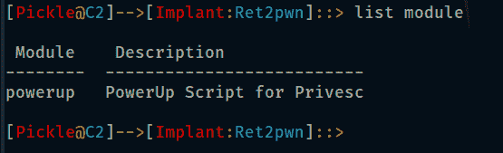

有一个通过调用 PowerShell 脚本的选项

**模块【模块名称】**

**设置睡眠**

有一个通过设置延迟时间的选项

**睡眠【秒钟】**

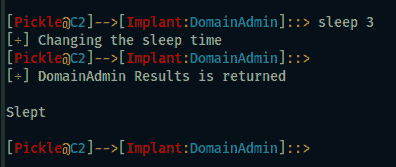

**退出植入**

可以选择通过以下方式结束植入活动

**退出**

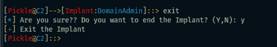

**PickleC2 模块**

PickleC2 支持任何人通过在 modules 文件夹中添加 powershell 模块和在数据库中添加模块来添加他自己的 powershell 脚本以在他的目标中调用。

**添加 PowerShell 模块**

任何想要添加 powershell 模块的人都必须遵循以下步骤:

*   运行 AddModule.py 脚本。

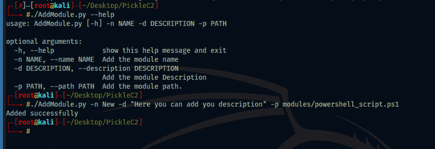

*   在模块文件夹中添加 powershell 模块。

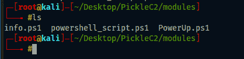

**使用模块**

PickleC2 使用起来非常简单，使用一个模块你需要做的就是

*   互动<target_name></target_name>

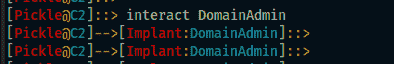

*   模块<module_name></module_name>

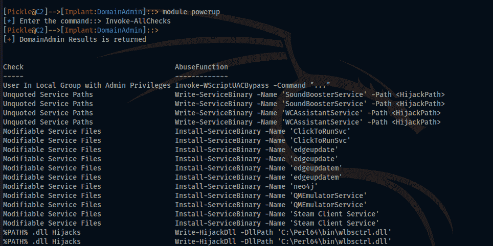[**Download**](https://github.com/xRET2pwn/PickleC2)