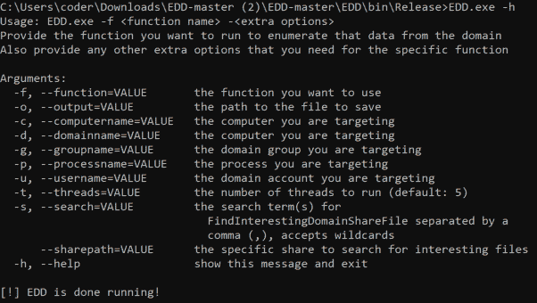

# EDD:枚举域数据

> 原文：<https://kalilinuxtutorials.com/edd/>

**EDD** (枚举域数据)的设计类似于 Power View，但在. NET 中。Power View 本质上是最终的域枚举工具，我们想要一个我们自己开发的. NET 实现。这个工具很大程度上是通过查看大量现有项目中不同功能的实现并将它们组合到 EDD 中来组装的。

**用途**

要使用 EDD，您只需调用应用程序，提供您想要运行的函数(如下所列)并提供该函数使用的任何可选/必需参数。

**功能**

下列函数可以与-f 标志一起使用，以指定要枚举的数据/要采取的操作。

**森林/域信息**

**getdomain sid–返回域 sid(如果未提供域，则默认为当前域)
getforest–返回当前林的名称
getforestdomains–返回当前林中所有域的名称
convertsidtoname–将 SID 转换为相应的组或域名(使用-u 选项提供 SID 值)
getadc sservers–获取当前域中运行 AD CS 的服务器列表**

**电脑信息**

**获取域中所有计算机的列表
获取域控制器列表
获取域共享列表**

**用户信息**

**getnetlocalgroupmember–返回远程系统上本地组中所有用户的列表
getnetdomaingroupmember–返回域组中所有用户的列表
getdomain user–检索关于特定用户的信息(名称、描述、SID、域组)
getnetsession–返回目标系统上具有会话的帐户列表
getnetloggedon–返回登录到目标系统的帐户列表
getuserswithspns–返回与 SPN 相关联的所有域帐户的列表**

**连锁信息**

**finddomainprocess–在域中的所有系统上搜索特定的进程(需要远程系统上的管理员访问权限)
finddomainuser–在域环境中搜索指定的用户或组，并尝试查找活动会话(默认情况下搜索域管理员)
findtamingdomainsharefile–在域环境中搜索所有可访问的共享。一旦找到，它将解析所有文件名中的“有趣”字符串
findwritableshares–枚举域中的所有共享，然后检查当前帐户是否可以在根级共享中创建一个文本文件，以及一个级别的深度。**

[**Download**](https://github.com/FortyNorthSecurity/EDD)