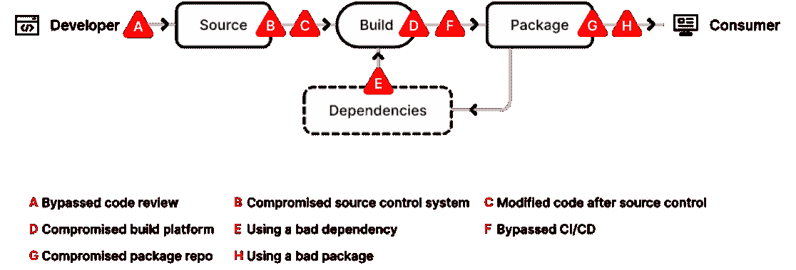
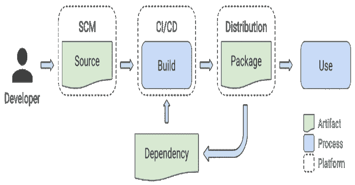

# SLSA:软件产品的供应链层次

> 原文：<https://kalilinuxtutorials.com/slsa/>

**SLSA** (发音为“salsa”)是一个从源代码到服务的安全框架，为任何从事软件工作的人提供了一种通用语言，以提高软件安全性和供应链完整性的水平。

**了解 SLSA 的最佳方式是访问 slsa.dev.**

**这个回购里有什么？**

此回购的主要内容是 docs/目录，其中包含核心 SLSA 规范和 slsa.dev 网站的源代码。

你可以在这里阅读 SLSA 的文档:

*   级别(定义框架)

要求(如何实现合规性)

使用示例

我们的路线图

**安全等级**

每一级都提供了一个不断增加的可信度，一种表明软件没有被篡改并且可以安全地追溯到其源头的方式。

| 水平 | 描述 | 例子 |
| --- | --- | --- |
| one | 构建过程的文档 | 未签名出处 |
| Two | 构建服务的防篡改性 | 托管源代码/版本，签名出处 |
| three | 防止对特定威胁的额外抵抗 | 主机上的安全控制，不可伪造的出处 |
| four | 最高级别的信心和信任 | 双方评审+密封构建 |

实现理想的安全状态可能需要数年时间，中间里程碑非常重要。SLSA 指导你逐步提高你的软件的安全性。关键基础设施或重要业务运营中使用的构件可能希望获得更高级别的安全性，而风险较低的软件可以在它们感到舒适时停止。

**详解**

| 水平 | 要求 |
| --- | --- |
| Zero | **无担保。** SLSA 0 代表没有任何 SLSA 水平。 |
| one | **构建过程必须是完全脚本化/自动化的，并生成出处。**起源是关于工件是如何构建的元数据，包括构建过程、顶级源和依赖关系。知道出处可以让软件消费者做出基于风险的安全决策。SLSA 1 的出处不防止篡改，但它提供了基本级别的代码源代码识别，并有助于漏洞管理。 |
| Two | 需要使用版本控制和生成认证出处的托管构建服务。这些额外的要求让软件消费者对软件的来源更有信心。在这个级别上，起源防止了在构建服务受信任的范围内的篡改。SLSA 2 也提供了一个简单的升级到 SLSA 3 的途径。 |
| three | 源平台和构建平台满足特定的标准，以分别保证源的可审核性和来源的完整性。我们设想了一个认证流程，通过该流程，审计员证明平台符合要求，消费者可以信赖。SLSA 3 通过防止特定类别的威胁，如交叉构建污染，提供了比早期版本更强的防篡改保护。 |
| four | **需要两个人审查所有变更，以及一个密封的、可重复的构建流程。**两人审核是捕捉错误和阻止不良行为的行业最佳实践。密封的构建保证了出处的依赖列表是完整的。虽然不是严格要求，但是可再现的构建提供了许多可审计性和可靠性的好处。总的来说，SLSA 4 给了消费者高度的信心，软件没有被篡改。 |

SLSA 等级是不可传递的(见我们的常见问题)。这使得每个工件的 SLSA 评级相互独立，允许基于风险的并行进度和优先级。级别描述了工件的构建过程和顶级源代码的完整性保护，但是没有描述工件的依赖关系。依赖项有它们自己的 SLSA 等级，SLSA 4 工件有可能从 SLSA 0 依赖项构建。

**等级要求**

下表总结了每个级别的要求。

| 要求 | SLSA 1 号 | SLSA 2 | SLSA 3 | SLSA 4 |
| --- | --- | --- | --- | --- |
| 源代码-版本控制 |  | -好的 | -好的 | -好的 |
| 来源-核实的历史 |  |  | -好的 | -好的 |
| 来源-无限期保留 |  |  | 18 个月。 | -好的 |
| 来源-两人审查 |  |  |  | -好的 |
| 构建–脚本构建 | -好的 | -好的 | -好的 | -好的 |
| 构建–构建服务 |  | -好的 | -好的 | -好的 |
| 建筑——短暂的环境 |  |  | -好的 | -好的 |
| 构建-隔离 |  |  | -好的 | -好的 |
| 构建-无参数 |  |  |  | -好的 |
| 建造-密封 |  |  |  | -好的 |
| 构建–可重复 |  |  |  | ○ |
| 出处——可用 | -好的 | -好的 | -好的 | -好的 |
| 出处-已认证 |  | -好的 | -好的 | -好的 |
| 出处——服务生成 |  | -好的 | -好的 | -好的 |
| 出处-不可伪造 |  |  | -好的 | -好的 |
| 出处-依赖性完成 |  |  |  | -好的 |
| 通用–安全性 |  |  |  | -好的 |
| 普通-访问 |  |  |  | -好的 |
| 普通–超级用户 |  |  |  | -好的 |

*○ =必须，除非有正当理由*

**供应链威胁**

攻击可能发生在典型软件供应链的每一个环节，在当今环境下，这类攻击越来越公开、具有破坏性且代价高昂。在开发 SLSA 的过程中，每个级别的要求都是为了具体降低此类已知示例的风险。

最近许多引人注目的攻击是供应链完整性漏洞的后果，本可以通过 SLSA 的框架加以防止。例如:

|  | 威胁 | 已知示例 | SLSA 能帮上什么忙 |
| --- | --- | --- | --- |
| A | 将错误代码提交到源存储库 | Linux 伪君子犯:研究人员试图通过邮件列表上的补丁故意将漏洞引入 Linux 内核。 | 两人审查发现了大部分(但不是全部)漏洞。 |
| B | 妥协源代码控制平台 | PHP:攻击者攻破了 PHP 的自托管 git 服务器，并注入了两次恶意提交。 | 对于攻击者来说，一个受到更好保护的源代码平台会是一个更难对付的目标。 |
| C | 使用官方流程构建，但代码与源代码控制不匹配 | Webmin:攻击者修改了构建基础结构以使用与源代码控制不匹配的源文件。 | 一个符合 SLSA 标准的构建服务器会产生标识所使用的实际来源的出处，从而允许消费者检测到这种篡改。 |
| D | 折衷构建平台 | 网络安全管理软件产品:攻击者破坏了构建平台，并安装了一个在每次构建过程中注入恶意行为的植入物。 | 更高的 SLSA 级别需要对构建平台进行更强的安全控制，这使得妥协和获得持久性变得更加困难。 |
| E | 使用错误的依赖关系(即递归的 A-H) | 事件流:攻击者添加了一个无害的依赖项，然后更新该依赖项以添加恶意行为。更新与提交给 GitHub 的代码不匹配(即攻击 F)。 | 将 SLSA 递归应用于所有依赖项会阻止这个特定的向量，因为出处会表明它不是由正确的构建器构建的，或者源代码不是来自 GitHub。 |
| F | 上传不是由 CI/CD 系统构建的工件 | CodeCov:攻击者使用泄漏的凭据将恶意工件上传到 GCS bucket，用户可以直接从该 bucket 下载。 | GCS 存储桶中工件的出处将表明工件不是以预期的方式从预期的源存储库中构建的。 |
| G | 折衷包存储库 | 对包镜像的攻击:研究人员运行了几个流行的包存储库的镜像，这些镜像可能被用来服务恶意包。 | 与上面的(F)类似，恶意工件的出处已经表明它们不是按照预期或者从预期的源回购构建的。 |
| H | 欺骗消费者使用劣质包装 | Browserify 域名仿冒:攻击者上传了一个与原始名称相似的恶意包。 | SLSA 没有直接解决这种威胁，但是追溯到源代码控制的出处可以启用和增强其他解决方案。 |

SLSA 级别有助于让消费者相信软件没有被篡改，并且可以安全地追溯到源头——这对于当今的大多数软件来说很难做到，如果不是不可能的话。

**局限性**

SLSA 可以帮助减少软件工件中的供应链威胁，但是有局限性。

*   mant 文物的供应链中有大量的依赖关系。完整的依赖关系图可能会非常大。
*   在实践中，从事安全工作的团队需要识别并关注供应链中的重要组件。这可以手动执行，但工作量可能很大。
*   一个工件的 SLSA 等级是不可传递的(参见我们的常见问题),依赖项有它们自己的 SLSA 等级。这意味着有可能从 SLSA 0 依赖项中构建 SLSA 4 工件。所以，虽然主工件具有很强的安全性，但风险可能仍然存在于其他地方。这些风险的集合将帮助软件消费者理解如何以及在哪里使用 SLSA 4 工件。
*   虽然这些任务的自动化会有所帮助，但是让每个软件消费者完全检查每个工件的整个图形是不现实的。为了弥补这一差距，审计员和认证机构可以验证并断言某些东西符合 SLSA 要求。这对于闭源软件来说尤其有价值。

作为路线图的一部分，我们将探索如何识别重要的组成部分，如何确定整个供应链的总体风险，以及认证的作用。

**要求**

这个文档涵盖了工件满足 SLSA 的所有详细需求。有关更广泛的概述，包括基本术语和威胁模型，请参阅概述。

提醒:SLSA 在阿尔法。以下定义尚未最终确定，可能会发生变化，尤其是 SLSA 3-4。

*   什么是 SLSA？
*   定义
*   来源要求
*   构建要求
*   出处要求
*   通用要求

**什么是 SLSA？**

SLSA 是一套可逐步采用的安全准则，由行业共识建立。SLSA 制定的标准是软件生产者和消费者的指导原则:生产者可以遵循这些指导原则使他们的软件更加安全，而消费者可以根据软件包的安全状况做出决定。SLSA 的四个级别被设计成递增的和可操作的，并且防止特定的完整性攻击。SLSA 4 代表理想的最终状态，较低的级别代表具有相应完整性保证的里程碑。

**术语**

SLSA 的框架解决了软件供应链的每一步——产生一个工件的一系列步骤。我们将供应链表示为一个由源、构建、依赖和包组成的有向无环图。一个工件的供应链是它的依赖项的供应链加上它自己的源和构建的组合。

| 学期 | 描述 | 例子 |
| --- | --- | --- |
| 假象 | 不可变的数据块；主要是指软件，但 SLSA 可以用于任何工件。 | 文件、git 提交、文件目录(以某种方式序列化)、容器映像、固件映像。 |
| 来源 | 由人直接创作或审阅的工件，没有修改。它是供应链的起点；我们不再进一步追溯起源。 | Git commit(源代码)托管在 GitHub(平台)上。 |
| 建设 | 将一组输入工件转换成一组输出工件的过程。输入可以是源代码、依赖项或短暂的构建输出。 | Travis CI(平台)运行的. travis.yml(流程)。 |
| 包裹 | “发布”给其他人使用的工件。在模型中，它总是一个构建过程的输出，尽管这个构建过程可能是一个空操作。 | Docker 映像(包)分布在 DockerHub(平台)上。包含源代码的 ZIP 文件是一个包，而不是一个源，因为它是从其他源构建的，比如 git commit。 |
| 属国 | 作为构建过程的输入，但不是来源的工件。在模型中，它始终是一个包。 | Alpine 包(package)分布在 Alpine Linux(平台)上。 |

**定义**

本文件中的关键词“必须”、“不得”、“要求”、“应”、“不应”、“应该”、“不应”、“推荐”、“可以”和“可选”应按照 RFC 2119 中的描述进行解释。

**不可变引用:**保证总是指向同一个不可变工件的标识符。这必须允许消费者定位工件，并且应该包括工件内容的加密散列以确保完整性。示例:git URL+branch/tag/ref+commit ID；云存储桶 ID + SHA-256 哈希；Subversion URL(无哈希)。

**平台:**托管软件的源代码、构建或分发的基础设施或服务。例子:GitHub，Google Cloud Build，Travis CI，Mozilla 的自托管 Mercurial 服务器。

**出处**:关于工件如何生产的元数据。

**修订:**一个源的不可变的、连贯的状态。例如，在 Git 中，修订是从特定存储库中的特定分支可到达的历史中的提交。一个回购中的不同修订可能有不同的级别。例如:某个分支的最新修订符合 SLSA 协议 4，但截止日期之前的非常老的历史修订则不符合。

受信任的人:被授权维护软件项目的一组人。例如，https://github.com/MarkLodato/dotfiles 只有一个受信任的人(MarkLodato)，而 https://hg.mozilla.org/mozilla-central 有一组对 mozilla-central 存储库具有写访问权限的受信任的人。

**来源需求**

| 要求 | 描述 | 腰神经 2 | L2 | L3 | 哌泊噻嗪棕榈酸酯 |
| 版本控制 | 在满足以下要求的版本控制系统中跟踪对源代码的每个更改:**【更改历史】**存在进入修订的更改历史记录。每个变更必须包含:上传者和审核者(如果有)的身份、审核(如果有)和提交的时间戳、变更描述/理由、变更的内容以及父修订。**【不可变引用】**有一种方法可以无限引用这个特定的、不可变的修订。在 git 中，这是{ repo URL+branch/tag/ref+commit ID }。大多数流行版本控制系统都满足这一要求，如 git、Mercurial、Subversion 或 Perforce。注意:这并不要求公开代码、上传者/审核者身份或变更历史。相反，一些组织必须证明这些需求得到了满足，这种证明是否充分取决于消费者。 |  | -好的 | -好的 | -好的 |
| 验证历史 | 修订历史中的每个更改都至少有一个强认证的参与者身份(作者、上传者、审阅者等)。)和时间戳。必须清楚哪些身份被验证，这些身份必须使用两步验证或类似的方法。(例外情况如下所示。)**【第一父历史】**在非线性版本控制系统的情况下，一个版本可以有多个父版本，只有“第一父历史”在范围内。换句话说，当一个特性分支合并回主分支时，只有合并本身在范围内。**【历史截止】**TBD 有一些例外，允许现有项目满足 SLSA 3/4，即使历史中存在历史修订。目前的想法是，这可能会持续 N 个月，或者是一个平台证明，保证未来 N 个月内的未来更改将满足需求。 |  |  | -好的 | -好的 |
| 无限期保留 | 修订版及其更改历史记录将无限期保存，不能删除，除非符合既定的透明删除策略，如法律或政策要求。**【不可变历史】**除非受信任的平台管理员根据删除政策获得多方批准，否则即使多方批准，也不能删除或修改历史。**【SLSA 3 的有限保留】**在 SLSA 3(但不是 4)，保留限制在 18 个月是可以接受的，由源代码管理平台证明。示例:如果在 2020 年 4 月 5 日提交，然后在 2021 年 1 月 1 日生成保留证明，则提交必须至少保留到 2022 年 7 月 1 日。 |  |  | 18 个月。 | -好的 |
| 两人审查 | 在提交之前，修订历史中的每个更改都经过了两个可信的人的同意，并且这两个可信的人都经过了严格的身份验证。(来自已验证的  历史的例外也适用于此。)以下组合是可以接受的:上传者和审核者是两个不同的受信任的人。两个不同的审查者是受信任的人。**【不同的人】**平台确保任何人都不能使用备用身份绕过两人审查要求。例如:如果一个人用身份 X 上传，然后用别名 Y 审查，平台认为这是同一个人，不认为满足审查要求。**【知情审核】**审核者能够并被鼓励对他们批准的内容做出知情的决定。应该向审阅者呈现建议的修订版和先前审阅的修订版之间完整的、有意义的内容差异。例如，仅指出文件已更改而不显示内容是不够的。**【特定上下文批准】**批准是针对特定上下文的，比如 git 中的 repo +分支。将经过全面审查的内容从一个上下文转移到另一个上下文仍然需要审查。(“上下文”的确切定义依赖于项目，这并不排除很好理解的自动或者无审查的合并，比如切割一个发布分支。)Git 示例:如果一个 repo 中经过完全审查的提交被合并到不同的 repo 中，或者一个分支中的提交被合并到不同的分支中，那么合并仍然需要审查。 |  |  |  | -好的 |

**建造要求**

对构建过程的要求:

| 要求 | 描述 | 腰神经 2 | L2 | L3 | 哌泊噻嗪棕榈酸酯 |
| 脚本构建 | 所有构建步骤都在某种“构建脚本”中完全定义。唯一的手动命令(如果有的话)是调用构建脚本。示例:构建脚本是 Makefile，通过 **`make all`调用。**建造脚本是。github/workflows/build.yaml，由 github 操作调用。 | -好的 | -好的 | -好的 | -好的 |
| 构建服务 | 所有构建步骤都使用一些构建服务运行，而不是在开发人员的工作站上运行。例如:GitHub Actions、Google Cloud Build、Travis CI。 |  | -好的 | -好的 | -好的 |
| 短暂的环境 | 构建服务确保构建步骤运行在一个短暂的环境中，比如容器或 VM，只为这个构建提供，而不是从以前的构建中重用。 |  |  | -好的 | -好的 |
| 偏远的；孤立的 | 构建服务确保构建步骤在一个独立的环境中运行，不受其他构建实例的影响，无论是之前的还是并发的。构建不能访问构建服务的任何秘密，例如出处签名密钥。时间上重叠的两个构建不能相互影响。一个构建不能持续或影响后续构建的构建环境。如果使用构建缓存，它必须是纯内容可寻址的，以防止篡改。 |  |  | -好的 | -好的 |
| 无参数 | 除了生成入口点和顶级源位置之外，生成输出不受用户参数的影响。换句话说，构建是通过构建脚本而不是其他任何东西完全定义的。示例:GitHub Actions workflow _ dispatch`**inputs**`必须为空。Google Cloud Build 用户定义的替换必须为空。(默认替换，其值由服务器定义，是可接受的。) |  |  |  | -好的 |
| 密封的 | 所有可传递的构建步骤、源代码和依赖项都在前面用不可变的  引用完全声明，构建步骤在没有网络访问的情况下运行。用户定义的构建脚本:必须以构建服务理解的格式使用******引用**来声明所有的依赖项，包括源代码和其他构建步骤。构建服务:必须获取可信控制平面中的所有工件。不得允许可变引用。必须验证每个艺术品的完整性。如果**不可变引用**包含加密散列，服务必须验证散列，如果验证失败，则拒绝获取。否则，服务必须通过确保传输完整性的通道获取工件，比如 TLS 或代码签名。运行生成步骤时必须阻止网络访问。这个要求是“尽最大努力”它应该阻止一个合理的团队拥有一个非密封的构建，但它不需要阻止一个坚定的对手。例如，使用容器来阻止网络访问就足够了。**** |  |  |  | -好的 |
| 可再生的 | 使用相同的输入工件重新运行构建步骤会得到完全相同的输出。不能满足这一点的构建必须提供一个为什么构建不能被复制的理由。“○”表示该要求是“最大努力”。用户提供的构建脚本应该声明构建是否是可重复的或者为什么不可重复的理由。构建服务可能会盲目地传播这一意图，而不验证可再现性。如果构建不能重现，消费者可能会拒绝它。 |  |  |  | ○ |

**出处要求**

对来源生成和消费流程的要求:

| 要求 | 描述 | 腰神经 2 | L2 | L3 | 哌泊噻嗪棕榈酸酯 |
| 有空的 | 该出处以消费者接受的格式对消费者可用。格式应完全来自 SLSA，但如果生产商和消费者都同意且符合所有其他要求，也可以使用另一种格式。 | -好的 | -好的 | -好的 | -好的 |
| 鉴定 | 消费者可以验证出处的真实性和完整性。这应该通过来自私钥的数字签名来实现，只有生成出处的服务才可以访问该私钥。 |  | -好的 | -好的 | -好的 |
| 服务生成 | 出处中的数据必须从构建服务获得(因为生成器*是构建服务的*，或者因为出处生成器直接从构建服务读取数据)。本服务的普通用户不得插入或更改内容，除非有以下说明。以下起源字段可由用户控制的构建步骤生成:来自标识工件的输出工件散列。推理:这仅仅允许一个“坏的”构建错误地声称它产生了一个“好的”工件。这不是一个安全问题，因为消费者必须只接受“好的”构建，而拒绝“坏的”构建。“可再现的”布尔和从可再现的证明。 |  | -好的 | -好的 | -好的 |
| 不可证伪 | 构建服务的用户不能伪造出处。注意:这个需求是一个更严格的服务生成版本。出处签名密钥必须存储在只有生成服务帐户才能访问的安全密钥管理系统中。起源签名密钥不能被运行用户定义的构建步骤的环境访问。出处中的每个字段必须由可信控制平面中的构建服务生成或验证。用户控制的构建步骤必须不能注入或更改内容，除非有以下说明。以下起源字段可由用户控制的构建步骤生成，而无需构建服务验证它们的正确性:来自标识工件的输出工件散列。推理:这仅仅允许一个“坏的”构建错误地声称它产生了一个“好的”工件。这不是一个安全问题，因为消费者必须只接受“好的”构建，而拒绝“坏的”构建。“可再现的”布尔和从可再现的证明。 |  |  | -好的 | -好的 |
| 依赖关系完成 | 出处记录了运行构建步骤时可用的所有构建依赖项。这包括构建工作人员的机器、VM 或容器的初始状态。必须包括所有用户指定的构建步骤、源代码和依赖项。应该包括所有服务提供的工件。 |  |  |  | -好的 |

对出处内容的要求:

| 要求 | 描述 | 腰神经 2 | L2 | L3 | 哌泊噻嗪棕榈酸酯 |
| 识别藏物 | 出处必须通过至少一个加密散列来标识输出工件。出处可以使用不同的算法来提供多个标识密码散列。当只提供一个散列时，为了跨系统兼容性，推荐的算法是 SHA-256。如果使用另一种算法，它应该能够抵抗碰撞和第二次预成像。 | -好的 | -好的 | -好的 | -好的 |
| 标识构建者 | 出处标识执行构建和生成出处的实体。这代表消费者必须信任的实体。例如:“GitHub 托管工作程序的 GitHub 操作”、“jdoe@example.com 的机器”。 | -好的 | -好的 | -好的 | -好的 |
| 识别来源 | 出处通过不可变的  引用来标识包含顶级构建脚本的源。示例:git URL + branch/tag/ref +提交 ID。 | -好的 | -好的 | -好的 | -好的 |
| 识别入口点 | 出处标识了用于调用构建脚本的“入口点”或命令。例子:`**make all**`。 | -好的 | -好的 | -好的 | -好的 |
| 包括所有构建参数 | 出处包括用户控制下的所有构建参数。详见无参数。(在 L3，必须列出参数；在 L4，它们必须是空的。) |  |  | -好的 | -好的 |
| 包括所有可传递的依赖关系 | 出处包括依赖性完成中列出的所有可传递依赖性。 |  |  |  | -好的 |
| 包括可复制的信息 | 出处包括指示构建是否旨在可再现的布尔值，如果是，则包括再现该构建所需的所有信息。更多详情请参见重现。 |  |  |  | -好的 |
| 包括元数据 | 出处包括帮助调试和调查的元数据。这至少应该包括开始和结束时间戳以及调试日志的永久链接。"○" =推荐。 | ○ | ○ | ○ | ○ |

**共同要求**

供应链中涉及的每个可信系统的共同要求(来源、构建、分发等。)

| 要求 | 描述 | 腰神经 2 | L2 | L3 | 哌泊噻嗪棕榈酸酯 |
| 安全性 | 该系统符合一些 TBD 基线安全标准，以防止妥协。(补丁、漏洞扫描、用户隔离、传输安全、安全引导、机器身份等。也许是 NIST 800-53 或其子集。) |  |  |  | -好的 |
| 接近 | 所有物理和远程访问必须是罕见的、记录在案的，并经过多方批准。 |  |  |  | -好的 |
| 超级用户 | 只有少数平台管理员可以忽略这里列出的保证。这样做必须得到第二个平台管理员的批准。 |  |  |  | -好的 |

**例子**

**激励范例**

考虑通过其官方 docker 图像使用 curl 的例子。我们在软件供应链中面临哪些威胁？(我们选择 curl 仅仅是因为它是一个流行的开源包，而不是把它单独挑出来。)

第一个问题是弄清楚实际的供应链。这需要大量的手动工作、猜测和盲目信任。向后工作:

*   Docker Hub 中的“最新”标签指向 7.72.0。
*   它声称来自 curl/curl-docker GitHub 库中的一个 Docker 文件。
*   该 Docker 文件读取以下工件，假设在构建期间没有进一步的获取:
    *   坞站中心映像:registry . hub . docker . com/library/alpine:3 . 11 . 5
    *   Alpine 包:libs H2 libs H2-dev libs H2-static auto conf auto make build-base Groff open SSL curl-dev python 3 python 3-dev lib tool curl stunnel perl nghttp 2
    *   文件位于 URL:https://curl.haxx.se/ca/cacert.pem
*   每个依赖项都有自己的供应链，但是让我们看看 curl-dev，它包含实际的“curl”源代码。
*   像所有 Alpine 包一样，这个包在 Alpine git repo 的 APKBUILD 中定义了它的构建脚本。有几个构建依赖项:
    *   文件位于 URL:https://curl.haxx.se/download/curl-7.72.0.tar.xz.
        *   APKBUILD 包含该文件的 sha256 哈希。不清楚这个散列来自哪里。
    *   Alpine 包:OpenSSL-dev nghttp 2-dev zlib-dev brotli-dev autoconf automake Groff libtool perl
*   源代码 tarball 是通过运行命令`**./buildconf && ./configure && make && ./maketgz 7.72.0**`从实际的上游 GitHub 库 curl/curl@curl-7_72_0 构建的*。该命令有一组依赖项，但是没有很好地记录下来。*
*   最后，还有实际运行上述构建的系统。我们对他们的软件、配置或运行时状态一无所知。

假设某个开发者的机器被攻破了。仅使用该开发人员的凭证就有可能单方面执行哪些攻击？(这些都没有得到证实。)

*   直接上传一张恶意图片到 Docker Hub。
*   指示 CI/CD 系统从非官方的 Dockerfile 文件开始构建。
*   在 curl/curl-docke[r](https://github.com/curl/curl-docker/blob/d6525c840a62b398424a78d792f457477135d0cf/alpine/latest/Dockerfile)git repo 中上传恶意 Dockerfile(或其他文件)。
*   上传恶意 https://curl.haxx.se/ca/cacert.pem.
*   在 Alpine 的 git repo 中上传一个恶意的 APKBUILD。
*   将恶意的 curl-dev Alpine 包上传到 Alpine 库。(不确定这是否可能。)
*   上传恶意 https://curl.haxx.se/download/curl-7.72.0.tar.xz.(如果上传发生在计算哈希之前，APKBUILD 的哈希不会检测到。)
*   上传对 curl/curl git repo 的恶意更改。
*   攻击供应链中的任何系统，就像网络安全管理软件产品的攻击一样。

SLSA 打算应对所有这些威胁。当供应链中的所有工件都具有足够的 SLSA 级别时，消费者可以放心，首先通过自我认证，最终通过自动验证，大多数攻击都会得到缓解。

最后注意，这一切都只是针对 curl 自己的第一方供应链步骤。依赖项，即 Alpine 基础映像和包，也有类似的威胁。它们也有依赖关系，依赖关系有其他的依赖关系，等等。每个从属关系都有自己的 SLSA 层，SLSA 层的组成描述了整个供应链的安全性。

再看一下 Docker 供应链安全，看看谁在掌舵？要更全面地了解开源安全，包括这些问题和更多问题，请参阅开源生态系统中的威胁、风险和缓解措施。

**愿景:案例研究**

让我们从使用 SLSA 框架的激励性例子中考虑如何保护 curlimages/curl。

**增量到达 SLSA 4**

让我们从逐步将 SLSA 原则应用到最终的 Docker 图像开始。

**SLSA 0:初始状态**

最初，Docker 图像是 SLSA 0。没有出处。很难确定谁构建了工件，以及使用了什么资源和依赖项。

该图显示了(可变的)定位器`**curlimages/curl:7.72.0**`指向(不可变的)工件`**sha256:3c3ff…**`。

slsa 1:来源

我们可以通过编写构建脚本和生成出处来实现 SLSA 1。构建脚本已经通过`**make**`自动化了，所以我们使用简单的工具来生成每个版本的出处。出处记录了输出工件散列、构建器(在本例中是我们的本地机器)和包含构建脚本的顶级源代码。

在更新的图中，出处证明说工件`**sha256:3c3ff…**`是从 curl/curl-docker@d6525 构建的。

在 SLSA 协议 1 中，出处不能防止篡改或伪造，但对于漏洞管理可能是有用的。

**SLSA 2 号和 3 号:建造服务**

为了达到 SLSA 2(以及后来的 SLSA 3)，我们必须切换到为我们生成出处的托管构建服务。这个更新的出处还应该包括基于尽力而为的依赖性。SLSA 3 还要求源平台和构建平台实施额外的安全控制，这可能需要启用。

在更新后的图中，出处现在列出了一些依赖关系，比如基础映像(`**alpine:3.11.5**`)和 apk 包(例如`**curl-dev**`)。

在 SLSA 3，出处明显比以前更值得信赖。只有技术高超的对手才有可能伪造它。

**SLSA 4:密封性和双人审查**

SLSA 4 需要双方的源代码控制和密封版本。密封性尤其保证了依赖性的完整性。一旦这些控制被启用，Docker 图像将是 SLSA 4。

在更新的图中，起源现在证明了它的密封性，并且包括了以前没有的`**cacert.pem**`依赖。

在 SLSA 4，我们有很高的信心，出处是完整和可信的，没有一个人可以单方面改变顶级来源。

我们可以递归地应用上面相同的步骤来锁定依赖关系。每个非源依赖项都有自己的出处，依次列出更多的依赖项，依此类推。

最后一个图显示了图的一个子集，突出显示了到上游源存储库(curl/curl)和证书文件 **(cacert.pem)** 的路径。

实际上，由于依赖关系的扇出，这个图非常大。需要有某种方法来修整图表，以便将重点放在最重要的组件上。虽然这可以合理地手工完成，但我们还没有一个坚实的愿景，如何以一种可扩展的、通用的、自动化的方式最好地做到这一点。一种想法是使用特定生态系统的试探法。例如，Debian 软件包是以一种非常统一的方式构建和组织的，这可能允许特定于 Debian 的试探法。

**SLSA 等级构成**

一个工件的 SLSA 级别是不可传递的，所以一些跨越整个供应链的安全风险的集合度量是必要的。换句话说，我们图中的每个节点都有自己独立的 SLSA 能级。仅仅因为一个工件的级别是 N 并不意味着它的依赖项的级别。

在我们的例子中，假设最终的 curl 图像/curl Docker 图像是 SLSA 4，但是它的 curl-dev 依赖关系是 SLSA 0。那么这将意味着重大的安全风险:对手可能会通过修改 curl-dev 包中的源代码，在最终的图像中引入恶意行为。也就是说，即使能够*识别*它有 SLSA 0 依赖性也有巨大的价值，因为它可以帮助集中精力。

这个综合风险度量的形成留待将来的工作。在没有真实数据的情况下，开发这样一个指标可能还为时过早。一旦 SLSA 被更广泛地采用，我们预计模式会出现，任务会变得容易一些。

**注册和代表团**

认证和授权将在 SLSA 框架中发挥重要作用。对于每个软件消费者来说，完全检查每个平台并完全遍历每个工件的整个图表是不现实的。审计员和/或认证机构可以验证并断言某个平台或供应商在以某种方式配置时满足 SLSA 要求。类似地，可能有一些方法可以“信任”一个工件，而不需要分析它的依赖关系。这对于闭源软件来说尤其有价值。

[**Download**](https://github.com/slsa-framework/slsa)