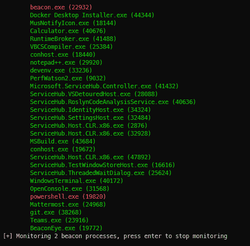

# BeaconEye:搜索 CobaltStrike 信标并记录操作员命令输出

> 原文：<https://kalilinuxtutorials.com/beaconeye/>

**BeaconEye** 扫描正在运行的进程，寻找活跃的 Cobalt Strike 信标。当发现进程正在运行信标时，BeaconEye 将监视每个进程的 C2 活动。

**工作原理**

BeaconEye 将扫描活动进程或小型转储文件，寻找可疑的 CobaltStrike 信标。在实时进程模式下，BeaconEye 可以选择将自己附加为调试器，并开始监控 C2 流量的信标活动(目前支持 HTTP/HTTPS 信标)。

用于加密 C2 数据和 mallable 配置文件的 AES 密钥被动态解码，这使 BeaconEye 能够在通过操作员发送命令时提取和解密 beacon 的输出。

相对于执行 BeaconEye 的当前目录，为每个进程创建一个活动日志文件夹。

**用途**

**BeconEye by @*ethical chaos*
cobalt strike beacon hunter 和命令监控工具 x86_64
-v，–verbose 显示更详细的输出，而不仅仅是关于找到的信标的
信息
-m，–monitor Attach to and monitor beacon found when scanning
live processes
-f，–Filter = VALUE 过滤名称以 x 开头的进程列表(
live mode only)
-d，–dump = VALUE 用于小型转储模式扫描的文件夹
dmp 或*。mdmp)
-h，–帮助显示此帮助**

**特性**

*   每个进程的日志文件夹
*   转储信标配置
*   显示大多数信标命令的输出
*   保存屏幕截图
*   检测独立信标和注入信标
*   检测用内置`**sleep_mask**`屏蔽的信标
*   脱机扫描正在运行的进程或小型转储

**告诫**

BeaconEye 可以检测所有类型的信标，但只能监控 HTTP/HTTPS 信标。目前，只有命令输出被解码，而不是命令请求。有关预期功能的完整列表，请参见下面的待办事项列表。

信标眼应该被认为是α，我渴望得到关于 4.x 信标的反馈，这些信标不能被检测到，或者延展性 C2 轮廓没有被正确解析，导致输出解码不正确。

[**Download**](https://github.com/CCob/BeaconEye)