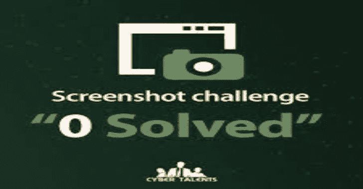
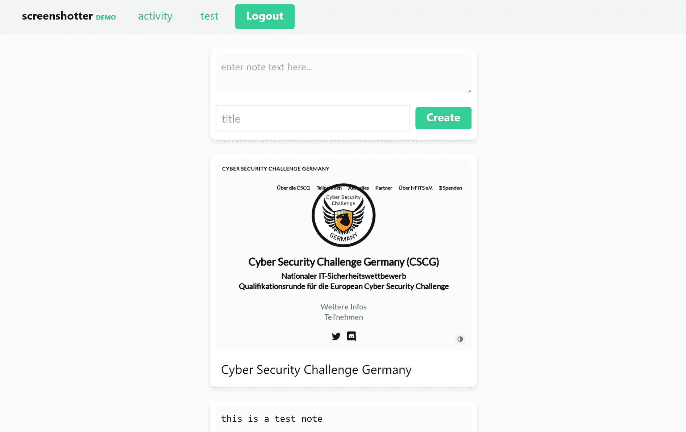

# Ctf-Screenshotter:关于制作截图的 Ctf 网络挑战

> 原文：<https://kalilinuxtutorials.com/ctf-screenshotter/>

Ctf-Screenshotter 是一个关于制作截图的 Ctf 网络挑战。它的灵感来自于现实生活中发现的一个 bug。这项挑战是由@LiveOverflow 为 https://cscg.de/.发起的

点击此处观看视频报道:https://www.youtube.com/watch?v=FCjMoPpOPYI

**进行挑战**

要运行挑战，您必须安装`**docker-compose**`:

**坞站-合成**

服务运行后，您应该能够访问 http://127.0.0.1:5000。

**解**

当你用`**git checkout solution**`签出`**solution**`分支时，`**DO_NOT_ACCESS**`文件夹包含了解决方案。

[**Download**](https://github.com/LiveOverflow/ctf-screenshotter)