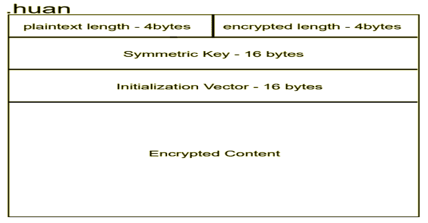
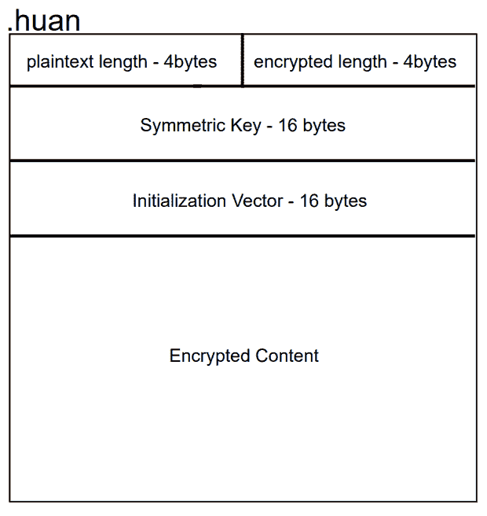
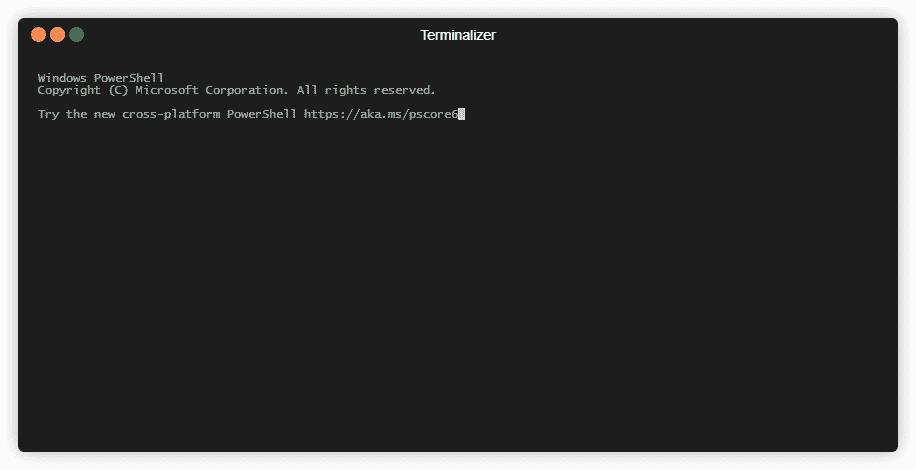

# Huan:加密 PE 加载器生成器

> 原文：<https://kalilinuxtutorials.com/huan/>

欢是我为学习 PE 文件结构和 PE 加载过程而开发的一个加密 PE 加载器生成器。它每次用不同的密钥加密 PE 文件，并将其嵌入加载程序二进制文件的新部分。目前，它可以处理 64 位 PE 文件。

**它是如何工作的？**

首先，Huan 读取给定的 PE 文件，并使用 CBC 模式 AES-128 加密算法对其进行加密。对于加密，我使用了`Tiny AES in C`并为本库的要求准备了填充代码。当加密完成时，它使用 Visual Studio 编译器(`MsBuild.exe`)编译加载程序，并创建一个可执行文件。之后，它在可执行文件上创建一个部分(名为`.huan`，并嵌入加密的内容、大小信息、IV 和对称密钥。这两个密钥都是为加载程序的每个副本随机创建的。该部分的布局如下所示。

当加载程序被执行时，它首先通过读取`Process Environment Block`来获取自己的映像库。在学习了图像库之后，它解析加载的自身副本以找到`.huan`部分。然后，它解密整个内容，缓冲它，并加载依赖于内存的二进制文件。

**快速演示**

[**Download**](https://github.com/frkngksl/Huan)