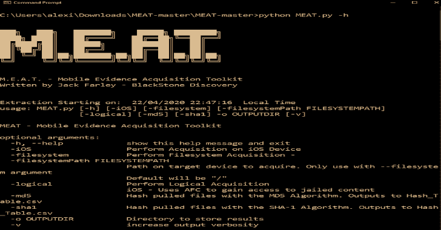

# 肉:这个工具包旨在帮助法医在 iOS 设备上执行不同种类的采集

> 原文：<https://kalilinuxtutorials.com/meat/>

**MEAT** 旨在帮助法医在 iOS 设备(以及未来的 Android)上进行不同类型的采集。

**要求从源头运行**

*   Windows 或 Linux
*   Python 3.7.4 或 3.7.2
*   requirements.txt 中看到的 Pip 包

**支持的收购类型**

**iOS 设备**

**逻辑**

在 MEAT 上使用逻辑获取标志将指示该工具提取可通过 AFC 访问的文件和文件夹。允许访问的特定文件夹是:\private\var\mobile\Media，其中包括 fodlers，如:

*   航空公司
*   书
*   二级离散复镜像
*   下载
*   常规 _ 存储
*   iTunes_Control
*   媒体分析
*   照片数据
*   照片
*   公共登台
*   购买
*   记录

**文件系统**

**iOS 设备先决条件**

*   越狱的 iOS 设备
*   通过 Cydia 安装的 AFC2

在 MEAT 上使用文件系统获取标志将指示工具启动 AFC2 服务，并将所有文件和 fodlers 复制回主机。

此方法要求设备越狱，并安装以下软件包:

*   苹果文件导管 2

用户也可以使用-filesystemPath 标志来改变这种方法，以指示 MEAT 只提取指定的文件夹，如果您正在进行应用程序分析并且只需要应用程序数据，这将非常有用。

**肉帮**

usag**e:MEAT . py[-h][-iOS][-file system][-file system Path file system tempath]
[-logical][-MD5][-sha1]-o output dir[-v]
MEAT–移动证据采集工具包
可选参数:
-h，–帮助显示此帮助消息并退出
-iOS 在 iOS 设备上执行采集
-filesystem 执行文件系统采集-
-file system tempath file system tempath
路径仅使用–文件系统参数
默认为"/"
-逻辑执行逻辑采集
iOS–使用 AFC 获取对监禁内容的访问权限
-md5 哈希使用 md5 算法提取文件。输出到 Hash_Table.csv
-sha1 使用 SHA-1 算法散列提取的文件。输出到 Hash_Table.csv
-o OUTPUTDIR 目录以存储结果
-v 增加输出详细度**

**在**上测试的设备

iPhone X iOS 13.3 iPhone XS iOS 12.4

[**Download**](https://github.com/jfarley248/MEAT)