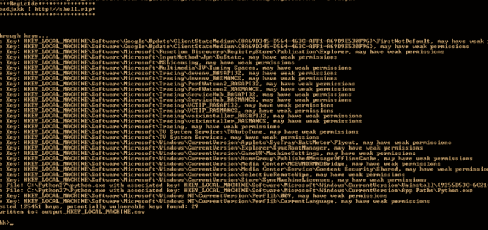

# Reg1c1de:注册表权限扫描器，用于在注册表中查找潜在的权限

> 原文：<https://kalilinuxtutorials.com/reg1c1de/>

Reg1c1de 是一个工具，它扫描指定的注册表配置单元，并报告用户拥有写权限的任何注册表项。此外，如果发现任何注册表值包含具有特定文件扩展名的文件路径并且它们是可写的，也会报告这些注册表值。

关于这个工具及其用法的更多信息可以在相关的 github.io 文章中找到:这里

帮助输出:

**++++++ ++ reg 1c 1 de ++ ++ reg 1c 1 de ++ reg 1c 1 de ++ reg 1c 1 de 是一款扫描指定注册表配置单元并报告用户拥有的任何注册表项的工具:@ dead jakk | http://shell . rip ++++++ ++ T2 应该进一步调查这些密钥，因为它们可能会导致特权升级或其他邪恶的
争论:(这些都是可选的！)
-h 显示此帮助消息
-vv 启用调试输出(更详细)
-e 扫描整个指定的 hive，默认情况下禁用此功能
-o filename 将易受攻击的密钥写入 csv，示例-o=filename
-k base key 从 hive 下枚举，默认值=Software，示例-k=Software
-df 禁用可写文件检查， 如果您不想进行成千上万次访问被拒绝的文件打开尝试
-r 根配置单元的四个字母简写以进行枚举，默认值=HKLM，示例-r=HKLM
可接受的值为:HKCU、HKLM、HKCR、HKCC、HKU
-writetests 启用此标志将启用写测试，这将向每个发现的对项的写访问的实例写入一个虚拟注册表项和值。
我不推荐使用这个，尤其是如果你不能备份注册表的话，尽管它在这里。
示例用法:
Reg1c1de.exe-v-o =输出文件-r=HKLM -e**

[**Download**](https://github.com/deadjakk/Reg1c1de)