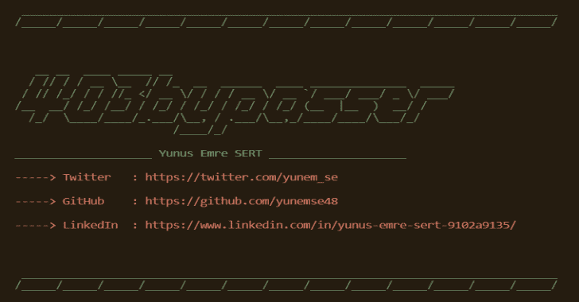

# 403Bypasser:自动化用于规避目标页面访问控制限制的技术

> 原文：<https://kalilinuxtutorials.com/403bypasser/>

403bypasser 自动执行用于规避目标页面访问控制限制的技术。 **403bypasser** 将继续改进，欢迎投稿。

**安装**

*   将存储库克隆到您的机器上。`**git clone https://github.com/yunemse48/403bypasser.git**`
*   通过运行代码`**pip install -r requirements.txt**`安装所需的模块
*   准备好了。

**用法**

**自变量**

| 争吵 | 描述 | 例子 | 注意 |
| --- | --- | --- | --- |
| -你 | 要扫描的单一 URL | http://example.com 还是 http://example.com/ | 所有这些示例用法都以相同的方式解释 |
| -你 | URL 列表的路径 | ./urllist.txt, ../../urllist.txt, etc. | 只需提供文件所在的路径🙂 |
| -d | 要扫描的单个目录 | 管理或/管理或管理/或/管理/ | 所有这些示例用法都以相同的方式解释 |
| -D | 目录列表的路径 | 。/dirlist.txt，../../dirlist.txt 等。 | 只需提供文件所在的路径🙂 |

**用法 1:** `**python3 403bypasser.py -u https://example.com -d /secret**`
**用法 2:** `**python3 403bypasser.py -u https://example.com -D dirlist.txt**`
**用法 3:** `**python3 403bypasser.py -U urllist.txt -d /secret**`
**用法 4:** `**python3 403bypasser.py -U urllist.txt -D dirlist.txt**`

**重要提示:**以下所有解释相同。因此，使用哪种模式只是个人喜好的问题。

*   `**python3 403bypasser.py -u https://example.com -d secret**`
*   `**python3 403bypasser.py -u https://example.com -d /secret**`
*   `**python3 403bypasser.py -u https://example.com -d /secret/**`
*   `**python3 403bypasser.py -u https://example.com -d secret/**`
*   `**python3 403bypasser.py -u https://example.com/ -d secret**`
    ***都一样！***

因为 Python 是一种跨平台语言，所以可以在不同的操作系统上运行这个程序。

**输出**

程序的输出保存在一个文件中(在当前目录中),输入的是域名。
举例:
`**python3 403bypasser.py -u https://example.com -d /secret**`给出。然后输出被保存到当前目录中的`**example.txt**`。

[**Download**](https://github.com/yunemse48/403bypasser)