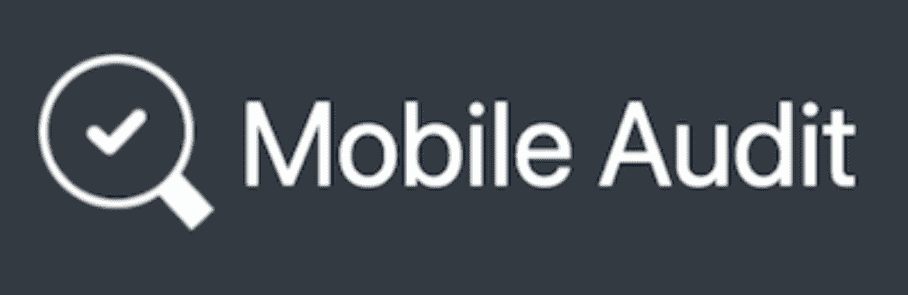
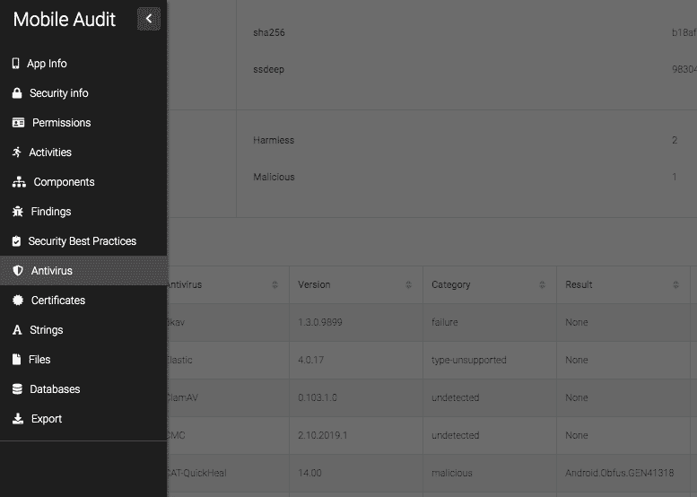
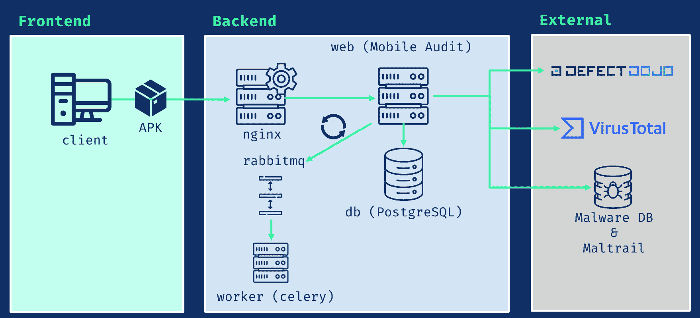
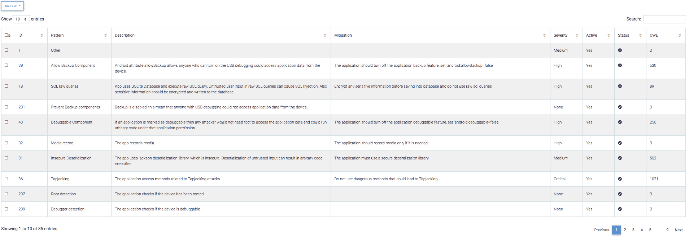
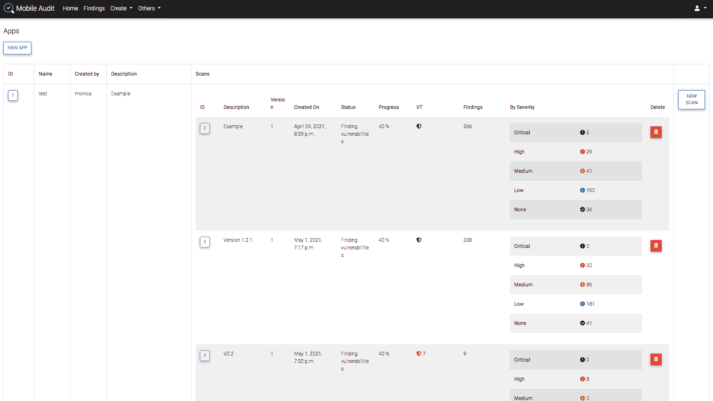
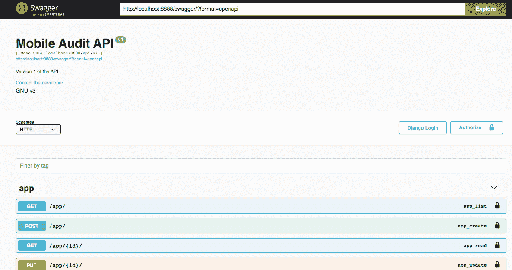
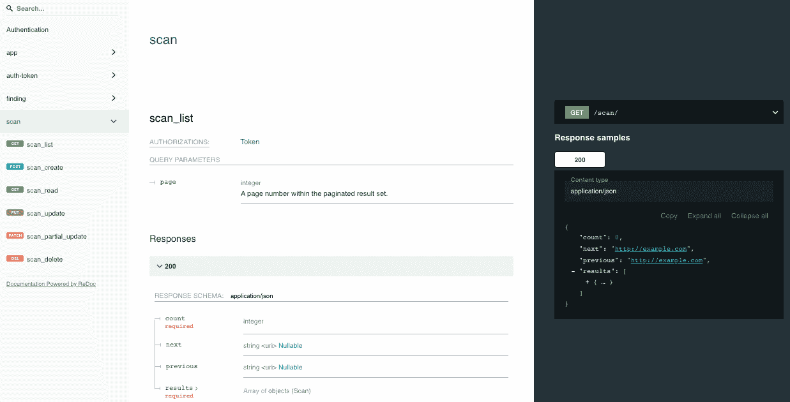

# Mobile audit:Android 移动 apk 的 SAST 和恶意软件分析

> 原文：<https://kalilinuxtutorials.com/mobileaudit/>

**MobileAudit** 是一款针对 Android 手机 apk 的 SAST 和恶意软件分析软件。

Django Web 应用程序，用于执行静态分析和检测 Android APKs 中的恶意软件

在每次扫描中，它将包含以下信息:

*   申请信息
*   安全信息
*   成分
*   SAST 的发现
*   实施最佳做法
*   病毒总数信息
*   证书信息
*   用线串
*   数据库
*   文件

为了便于访问，扫描页面左侧有一个侧栏:

**组件**

*   **db** : PostgreSQL 13.2
*   nginx : Nginx 1.19.10
*   rabbitmq : RabbitMQ 3.8.14
*   工人:芹菜 5.0.5
*   **web** :移动审计 App

**码头工人基础图片**

图片基于 python buster。链接到 Docker Hub 图像

| 图像 | 标签 | 基础 |
| --- | --- | --- |
| mpast/移动审计 | 1.3.8 | python:3.9.4-buster |
| mpast/移动审计 | 1.3.6 | python:3.9.2-buster |
| mpast/移动审计 | 1.3.0 | python:3.9.1-buster |
| mpast/移动审计 | 1.0.0 | python:3.9.0-buster |

**主要特征**

*   使用 Docker 在多平台环境中轻松部署
*   提取 APK 的所有信息
*   分析所有源代码，寻找弱点
*   所有调查结果都进行了分类，并遵循 **CWE 标准**
*   所有调查结果都进行了分类，包括**移动十大风险**
*   还要强调在 APK 安全实施 Android 的**最佳实践**
*   可以对结果进行编辑，并且可以对**假阳性进行分类并删除**
*   所有扫描结果都可以**导出为 PDF**
*   用户认证和用户管理
*   带有 Swagger 和 ReDoc 的 API v1
*   坦克激光瞄准镜（Tank Laser-Sight 的缩写）
*   动态页面重新加载(WIP)
*   LDAP 集成
*   导出到降价
*   导出到 CSV

**图案**

该应用程序具有一个引擎，该引擎具有不同的规则和模式，在结果扫描阶段使用这些规则和模式来检测 apk 中的漏洞和/或恶意代码。

这些可以在`**/patterns**`中激活和停用

**注意**:一些硬编码的模式来自 apkleaks

**车型**

该应用程序为扫描信息的每个实体创建了模型，能够为每个 apk 创建关系并获得最佳结论。

要查看整个模型架构，请转到[模型](https://github.com/mpast/mobileAudit/blob/main/app/static/models.png)

###集成

**病毒总量(API v3)**

 **它检查是否已经扫描了 APK，并提取其所有信息。此外，还可以上传环境中的 APK 选定属性(默认情况下禁用)。

**缺陷道场(API v2)**

 **将发现上传到缺陷管理器是可能的。

**马尔瓦雷德布&马尔特赖**

它在数据库中检查 APK 中是否有与恶意软件相关的 URL。

**安装**

使用 Docker 编写:

提供的`**docker-compose.yml**`文件允许您在开发中本地运行应用程序。

要构建本地映像，并且如果本地应用程序 docker 文件有更改，您可以使用以下内容构建映像:

**坞站-复合构建**

然后，要启动容器，运行:

**坞站-合成**

可选:以分离模式运行(不查看日志)

**坞站-合成 up -d**

应用程序启动后，您可以通过导航到:http://localhost:8888/访问仪表板来测试应用程序。

此外，还有一个使用`**docker-compose.prod.yaml**`的 TLS 版本运行在端口 443 中

要使用它，请执行

**坞站-复合-f 坞站-复合. prod.yaml up**

然后，您可以通过导航到:https://localhost/来访问仪表板，从而测试应用程序。

有关更多信息，请参见 TLS

要停止并移除容器，请运行

**坞站-复合下行**

**API v1**

REST API 与 Swagger 和 ReDoc 的集成。

**用法**

*   端点认证并获得令牌: **`/api/v1/auth-token/`**

通过身份验证后，在所有请求中使用报头:`**Authorization: Token <A**piKey>`

**大摇大摆**

**ReDoc**

**终点**

*   在`**/swagger.json**`的 API 规范的 JSON 视图
*   在`**/swagger.yaml**`的 API 规范的 YAML 视图
*   在`**/swagger/**`的 API 规范的 swagger-ui 视图
*   在`**/redoc/**`的 API 规范的 ReDoc 视图

**TLS**

**前置要求**

*   将证书添加到`nginx/ssl`
*   要生成自签名证书:

*   **OpenSSL req-x509-nodes-days 1-new key RSA:4096-subj "/C = ES/ST = Madrid/L = Madrid/O = Example/OU = IT/CN = localhost "-key out nginx/SSL/nginx . key-out****nginx/SSL/nginx . CRT**

**Nginx 配置**

*   TLS–端口 443: `**nginx/app_tls.conf**`
*   标准–端口 8888: `**nginx/app.conf**`

**Docker 配置**

默认情况下，`docker-compose.yml`中有一个配置为 8888 的卷可用

。/ngix/app . conf:/和**c/ngix/conf . d/app . conf**

**在生产环境中**使用 **`docker-compose.prod.yaml`** 与端口 443

**。/engine/app _ TLS . conf:/etc/engine x/conf . d/app _ TLS . conf**

**环境变量**

所有的环境变量都在一个`**.env**`文件中，有一个`**.env.example**`包含所有需要的变量。也有收藏于 **`app/config/settings.py` :**

**CWE_URL = env('CWE_URL '，' https://cwe . mitre . org/data/definitions/')
MALWARE _ ENABLED = env(' MALWARE _ ENABLED '，True)
MALWAREDB _ URL = env(' MALWAREDB _ URL '，' https://www . malwaredomainlist . com/mdlcsv . PHP ')
maltraiddb _ URL = env(' maltraiddb _ URL '，' https://raw . githubusercontent . com/stampar/aux/master**

[**Download**](https://github.com/mpast/mobileAudit)****