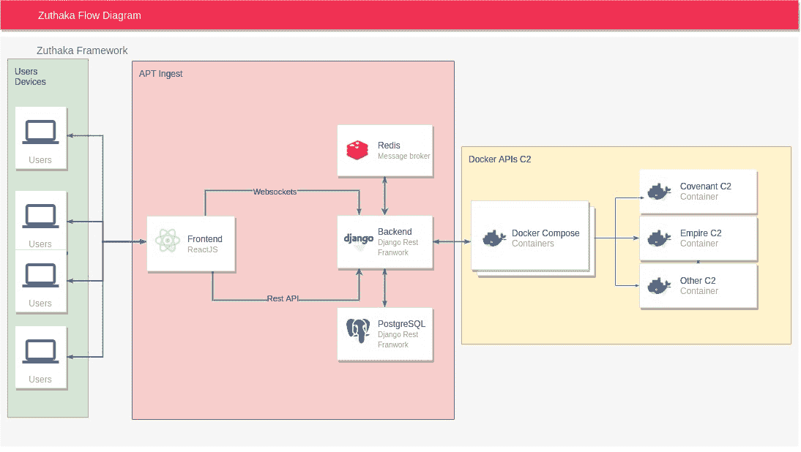

# Zuthaka:一个开源应用程序，旨在通过简化管理不同 apt 和其他后期开发工具的任务来帮助红队工作

> 原文：<https://kalilinuxtutorials.com/zuthaka/>

Zuthaka 是一个协作的免费开源命令&控制集成框架，允许开发者专注于他们 C2 的核心功能和目标。

**关于项目**

**问题陈述**

当前的 C2s 生态系统已经迅速成长，以适应现代红队的运作和多样化的需求(关于 C2 选择的进一步信息可以在这里找到)。这给各地的攻击性安全专业人员带来了大量的开销工作。创建一个 C2 已经是一项艰巨的任务，大多数可用的 C2s 缺乏一个直观且易于使用的网络界面。大多数 Red 团队必须独立管理和理解其基础架构中的每个 C2。

**解**

Zuthaka 相信社区的努力超过了任何个人的努力，因此它提供了一个简化的 API，用于快速清晰地集成 C2s，并通过红队运营的统一界面为多个 C2 实例提供集中管理。

Zuthaka 不仅仅是一个 C2s 的集合，它也是一个坚实的基础，可以建立在其上并轻松定制以满足需要完成的练习的需求。C2 的这个集成框架允许开发人员专注于一个独特的目标环境，而不必重新发明轮子。

**用**建造

*   Django Rest 框架
*   雷迪斯
*   反应堆
*   Nginx
*   码头工人
*   一种数据库系统

**已经支持 C2**

*   契约
*   帝国

**入门**

Zuthaka 由前端和后端组成，前端展示进程管理器、文件管理器、外壳后开发模块和一般 C2 处理的 API 的 UI，后端负责处理在 Zuthaka 中实例化的 C2s 的一致性和可用性问题。还部署了 Redis 作为消息代理来异步处理代理 UI 和 Nginx 服务器中的每个元素。

**先决条件**

安装一个工作的 Docker 实例对于基本基础设施(Zuthaka 的前端和后端、Nginx、Redis)的自动部署是必要的。所有需要处理的 C2s 都应该并行部署。

**安装**

要构建完整的 Zuthaka 项目，首先下载依赖项。

**git 克隆 https://github . com/puara/zuhaka**

要用相应的服务启动项目，可以使用 docker-compose 文件。

**坞站-合成**

**用途**

[**Download**](https://github.com/pucarasec/zuthaka)