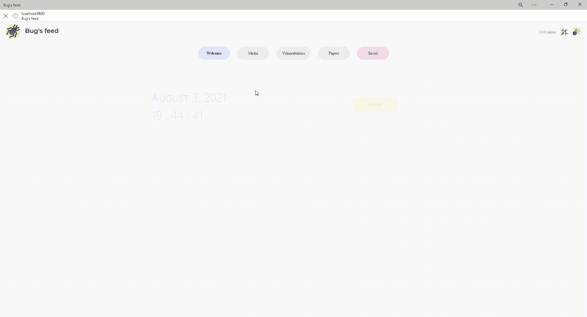

# Bugs-feed:一个本地托管的门户网站，你可以在这里搜索最新的新闻、视频、简历、漏洞…

> 原文：<https://kalilinuxtutorials.com/bugs-feed/>

**Bugs-feed** 是一个本地托管的门户网站，你可以在那里搜索最新的新闻、视频、简历、漏洞……它是作为一个 PWA 应用程序实现的，所以你可以摆脱浏览器，把它作为一个桌面应用程序来使用。浏览不同的选项卡，查看最新的错误，或者一次搜索所有的错误。它带有一个配置面板，你可以在其中修改标签和视频频道。

作为一名黑客和开发爱好者，我喜欢为最新的漏洞制作自己的脚本。
**问题:**外面的信息太多了。仅仅一天就发现了许多新的漏洞，写了无数相关的推文，并拍摄了相应的视频。
**解决方案:**将所有信息收集在一个地方，并使其易于分解，以便您可以提取相关知识。

Bug 的 feed 是一个 docker containered Flask 应用程序，它利用 Selenium、Twint 和 FeedParser 来抓取不同的网站，如 Hackerone、Youtube、Bugcrowd、Exploit Database 或 Twitter，并将结果存储在 Mongo 数据库中。大多数请求通过 Tor 和一个随机用户代理进行。

除了 twitter、youtube、oxford 和 bugcrowd(将来可能会改变)。

废弃如此多的信息，取决于不同的网站，很容易破坏一些脚本。如果失败，考虑使用手动刷新按钮。

**先决条件**

**码头工人**

Docker 消除了重复、平凡的配置任务，并在整个开发生命周期中用于快速、简单和可移植的应用程序开发-桌面和云。Docker 全面的端到端平台包括 ui、CLI、API 和安全性，它们在整个应用交付生命周期中协同工作。

**建造**

*   通过利用 Docker 图像在 Windows 和 Mac 上高效开发您自己独特的应用程序，让您的编码有一个良好的开端。使用 Docker Compose 创建多容器应用程序。
*   在整个开发流程中集成您最喜欢的工具——Docker 可以与您使用的所有开发工具兼容，包括 VS Code、CircleCI 和 GitHub。
*   将应用程序打包为可移植的容器映像，以便在任何环境中一致地运行，从内部部署的 Kubernetes 到 AWS ECS、Azure ACI、Google GKE 等等。

**分享**

*   利用 Docker 信任的内容，包括 Docker 官方图像和来自 Docker Hub 存储库的经 Docker 验证的出版商的图像。
*   通过与团队成员和其他开发人员协作以及轻松地将图像发布到 Docker Hub 来进行创新。
*   借助基于角色的访问控制，个性化开发人员对图像的访问，并借助 Docker Hub 审计日志深入了解活动历史。

**运行**

轻松交付多个应用程序，并让它们在您的所有环境中以相同的方式运行，包括设计、测试、试运行和生产-桌面或云原生。

在不同的容器中用不同的语言独立地部署您的应用程序。降低语言、库或框架之间冲突的风险。

使用 Docker Compose CLI 的简单性加快开发，只需一个命令，就可以在本地和云上使用 AWS ECS 和 Azure ACI 启动您的应用程序。

**坞站-复合**

**Docker 撰写概述**

Compose 是一个定义和运行多容器 Docker 应用程序的工具。使用 Compose，您可以使用 YAML 文件来配置应用程序的服务。然后，只需一个命令，您就可以从您的配置中创建并启动所有服务。要了解更多有关 Compose 所有功能的信息，请参阅功能列表。

Compose 适用于所有环境:生产、登台、开发、测试以及 CI 工作流。您可以在常见用例中了解每个案例的更多信息。

使用 Compose 基本上是一个三步的过程:

*   用一个`**Dockerfile**`来定义你的应用环境，这样它可以在任何地方被复制。
*   在`**docker-compose.yml**`中定义组成你的应用的服务，这样它们可以在一个隔离的环境中一起运行。
*   运行`**docker compose up**`，Docker compose 命令启动并运行你的整个应用程序。您也可以使用 docker-compose 二进制文件运行`**docker-compose** **up**`。

一个`**docker-compose.yml**`长这样:

**版本:“3.9”#可选自 v1.27.0
服务:
web:
构建:。
端口:
——【5000:5000】**
**卷:
。:/code
–log volume 01:/var/log****【link:
–redis
【image:redis
【logvolume 01:{ }**

有关合成文件的更多信息，请参见合成文件参考。

Compose 具有用于管理应用程序整个生命周期的命令:

*   启动、停止和重建服务
*   查看运行服务的状态
*   流式传输正在运行的服务的日志输出
*   在服务上运行一次性命令

**特色**

使其有效的 Compose 功能有:

*   单个主机上的多个隔离环境
*   创建容器时保留体积数据
*   仅重新创建已更改的容器
*   变量和在环境之间移动合成

**单个主机上的多个隔离环境**

Compose 使用项目名称将环境相互隔离。您可以在几种不同的上下文中使用此项目名称:

*   在开发主机上，创建单个环境的多个副本，例如当您想要为项目的每个特性分支运行一个稳定的副本时
*   在 CI 服务器上，为了防止内部版本相互干扰，您可以将项目名称设置为唯一的内部版本号
*   在共享主机或开发主机上，防止可能使用相同服务名的不同项目相互干扰

默认项目名称是项目目录的基本名称。您可以使用`**-**` [**`p`**](https://docs.docker.com/compose/reference/) 命令行选项或`**COMPOSE_PROJECT_NAME**` 环境变量来设置自定义项目名称。

默认项目目录是合成文件的基本目录。可以使用`**--project-directory**`命令行选项为其定义一个自定义值。

**创建容器时保存体积数据**

Compose 保留服务使用的所有卷。当`**docker-compose up**`运行时，如果它从以前的运行中找到任何容器，它会将卷从旧容器复制到新容器。此过程确保您在宗卷中创建的任何数据都不会丢失。

如果您在 Windows 机器上使用`**docker-compose**`,请参阅环境变量，并根据您的特定需求调整必要的环境变量。

**仅重新创建已更改的容器**

组合缓存用于创建容器的配置。当您重新启动未更改的服务时，Compose 会重新使用现有的容器。重用容器意味着您可以很快对环境进行更改。

**变量和环境之间移动的构图**

合成支持合成文件中的变量。您可以使用这些变量为不同的环境或不同的用户定制您的合成。请参阅变量替换了解详情。

您可以使用`**extends**`字段或通过创建多个合成文件来扩展合成文件。更多细节请参见延长 [s](https://docs.docker.com/compose/extends/) 。

**常见用例**

Compose 可以有多种不同的用法。下面列出了一些常见的使用案例。

**开发环境**

开发软件时，在隔离环境中运行应用程序并与之交互的能力至关重要。Compose 命令行工具可用于创建环境并与之交互。

合成文件提供了一种方法来记录和配置应用程序的所有服务依赖项(数据库、队列、缓存、web 服务 API 等)。使用 Compose 命令行工具，您可以用一个命令(`**docker-compose up**`)为每个依赖项创建和启动一个或多个容器。

总之，这些特性为开发人员开始一个项目提供了一种便捷的方式。Compose 可以将多页的“开发人员入门指南”简化为一个机器可读的 Compose 文件和几个命令。

自动化测试环境

任何持续部署或持续集成过程的一个重要部分是自动化测试套件。自动化的端到端测试需要一个运行测试的环境。Compose 为您的测试套件提供了一种创建和销毁隔离测试环境的便捷方式。通过在合成文件中定义完整的环境，只需几个命令就可以创建和销毁这些环境:

**$ docker-合成 up -d
$。/run _ tests
$ docker-复合下行**

**单主机部署**

Compose 传统上一直专注于开发和测试工作流，但随着每个版本的发布，我们都在更多面向生产的功能上取得进展。

有关使用面向生产的功能的详细信息，请参阅本文档中的在生产中合成。

**安装**

您可以在上定义端口。环境文件

**发布**

下载最新版本并运行`**docker-compose up -d**`

**源代码**

**#克隆 Bugs-feed
git 克隆 https://github.com/pwnedshell/Bugs-feed.git
#转到 Bugs-feed 文件夹
CD Bugs-feed/
# Run docker compose
docker-compose up-d**

**用途**

*   转到本地主机:9600
*   等待 5 分钟(仅第一次)
*   下载桌面应用程序(可选)
*   狩猎时间！

[**Download**](https://github.com/PwnedShell/Bugs-feed)