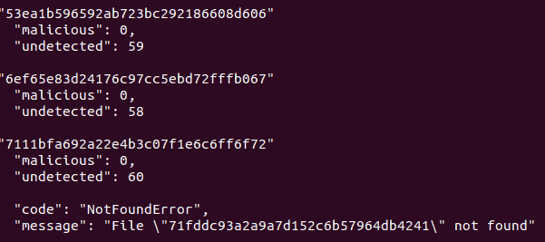
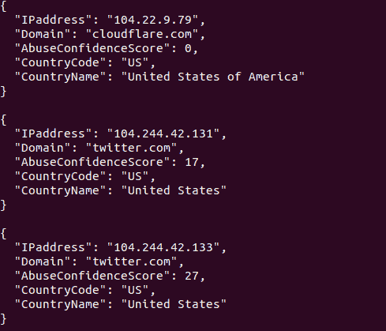

# packetsifterTool:一个帮助分析人员筛选数据包捕获(Pcap)以发现值得注意的流量的工具

> 原文：<https://kalilinuxtutorials.com/packetsiftertool/>

**packets fter tool**对 PCAP 数据进行批处理，以发现潜在的 IOC。
只需用您想要的集成(病毒总数，滥用 IPDB)初始化 PacketSifter，并将 PacketSifter 传递到 pcap，所需的开关和 PacketSifter 将筛选数据并生成几个输出文件。

**注意**请在使用相应的开关之前运行 AbuseIPDBInitial.sh 和 VTInitial.sh，否则集成将不起作用

**2021 年 5 月 27 日**
packets after 已经过改进，允许与用户进行更简化的交互。只需下载新更新的 packetsifter.sh，运行。/packet sitter-h 并了解如何正确使用新的 packet sitter！

**工作原理**

只需在您的 pcap 之后传递 packets 来分析您想要的标志，并让 packets after 为您完成这项工作！

##### 举例:

root@ubuntu:~#。/packet sitter-I/tmp/testing . pcap-a-r-v

**命令行选项**

选项:

*   -a 启用 abuseipdb 在 DNS A 记录中查找 IP 地址
*   -h 打印帮助
*   -i 输入文件[必需]
*   -r 解析 pcap 中的主机名[可能导致对攻击者基础结构的 DNS 查询]
*   -v 启用导出的 SMB/HTTP 对象的病毒总量查找

**要求**

沙克-https://tshark.dev/setup/install/

**输出**

目前，PacketSifter 生成以下 pcaps:

*   http . pcap–包含端口 80、8080 或 8000 的所有会话
*   smb . pcap–所有被 tshark 剖析者归类为 NBSS、SMB 或 SMB2 的对话
*   dns . pcap–所有被 tshark 解析器归类为 DNS 的会话
*   ftp . pcap–所有被 tshark 剖析器归类为 FTP 的对话

目前，PacketSifter 生成以下文本文件:

*   iostatistics . txt–协议层次和输入/输出在 30 秒间隔内分解(有助于发现潜在信标)
*   IP statistics . txt–通过 IP 与端点往来的整体统计数据和通过 IP 的单独对话
*   TCP statistics–通过 TCP 与端点往来的总体统计数据，以及分解的单个 TCP 会话。这个文件可以包含大量的信息。对于有疑问的对话，建议使用 less 或 grep。
*   http _ info . txt–关于 HTTP 会话的统计数据
*   hostnamesResolved.txt(可选)-在 pcap 中观察到的已解析主机名。这可能导致攻击者基础设施的 DNS 查询。小心行事！！
*   smb statistics . txt–统计使用 SMB 或 smb2 运行的命令
*   DNS records . txt–DNS A 查询/响应
*   dnstxtrecords . TXT–DNS TXT 查询/响应
*   errors . txt–垃圾文件

VirusTotal Integration 输出文本文件(全部可选):

*   httphashtoobject . txt–包含 md5 哈希的文本文件，用于对象配对以供参考
*   httpvtresults . txt–包含通过 VirusTotal API 对 http 对象进行 md5 哈希查找的结果的文本文件
*   smbhashtoobject . txt–包含 md5 哈希的文本文件，用于对象配对以供参考
*   smbvtresults . txt–包含通过 VirusTotal API 对 smb 对象进行 md5 哈希查找的结果的文本文件

AbuseIPDB 集成输出文本文件(可选):

*   iplookupresults . txt–包含 IP 地理位置+ IP 信誉结果的文本文件

目前，PacketSifter 生成以下 tar.gz 文件:

*   httpObjects.tar.gz–在 pcap 中观察到的 HTTP 对象。可能有许多 http 对象，您可能会根据 pcap 提取恶意的 HTTP 对象。慎用！！
*   smbObjects.tar.gz–在 pcap 中观察到的 SMB 物体。可能有许多 SMB 对象，您可能会根据 pcap 提取恶意 SMB 对象。慎用！！

**病毒总集成**

PacketSifter 现在可以通过 VirusTotal API 对通过 SMB/HTTP 找到的导出对象执行哈希查找。

**配置 PacketSifter 与 VirusTotal 集成的步骤:**

1.  确保您已经安装了 jq(https://stedolan.github.io/jq/download/)。

**root @ Ubuntu:~ # apt-get install jq**

*   确保您安装了 curl。

**root @ Ubuntu:~ # apt-get install curl**

*   下载新版本的 packetsifter.sh 和新脚本 VTInitial.sh
*   在与 packetsifter.sh 相同的文件夹中运行 VTInitial.sh，并在出现提示时提供 64 个字符的字母数字病毒总数 API 密钥
*   有关如何获取免费的 VirusTotal API 密钥 https://developers.virustotal.com/reference 的说明

**vt initial . sh 成功输出如下:**

运行带有-v 标志的 PacketSifter 以启用 VirusTotal 对导出的 HTTP 和 SMB 对象的查找。

**virus total integration 成功输出，后续生成的 httpvtresults . txt/smbvtresults . txt 如下所示:**

**AbuseIPDB 集成**

PacketSifter 可以对 DNS A 记录中返回的 IP 地址执行 IP 地理位置+ IP 信誉查找。

**配置 PacketSifter 与 AbuseIPDB 集成的步骤:**

*   确保您已经安装了 jq(https://stedolan.github.io/jq/download/)。

**root @ Ubuntu:~ # apt-get install jq**

*   确保您安装了 curl。

**root @ Ubuntu:~ # apt-get install curl**

*   下载新版本的 packetsifter.sh 和新脚本 AbuseIPDBInitial.sh
*   在与 packetsifter.sh 相同的文件夹中运行 AbuseIPDBInitial.sh，并在出现提示时提供 80 个字符的字母数字 AbuseIPDB API 密钥。
*   有关如何获得免费 AbuseIPDB API 密钥 https://www.abuseipdb.com/register 的说明

**AbuseIPDB 自由 API 密钥每天最多可查找 1000 次* *
**abuseipdbinitial . sh 的成功输出如下所示:**

*   运行带有-a 标志的 PacketSifter，通过 AbuseIPDB 启用对 DNS A 记录的查找。

**AbuseIPDB 集成的成功输出和随后生成的 IPLookupResults.txt 如下所示:**
**置信度得分在 0-100%置信度范围内* *

[**Download**](https://github.com/packetsifter/packetsifterTool)