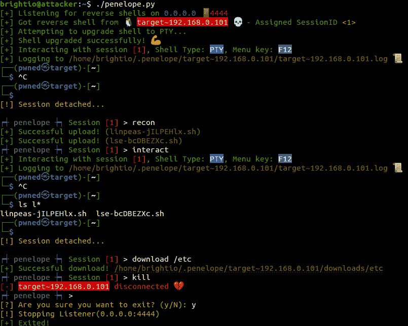
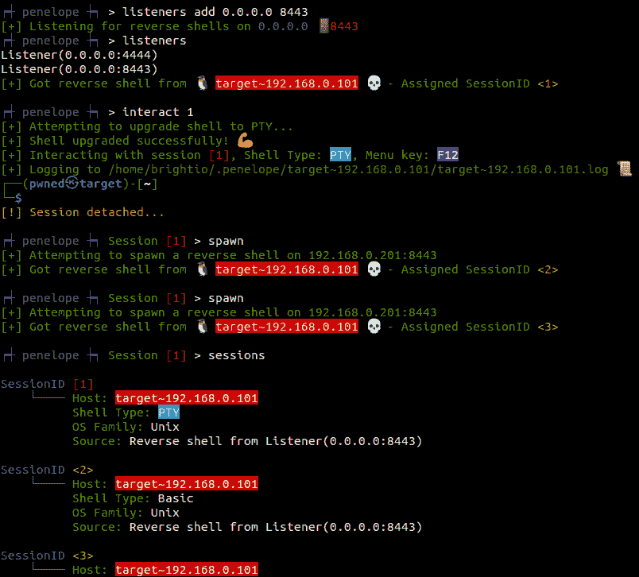

# 佩内洛普:外壳处理器

> 原文：<https://kalilinuxtutorials.com/penelope/>

Penelope 是一个高级的 shell 处理程序。其主要目的是在利用 RCE 漏洞时取代 netcat 作为外壳捕获器。它可以在 Linux 和 macOS 上运行，唯一的要求是 Python3。这是一个没有第三方依赖的脚本，希望它将保持这种方式。

主要功能包括:

*   将 shells 自动升级到 PTY(包括自动调整大小)
*   记录与目标的交互
*   从目标下载文件
*   将文件上传到目标
*   将预设脚本上传到目标
*   生成备份外壳
*   多个会话
*   多个侦听器
*   可以通过漏洞导入并在同一个终端上获得 shell(参见 extras)

通过使用`**set DisablePayloadHandler True**`禁用默认处理程序，Penelope 可以与 metasploit 漏洞结合使用

它支持 Windows shells，但尚未实现自动升级。但是它可以接受来自@antonioCoco 的优秀项目 ConPtyShell 的 PtyShell。PTY 的自动调整已实施。

**样品基本用途**

**penelope.py #监听 0 . 0 . 0 . 0:4444
penelope . py 5555 #监听 0 . 0 . 0 . 0:5555
penelope . py 5555-I eth 0 #监听 eth 0:5555
penelope . py-c target 3333 #连接到 target 上的 bind shell:3333**

**演示随机用法(1)**

*   执行不带参数的 penelope 并得到一个反向 shell
*   按 F12 分离会话并转到主菜单
*   运行“recon”命令，将预设的权限脚本上传到目标
*   再次与会话交互，确认脚本已上传
*   用 F12 再次分离并从目标下载/etc 目录
*   终止会话并使用 Ctrl-D 退出

**演示随机用法(2)**

*   添加额外的监听器并显示所有监听器
*   与会话 1 交互
*   产生 2 个额外的备份会话
*   显示所有会话

**命令行选项**

**位置参数:
端口根据-i/-c 选项监听/连接的端口。默认:4444
反转还是绑定外壳？:
-i，–Address IP 地址或者监听的接口。默认值:0.0.0.0
-c，–连接绑定 shell 主机
提示:
-a，–提示显示基于注册侦听器的反向 shell 的示例负载
-l，–接口显示可用的网络接口
-h，–帮助显示此帮助消息并退出
详细程度:
-Q，–静默仅显示错误和警告
-X，–额外静默抑制所有日志记录消息
日志记录:
-L，–no-log Do –no-timestamps 不包括日志上的时间戳
Misc:
-H，–no-history 禁用目标上的 shell 历史记录
-P，–plain 直接进入菜单
-S，–单个会话仅容纳第一个创建的会话
-C，–no-attach 禁用创建时的自动附加会话
-U，–no-upgrade 不升级 shell
Debug:
-d，–Debug 显示调试消息
-NP，–no-python 模拟 python**

**菜单选项**

**使用【会话 id |无】
选择一个会话
【会话 id】
显示活动会话。之后，与该
会话交互
交互【session id】
与会话交互
终止【session id | all】
终止会话
下载…
从目标下载文件和文件夹
打开…
从目标下载文件和文件夹并在本地打开它们
上传…
将文件和文件夹上传到目标。如果指定了 URL，则在本地下载该 URL
，然后上传到目标
recon [sessionID]
将预设的侦察脚本上传到目标
spawn [sessionID]
Spawn 新会话。是逆转还是绑定，取决于当前的会话。
升级【session id】
将会话的 shell 升级到“PTY”。如果失败，尝试将
升级到“高级”。如果这也失败了，那么就退回到“基本”shell。
dir|。[sessionID]
打开会话的本地文件夹。如果没有选择会话，打开
基本文件夹。
监听器[ ]
添加或停止监听器。当不带参数调用时，它显示了
活动监听器。
连接
连接到绑定 shell
提示
显示运行在目标上的示例命令以获取反向 shell，基于
注册的监听器
重置
重置本地终端
历史
显示菜单历史
帮助【命令】
显示菜单帮助或关于特定命令的帮助
调试
打开调试控制台
设置
设置选项。当不带参数调用时，它显示当前选项
退出|退出|q|Ctrl+D
退出佩内洛普**

[**Download**](https://github.com/brightio/penelope)