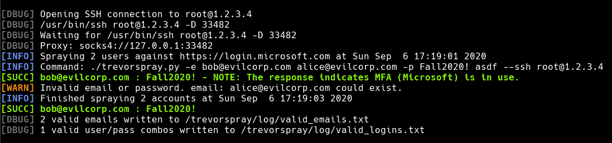

# TREVORspray:一个基于 MSOLSpray 的功能强大的循环 SOCKS 代理和 Python O365 喷雾器，它使用了 Microsoft Graph API

> 原文：<https://kalilinuxtutorials.com/trevorspray/>

TREVORspray 是一款基于 MSOLSpray 的特色 Python O365 喷雾器，它使用了 Microsoft Graph API。TREVORproxy 是一个 SOCKS 代理，它通过 SSH 主机循环交换请求。

微软在阻止针对 O365 的密码喷涂攻击方面做得越来越好。 **TREVORspray 可以通过无限数量的`--ssh`主机**代理其请求来解决这一问题。不需要奇怪的依赖或繁琐的设置-您需要的只是一个端口 22 打开的云虚拟机。

功劳归功劳——这要归功于:

*   [@dafthack](https://twitter.com/dafthack) 为写作 [MSOLSpray](https://github.com/dafthack/MSOLSpray)
*   [@Mrtn9](https://twitter.com/Mrtn9) 为他的 Python 港口 [MSOLSpray](https://github.com/MartinIngesen/MSOLSpray)
*   @KnappySqwurl 作为一个 splunk 向导，让我知道我有多大声🙂

## 特性

*   告诉您每个帐户的状态:如果它存在，被锁定，已启用 MFA，等等。
*   自动取消/恢复(尝试的用户/通行组合在`./logs/tried_logins.txt`中记忆)
*   仅使用普通 IP 通过多个 IP 进行循环代理`--ssh`
*   如果代理关闭(或者如果您失去互联网)，自动无限重新连接/重试
*   欺骗`User-Agent`和`client_id`看起来像合法的授权流量
*   将所有内容记录到`./logs/trevorspray.log`
*   将有效用户名保存到`./logs/valid_usernames.txt`
*   请求绕过 M＄锁定对策之间的可选`--delay`

**安装**

**$ git 克隆 https://github.com/blacklanternsecurity/trevorspray
$ CD trevorspray
$ pip install-r requirements . txt**

**示例:喷涂 O365，两次请求之间有 5 秒钟的延迟**

**$ Trevor spray . py-e bob@evilcorp.com-p 2020 年秋季！–延迟 5**

**例:喷 O365，3 个 IP 之间轮循(当前 IP 也用。)**

**$ Trevor spray . py-e emails . txt-p fall 2020！宋承宪 root@1.2.3.4 root@4.3.2.1**

**Trevor spray–Help**

$ **。/Trevor spray . py–help
用法:Trevor spray . py[-h]-e EMAILS[EMAILS…]-p PASSWORDS[PASSWORDS…][-f][-d DELAY][-u URL][-v][-s SSH[SSH…]][-k KEY][-b BASE _ PORT][-n][-T2]对 O365 执行密码喷射，可选择代理通过 SSH 主机的流量
可选参数:
-h，–help 显示此帮助消息并退出
-e –PASSWORDS PASSWORDS[PASSWORDS…]
将用于执行密码喷射的密码
-f，–force 强制喷射继续进行，在检测到多个帐户锁定时不停止
-d DELAY，–DELAY DELAY
请求之间的睡眠秒数
-u URL，–URL URL 要喷射的 URL(默认为 https://login.microsoft.com)
-v，–verbose 显示每个请求使用的代理
-s SSH [SSH …]， –ssh SSH[SSH…]
通过这些 SSH 主机(user@host)进行循环负载平衡注意:当前 ip 地址每循环使用一次
-k KEY，–KEY KEY 连接到代理主机时使用此 SSH 密钥
-b BASE_PORT，–BASE-PORT BASE _ PORT
用于 SOCKS 代理的基本监听端口
-n，–no-Current-IP 不从当前 IP 喷射，仅使用 SSH 代理**

**已知限制**

*   未在 Windows 上测试
*   目前仅适用于 M$ Graph API

**Trevor proxy–Help**

**$。/Trevor proxy . py–help
用法:Trevor proxy . py[-h][-p PORT][-l LISTEN _ ADDRESS][-v][-k KEY][–BASE-PORT BASE _ PORT]ssh _ hosts[ssh _ hosts…]
生成一个 SOCKS 服务器，该服务器通过指定的 SSH 主机对请求进行轮循
位置参数:
ssh_hosts 通过这些 SSH 主机进行轮循负载平衡(user@host)
可选参数:
-h，–可选参数 –LISTEN-ADDRESS LISTEN _ ADDRESS
SOCKS 服务器的监听地址(默认值:127.0.0.1)**
**-v，–详细打印额外调试信息
-k KEY，–KEY KEY 连接到代理主机时使用此 SSH 密钥
–BASE-PORT BASE _ PORT
用于 SOCKS 代理的基本监听端口**

[**Download**](https://github.com/blacklanternsecurity/TREVORspray)