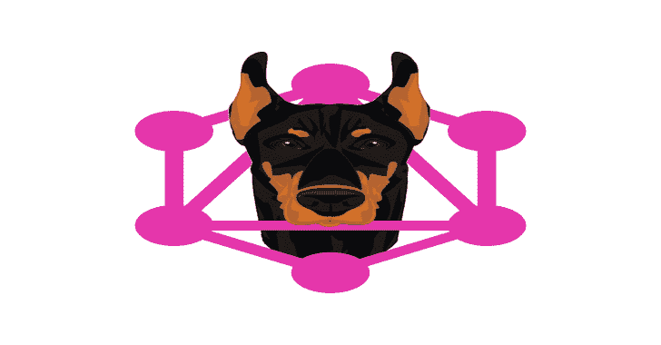

# Graphw00F:用于 GQL 端点的 GraphQL 指纹识别工具

> 原文：<https://kalilinuxtutorials.com/graphw00f/>

**Graphw00F** (受 wafw00f 启发)是用于 GQL 端点的 GraphQL 指纹识别工具，它发送良性和畸形查询的混合，以确定在后台运行的 GraphQL 引擎。graphw00f 将提供对每种技术提供的开箱即用的安全防御的见解，以及它们在默认情况下是打开还是关闭的。

特制的查询导致不同的 GraphQL 服务器实现对查询、突变和订阅做出独特的响应，这使得对后端引擎进行指纹识别并区分各种 GraphQL 实现变得很简单。(CWE: CWE-200)

**检测**

graphw00f 当前尝试发现以下 GraphQL 引擎:

*   石墨烯–Python
*   Ariadne–Python
*   阿波罗-打字稿
*   图形 SQL-go-go
*   gql 根-go
*   WPGraphQL–PHP
*   WordPress 图形 SQL API-PHP
*   ruby–graph QL
*   graph QL-PHP—PHP
*   哈苏拉-哈斯克尔
*   hypergraph QL–Java
*   graph QL-Java–Java
*   杜松–铁锈色
*   桑格利亚-斯卡拉
*   颤动–飞镖
*   戴安娜·茱莉亚
*   草莓–蟒蛇皮
*   tartiflette–Python

**GraphQL 技术防御矩阵**

每种指纹技术(例如石墨烯、Ariadne 等)都有一个相关文档(例如石墨烯)，其中涵盖了特定技术支持的安全防御机制，以便更好地了解实施可能受到的攻击。

| 现场建议 | 查询深度限制 | 查询成本分析 | 自动持久化查询 | 反省 | 调试方式 | 批量请求 |
| --- | --- | --- | --- | --- | --- | --- |
| 默认情况下打开 | 不支持 | 不支持 | 不支持 | 默认启用 | 不适用的 | 默认关闭 |

**先决条件**

*   python3
*   要求

**安装**

**克隆储存库**

**git 克隆 git @ github . com:dolevf/graph w00f . git**

**运行图表 w00f**

**python3 main.py -h**

**用法:main.py -h
选项:
-h，–help 显示此帮助消息并退出
-r，–no redirect 不遵循 3xx 响应给出的重定向
-t URL，–target = URL 目标 URL 带有路径
-o OUTPUT_FILE，–OUTPUT-FILE = OUTPUT _ FILE
将结果输出到一个文件(CSV)**
-l **，–List 列出所有 GraphQL 技术 graphw00f 能够** 

**例子**

**python 3 main . py-t http://127 . 0 . 0 . 1:5000/graph QL
+——————+
| graph w00f |
+——————+
* * * * * * * *
* * * * * *
* * * * * *
+———————++———————
| Node X | | Node Y |
+—————++—————————————————]攻击面矩阵:https://github . com/dolevf/graph w00f/blob/main/docs/hypergraph QL . MD
[！]技术:Java
[!]首页:https://www.hypergraphql.org
[*]已完成。**

[**Download**](https://github.com/dolevf/graphw00f)