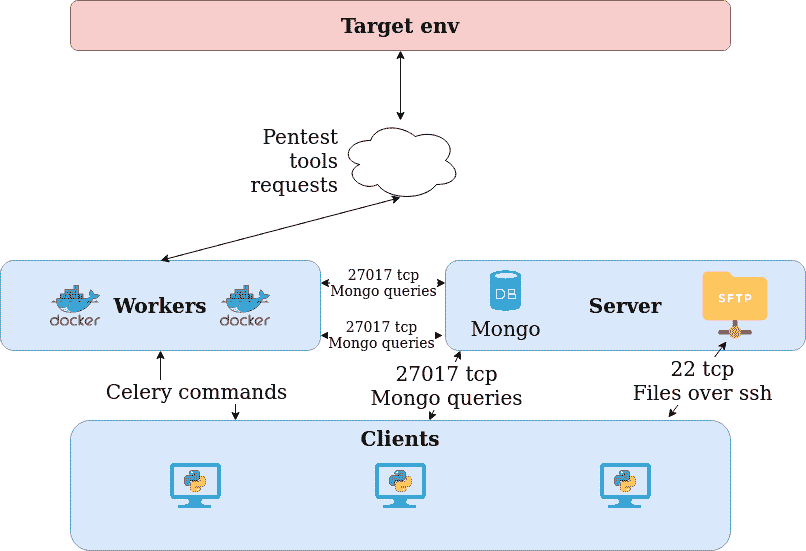

# Pollenisator:具有高度可定制工具的协作 Pentest 工具

> 原文：<https://kalilinuxtutorials.com/pollenisator/>

Pollenisator 是一个工具，旨在帮助 pentesters 和 auditor 自动使用一些工具/脚本并跟踪它们。

*   用 python 3 写的
*   提供“pentest 对象”的模型化:范围、主机、端口、命令、工具等。
*   工具/脚本分为 4 类:wave、网络/域、IP、端口
*   对象存储在 NoSQL 数据库(Mongo)中
*   保持它们之间的链接以允许查询
*   可以通过解析器/手动输入来创建对象
*   可以实现业务逻辑(自动引用、项目触发器等。)
*   许多工具/脚本启动条件可用于避免目标或扫描器过载。
*   基于 tcl/tk 的图形用户界面

**文档**

**特性**

*   注册您自己的工具
    *   在数据库中添加命令行选项。
    *   创建你自己的 light 插件来解析你的工具输出。
    *   使用对象模型向 pentest inside 插件添加、更新或删除对象。
    *   限制高噪音/重型工具的并行执行数量
*   使用定制工具定义重新识别/指纹识别程序
    *   选择启动和停止工具的时间段
    *   用域和网络 IP 范围定义您的范围。
    *   自定义设置以在范围中包括新主机
    *   保存通过工具执行生成的所有文件的结果
    *   启动给定的 docker 来实现局域网和网页测试的众多工具
*   协作测试
    *   通过用你想用的计算机启动一个工人，在你的机器之间分配工作。
    *   标记 ip 或工具，向你的队友展示你的能力。
    *   对每件物品做笔记，记录你的发现
    *   实时关注工具状态
    *   使用过滤器栏搜索所有对象属性。
    *   快速总结所有主机及其开放端口，并检查其中一些是否通电。
*   报告
    *   在 IPs 和端口上制造安全缺陷
    *   让你的插件直接产生缺陷，这样你就不用这么做了
    *   生成发现的安全缺陷的 Word 报告。你可以使用额外的工作自己的模板。
    *   生成发现的安全缺陷的 Powerpoint 报告。你可以使用额外的工作自己的模板。
*   附带预配置的工具
    *   IP /端口侦察:Nmap(快速 Nmap，然后进行全面扫描)
    *   域枚举:Knockpy，Sublist3r，dig reverse，crtsh
    *   Web : WhatWeb，Nikto，HeaderCollectors，http 方法，Dirsearch
    *   局域网:Crackmapexec，永恒之蓝和 bluekeep 扫描，smbmap，匿名 ftp，enum4linux
    *   未知端口:amap、nmap 脚本
    *   Misc : ikescan，ssh_scan，openrelay，searchsploit

**设置指南**

本安装指南最初是在 ubuntu 16.04 /18.04 上修订的

**词典**

*   worker:worker 是一个 docker / computer，你要运行的所有工具都安装在那里。这些工作人员将在目标上启动它们，并将结果数据发送到服务器。“工人”这个名字来源于对这部分芹菜的使用。
*   服务器:服务器只是一个 mongo 数据库和一个 SFTP 服务器。数据存储在数据库中，文件保存在 SFTP 目录中。
*   客户端:客户端是 pollenisator.py 的一个实例，它与服务器交互以启动工具并获取数据。

**架构概述**

可以有 1 个或以上的工人，1 个或以上的 pollenisator 客户端和 1 个 mongo 后端。mongo 数据库和 sftp 服务器可以用 docker 设置，也可以手动安装在 windows/linux 上(建议使用 linux)

工作线程将运行队列中的命令。你可以安装你想要的工具并做一些配置或者使用 docker 文件。

Pollenisator 客户端将根据一系列设置检查哪些命令已准备好启动，并向每个连接的人显示扫描结果。

[**Download**](https://github.com/AlgoSecure/Pollenisator)