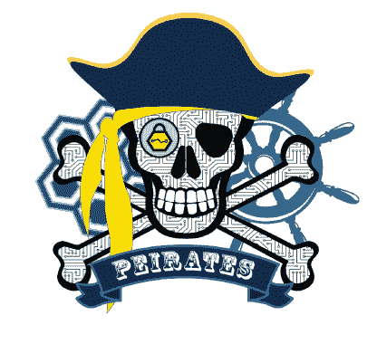

# Peirates : Kubernetes 渗透测试工具

> 原文：<https://kalilinuxtutorials.com/peirates/>

Kubernetes 渗透工具 Peirates 使攻击者能够提升权限并通过 Kubernetes 集群。它自动化已知的技术来窃取和收集服务帐户，获得进一步的代码执行，并获得对群集的控制。

我在哪里运行 Peirates？

您从 Kubernetes 上运行的容器中运行 Peirates。

**裴拉特攻击一个库伯内特星团？**

是的，绝对是。在 Kubernetes 集群中使用该工具之前，请咨询您的律师和集群所有者。

**谁创造裴率？**

InGuardians 的 CTO Jay Beale 首先想到了 Peirates，并召集了一组 InGuardians 开发人员与他一起创建它，其中包括费思·奥尔德逊、亚当·克朗普顿和戴夫·梅尔。Faith 说服我们都学习 Golang，这样她就可以实现该工具对 Kubernetes 项目中的 kubectl 库的使用。亚当说服小组使用高度互动的用户界面。戴夫带来了富有感染力的热情。这四个开发人员一起实施攻击，并开始发布我们在渗透测试中使用的工具。

**模块**

**建设和运行**

如果您只想让 peirates 二进制文件开始攻击某些东西，请从 releases 页面获取最新版本。

但是，如果您想从源代码开始构建，请继续阅读！

抓海盗

**go get-v " github . com/inguardians/Pei rates "**

如果您还没有库，请获取库源(警告:这将占用几乎 1g 的空间，因为它需要整个 kubernetes 库)

**go get-v " k8s . io/ku bectl/pkg/cmd " " github . com/AWS/AWS-SDK-go "**

构建可执行文件

**CD $ GOPATH/github . com/inguardians/Pei rates
。/build.sh**

这将在同一个目录中生成一个名为`**peirates**`的可执行文件。

[**Download**](https://github.com/inguardians/peirates)