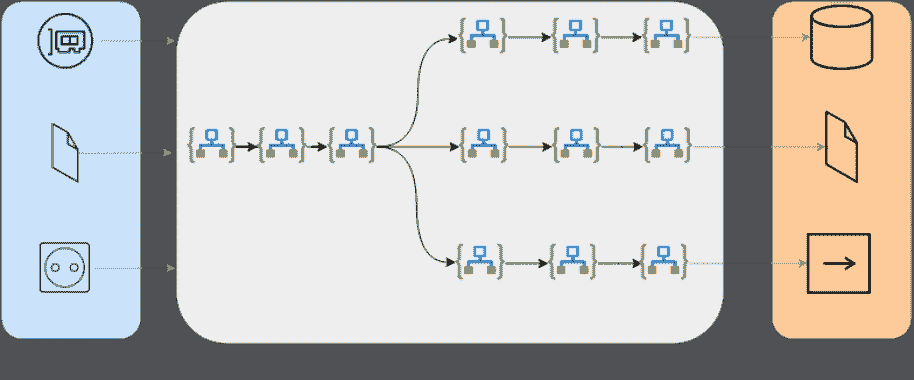

# DNSMonster:被动 DNS 捕获/监控框架

> 原文：<https://kalilinuxtutorials.com/dnsmonster/>

[](https://1.bp.blogspot.com/-uWJzkol1JWE/YSnFmJ8kCaI/AAAAAAAAKmQ/tRJaQxse9b4vUOuUffSRwejg-gnOX3CRwCLcBGAsYHQ/s728/DNSMonster%2B%25281%2529.png)

**DNSMonster** 是用 Golang、Click house 和 Grafana 构建的被动 DNS 收集和监控:`**dnsmonster**`实现了 DNS 流量的数据包嗅探器。它可以接受来自`**pcap**`文件、实时接口或`**dnstap**`套接字的流量，并可用于每秒索引和存储数千个 DNS 查询(它已被证明能够在商用计算机上每秒索引 200k+ DNS 查询)。

它的目标是可扩展、简单易用，并帮助安全团队了解企业 DNS 流量的详细信息。不打算跟踪 DNS 会话，而是打算在 DNS 数据包一进来就对其进行索引。它也不旨在侵犯最终用户的隐私，具有从 1 到 32 位屏蔽源 IP 的能力，使数据潜在地不可追踪。博客帖子

**重要提示:**1 . x 版本之前的代码被视为 beta 质量，可能会发生重大更改。请检查每个标签的发行说明，以查看每个版本之间的突发情况列表，以及如何减少潜在的数据丢失。



**主要特点**

*   可以用 Linux 的`afpacket`和零拷贝包捕获。
*   支持 BPF
*   能否模糊来源 IP 以增强隐私
*   可以具有预处理采样比
*   可以有一个“skip”`**fqdn**`列表，以避免将一些域/后缀/前缀写入存储，从而提高数据库性能
*   可以在 Clickhouse/Stdout/File 中有一个“允许”域列表，只记录对某些域的点击
*   每个输出流具有不同逻辑的模块化输出。当前为 stdout/file/clickhouse
*   跳过和允许域文件的热重新加载
*   使用 ClickHouse 的 TTL 属性的自动数据保留策略
*   使用 Grafana 的内置仪表板
*   可以作为单个静态链接的二进制文件提供
*   能够使用环境变量、命令行选项或配置文件进行配置
*   使用 ClickHouse 的采样功能对输出指标进行采样的能力
*   高压缩比得益于 ClickHouse 内置的 LZ4 存储
*   支持 TCP 上的 DNS、分段 DNS (udp/tcp)和 IPv6
*   支持 Unix 套接字或 TCP 上的 dnstrap

**手动安装**

**Linux**

对于`**afpacket**` v3 的支持，需要使用内核 3.x+。5 年前的任何 Linux 发行版都附带了 3.x+版本，所以它应该开箱即用。发布的二进制文件是以静态链接的二进制文件的形式发布的，不需要任何依赖关系，可以开箱即用。如果您的发行版没有正确运行预编译版本，请提交问题的详细信息，并使用手动构建这一节手动构建`**dnsmonster**`。

**视窗**

二进制文件的 Windows 版本取决于要安装的 npcap。安装后，二进制文件应该可以开箱即用。我已经在 Windows 10 环境下测试过了，它运行起来没有任何问题。要找到给`**-devName**`参数的接口名称并开始嗅探，您需要执行以下操作:

*   打开 cmd.exe(可能以管理员身份)并运行以下命令:`**getmac.exe**`，您将看到一个包含接口 MAC 地址和传输名称列的表格，类似于:`**\Device\Tcpip_{16000000-0000-0000-0000-145C4638064C}**`
*   像这样在`**cmd.exe**`中运行`**dnsmonster.exe**`:

```
dnsmonster.exe \Device\NPF_{16000000-0000-0000-0000-145C4638064C}
```

注意你要在`**dnsmonster.exe**`里面把`**\Tcpip**`从`**getmac.exe**`改成 **`\NPF`** 。

由于 **`afpacket`** 是一个 Linux 特性，Windows 不支持，`**useAfpacket**`及其相关选项将不起作用，并将导致 Windows 上的意外行为。

[**Download**](https://github.com/mosajjal/dnsmonster)