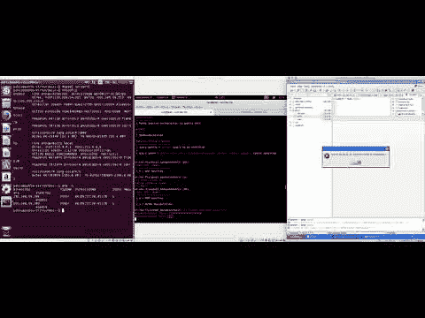
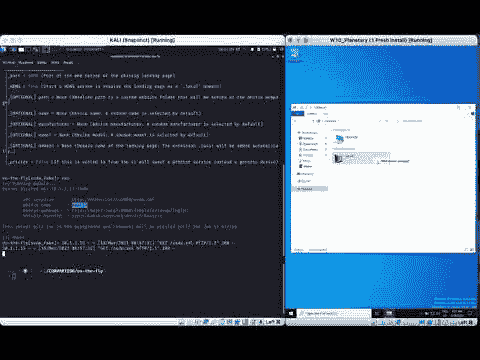
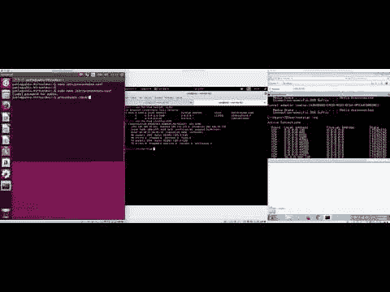
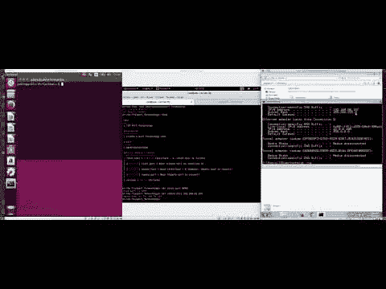
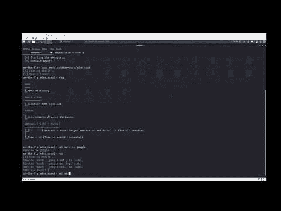

# 即时:提供在多个领域(物联网、集成电路和信息技术)执行测试的工具

> 原文：<https://kalilinuxtutorials.com/on-the-fly/>

**On-The-Fly** 是用 Python 编写的，大量使用了 Scapy 和 netfilterqueue。使用兼容版本的 Python 安装 Python 中的 Scapy 和网络过滤器队列是至关重要的。为此，建议使用 Python 3 到 Python 3 . 7 . 5 的版本(不要更高，因为在一些使用“动态”的库中可能与 3.8 和 3.9 不兼容)。第一次使用“pip install -r requirements.txt”启动该工具时，必须执行 requirements.txt 文件。同样，pip 版本必须面向 3.7.5 之前的 Python 3 版本。

**pip install-r requirements . txt**

**用途**

**python on-the-fly.py**

**示例视频**

*运行中:MySQL _ 操作模块*

*即时:SSDP _ 伪造模块*

*运行中:Proxy_socks4 模块*

*运行中:端口转发模块*

*运行中:MDNS_Scan 模块*

[**Download**](https://github.com/Telefonica/on-the-fly)