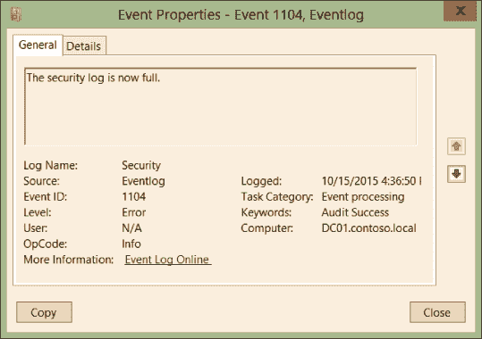

# QLOG : Windows 安全日志记录

> 原文：<https://kalilinuxtutorials.com/qlog/>

**QLOG** 为基于 Windows 的系统上的安全相关事件提供丰富的事件记录。它正处于重度开发阶段，目前处于 alpha 状态。QLOG 不使用 API 挂钩，也不需要在目标系统上安装驱动程序，QLOG 只使用 ETW 来检索其遥测数据。目前 QLOG 仅支持“流程创建”事件，但其他丰富的事件将很快推出。QLOG 作为 Windows 服务运行，但是如果您希望将丰富的事件直接传输到控制台，它也可以在控制台模式下运行。

**工作原理**

QLOG 读取 ETW，丰富事件，并将丰富的事件写入事件通道“QLOG”。它创建并使用一个名为“QMonitor”的新事件源来写入 Windows Eventlog。

以下是事件处理的顺序:

*   创建 ETW 会话并订阅相关的内核和用户 ETW 提供商
*   阅读来自 ETW 提供商的事件
*   丰富活动
*   将丰富的事件写入事件日志通道 QLOG

**开发&许可**

QLOG 由 threathunters.io 社区开发，一旦达到产品级成熟度，将会开源。

**我们为什么要创建 QLOG？**

Sysmon 做得很好，但是我们想创建一个开源的工具，并且不需要在目标系统上安装驱动程序。还有，微软根本不支持 Sysmon。因此，如果你在 prod 中遇到问题，你只能靠自己。当然，QLOG 也不支持，但它将是开源的，因此我们可以借助安全社区的力量解决问题，并根据社区的要求开发新功能。

**用法&安装**

QLOG 要求。要安装的. NET Framework >=4.7.2。

要在交互式控制台模式下运行，只需运行

qlog.exe

要作为 Windows 服务安装/卸载，请运行:

**#安装服务
qlog.exe-I
#卸载服务
qlog.exe-u**

**丰富流程创建事件的示例输出**

**{
“EventGuid”: “68795fe8-67e7-410b-a5c0-8364746d7ffe”,
“StartTime”: “2021-07-11T11:06:56.9621746+02:00”,
“QEventID”: 100,
“QType”: “Process Create”,
“Username”: “TESTOS\TESTUSER”,
“Imagefilename”: “TEAMS.EXE”,
“KernelImagefilename”: “TEAMS.EXE”,
“OriginalFilename”: “TEAMS.EXE”,
“Fullpath”: “C:\Users\TESTUSER\AppData\Local\Microsoft\Teams\current\Teams.exe”,
“PID”: 21740,
“Commandline”: “\”C:\Users\TESTUSER\AppData\Local\Microsoft\Teams\current\Teams.exe\” –type=renderer –autoplay-policy=no-user-gesture-required –disable-background-timer-throttling –field-trial-handle=1668,499009601563875864,12511830007210419647,131072 –enable-features=WebComponentsV0Enabled –disable-features=CookiesWithoutSameSiteMustBeSecure,SameSiteByDefaultCookies,SpareRendererForSitePerProcess –lang=de –enable-wer –ms-teams-less-cors=522133263 –app-user-model-id=com.squirrel.Teams.Teams –app-path=\”C:\Users\jocke”,
“Modulecount”: 41,
“TTPHash”: “42AC63285408F5FD91668B16F8E9157FD97046AB63E84117A14E31A188DDC62F”,
“Imphash”: “F14F00FA1D4C82B933279C1A28957252”,
“sha256”: “155625190ECAA90E596CB258A07382184DB738F6EDB626FEE4B9652FA4EC1CC2”,
“md5”: “9453BC2A9CC489505320312F4E6EC21E”,
“sha1”: “7219CB54AC535BA55BC1B202335A6291FDC2D76E”,
“ProcessIntegrityLevel”: “None”,
“isOndisk”: true,
“isRunning”: true,
“Signed”: “Signature valid”,
“AuthenticodeHash”: “B8AD58EE5C35B3F80C026A318EEA34BABF6609C077CB3D45AEE69BF5C9CF8E11”,
“Signatures”: [
{
“Subject”: “CN=Microsoft Corporation, O=Microsoft Corporation, L=Redmond, S=Washington, C=US”,
“Issuer”: “CN=Microsoft Code Signing PCA 2010, O=Microsoft Corporation, L=Redmond, S=Washington, C=US”,
“NotBefore”: “15.12.2020 22:24:20”,
“NotAfter”: “02.12.2021 22:24:20”,
“DigestAlgorithmName”: “SHA256”,
“Thumbprint”: “E8C15B4C98AD91E051EE5AF5F524A8729050B2A2”,
“TimestampSignatures”: [
{
“Subject”: “CN=Microsoft Time-Stamp Service, OU=Thales TSS ESN:3BBD-E338-E9A1, OU=Microsoft America Operations, O=Microsoft Corporation, L=Redmond, S=Washington, C=US”,
“Issuer”: “CN=Microsoft Time-Stamp PCA 2010, O=Microsoft Corporation, L=Redmond, S=Washington, C=US”,
“NotBefore”: “12.11.2020 19:26:02”,
“NotAfter”: “11.02.2022 19:26:02”,
“DigestAlgorithmName”: “SHA256”,
“Thumbprint”: “E8220CE2AAD2073A9C8CD78752775E29782AABE8”,
“Timestamp”: “15.06.2021 00:39:50 +02:00”
}
]
},
{
“Subject”: “CN=Microsoft Corporation, O=Microsoft Corporation, L=Redmond, S=Washington, C=US”,
“Issuer”: “CN=Microsoft Code Signing PCA 2011, O=Microsoft Corporation, L=Redmond, S=Washington, C=US”,
“NotBefore”: “15.12.2020 22:31:47”,
“NotAfter”: “02.12.2021 22:31:47”,
“DigestAlgorithmName”: “SHA256”,
“Thumbprint”: “C774204049D25D30AF9AC2F116B3C1FB88EE00A4”,
“TimestampSignatures”: [
{
“Subject”: “CN=Microsoft Time-Stamp Service, OU=Thales TSS ESN:F87A-E374-D7B9, OU=Microsoft Operations Puerto Rico, O=Microsoft Corporation, L=Redmond, S=Washington, C=US”,
“Issuer”: “CN=Microsoft Time-Stamp PCA 2010, O=Microsoft Corporation, L=Redmond, S=Washington, C=US”,
“NotBefore”: “14.01.2021 20:02:23”,
“NotAfter”: “11.04.2022 21:02:23”,
“DigestAlgorithmName”: “SHA256”,
“Thumbprint”: “ED2C601EDD49DD2A934D2AB32DCACC19940161EF”,
“Timestamp”: “15.06.2021 00:39:53 +02:00”
}
]
}
],
“ParentProcess”: {
“EventGuid”: null,
“StartTime”: “2021-07-11T09:54:28.9558001+02:00”,
“QEventID”: 100,
“QType”: “Process Create”,
“Username”: “TEST-OS\TESTUSER”,
“Imagefilename”: “”,
“KernelImagefilename”: “”,
“OriginalFilename”: “TEAMS.EXE”,
“Fullpath”: “C:\Users\TESTUSER\AppData\Local\Microsoft\Teams\current\Teams.exe”,
“PID”: 16232,
“Commandline”: “C:\Users\TESTUSER\AppData\Local\Microsoft\Teams\current\Teams.exe “,
“Modulecount”: 162,
“TTPHash”: “”,
“Imphash”: “F14F00FA1D4C82B933279C1A28957252”,
“sha256”: “155625190ECAA90E596CB258A07382184DB738F6EDB626FEE4B9652FA4EC1CC2”,
“md5”: “9453BC2A9CC489505320312F4E6EC21E”,
“sha1”: “7219CB54AC535BA55BC1B202335A6291FDC2D76E”,
“ProcessIntegrityLevel”: “Medium”,
“isOndisk”: true,
“isRunning”: true,
“Signed”: “Signature valid”,
“AuthenticodeHash”: “B8AD58EE5C35B3F80C026A318EEA34BABF6609C077CB3D45AEE69BF5C9CF8E11”,
“Signatures”: [
{
“Subject”: “CN=Microsoft Corporation, O=Microsoft Corporation, L=Redmond, S=Washington, C=US”,
“Issuer”: “CN=Microsoft Code Signing PCA 2010, O=Microsoft Corporation, L=Redmond, S=Washington, C=US”,
“NotBefore”: “15.12.2020 22:24:20”,
“NotAfter”: “02.12.2021 22:24:20”,
“DigestAlgorithmName”: “SHA256”,
“Thumbprint”: “E8C15B4C98AD91E051EE5AF5F524A8729050B2A2”,
“TimestampSignatures”: [
{
“Subject”: “CN=Microsoft Time-Stamp Service, OU=Thales TSS ESN:3BBD-E338-E9A1, OU=Microsoft America Operations, O=Microsoft Corporation, L=Redmond, S=Washington, C=US”,
“Issuer”: “CN=Microsoft Time-Stamp PCA 2010, O=Microsoft Corporation, L=Redmond, S=Washington, C=US”,
“NotBefore”: “12.11.2020 19:26:02”,
“NotAfter”: “11.02.2022 19:26:02”,
“DigestAlgorithmName”: “SHA256”,
“Thumbprint”: “E8220CE2AAD2073A9C8CD78752775E29782AABE8”,
“Timestamp”: “15.06.2021 00:39:50 +02:00”
}
]
},
{
“Subject”: “CN=Microsoft Corporation, O=Microsoft Corporation, L=Redmond, S=Washington, C=US”,
“Issuer”: “CN=Microsoft Code Signing PCA 2011, O=Microsoft Corporation, L=Redmond, S=Washington, C=US”,
“NotBefore”: “15.12.2020 22:31:47”,
“NotAfter”: “02.12.2021 22:31:47”,
“DigestAlgorithmName”: “SHA256”,
“Thumbprint”: “C774204049D25D30AF9AC2F116B3C1FB88EE00A4”,
“TimestampSignatures”: [
{
“Subject”: “CN=Microsoft Time-Stamp Service, OU=Thales TSS ESN:F87A-E374-D7B9, OU=Microsoft Operations Puerto Rico, O=Microsoft Corporation, L=Redmond, S=Washington, C=US”,
“Issuer”: “CN=Microsoft Time-Stamp PCA 2010, O=Microsoft Corporation, L=Redmond, S=Washington, C=US”,
“NotBefore”: “14.01.2021 20:02:23”,
“NotAfter”: “11.04.2022 21:02:23”,
“DigestAlgorithmName”: “SHA256”,
“Thumbprint”: “ED2C601EDD49DD2A934D2AB32DCACC19940161EF”,
“Timestamp”: “15.06.2021 00:39:53 +02:00”
}
]
}
],
“ParentProcess”: null
}
}**

[**Download**](https://github.com/threathunters-io/QLOG)