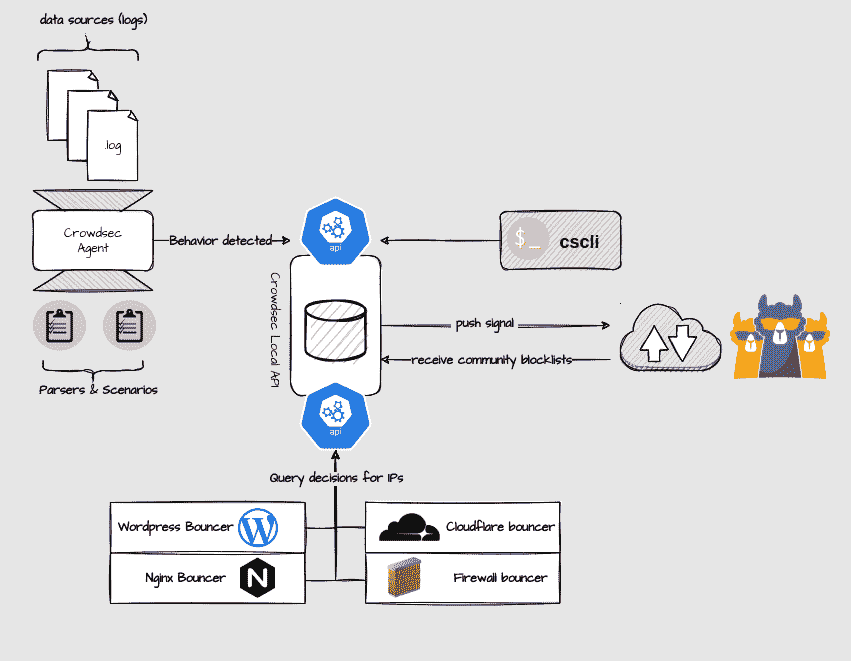
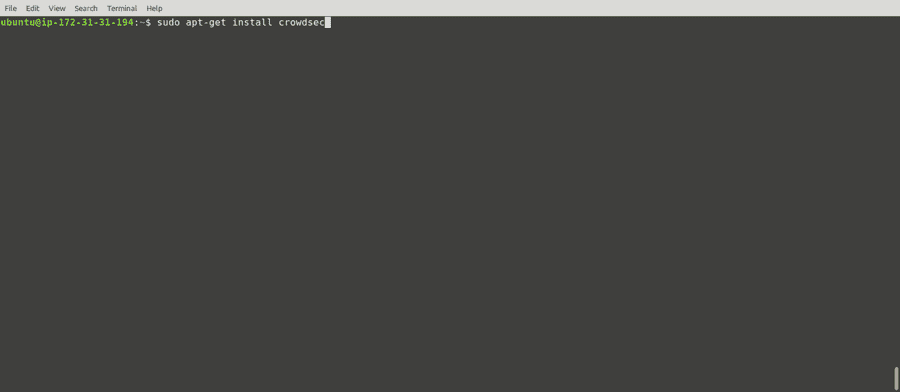
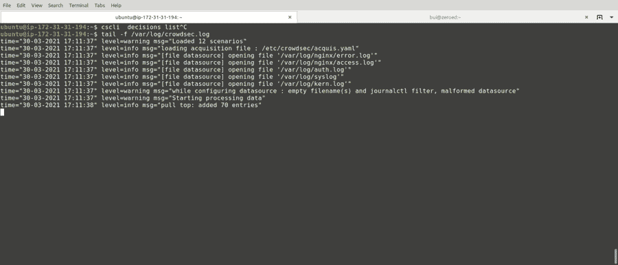
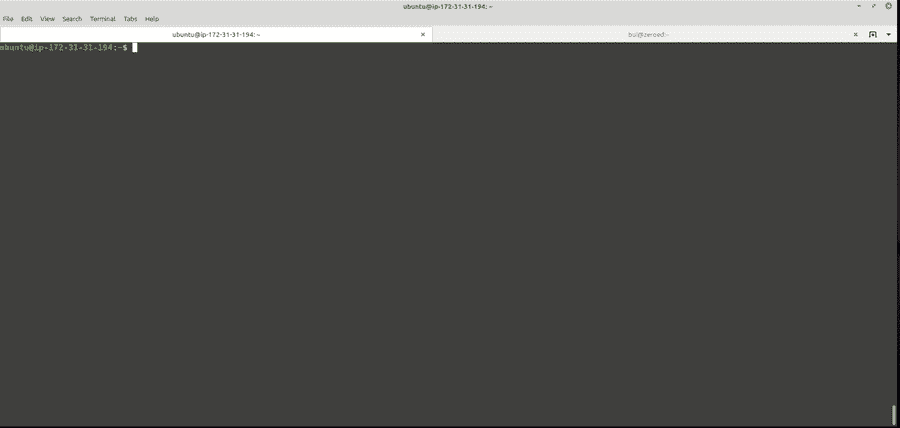

# CrowdSec:一个开源的大型多层防火墙，能够分析访问者的行为，并对各种攻击提供适当的响应

> 原文：<https://kalilinuxtutorials.com/crowdsec/>

**CrowdSec** 是一个免费的现代&协作行为检测引擎，再加上一个全球知识产权信誉网络。它基于 fail2ban 的理念，但兼容 IPV6，速度快 60 倍(Go vs Python)，使用 Grok 模式解析日志，使用 YAML 场景识别行为。CrowdSec 专为基于现代云/容器/虚拟机的基础设施而设计(通过分离检测和补救)。一旦检测到威胁，你可以用各种反弹器(防火墙拦截，nginx http 403，验证码等)来补救。)而攻击性 IP 可以在所有用户之间共享之前被发送到 CrowdSec 进行监管，以进一步提高每个人的安全性。参见常见问题或阅读下文了解更多信息。

**2 分钟安装**

通过操作系统的软件包系统安装它是最简单的方法。否则，您可以从源代码安装它。

**【从包(Debian)】**

**curl-s https://package cloud . io/install/repositories/crowd sec/crowd sec/script . deb . sh | sudo bash
sudo apt-get 更新
sudo apt-get 安装 crowdsec**

**来自软件包(rhel/centos/amazon linux)**

**curl-s https://package cloud . io/install/repositories/crowd sec/crowd sec/script . rpm . sh | sudo bash
sudo yum install crowd sec**

**来自软件包(FreeBSD)**

**sudo pkg 更新
sudo pkg 安装众包**

**来源于**

**wget https://github . com/crowd security/crowd sec/releases/latest/download/crowd sec-release . tgz
tar xzvf crowd sec-release . tgz
CD crowd sec-v *&&sudo。/wizard.sh -i**

**关于众包项目**

Crowdsec 是一款开源的轻量级软件，可以检测具有攻击行为的同行，以防止他们访问您的系统。其用户友好的设计和协助提供了一个低技术门槛，但仍然有很高的安全增益。

该架构如下所示:

一旦发现不想要的行为，通过保镖处理。攻击性 IP、场景触发和时间戳被发送用于监管，以避免中毒和误报。(这个可以禁用)。如果通过验证，这个 IP 将被重新分配给所有运行相同场景的 CrowdSec 用户。

**人数超过所有黑客**

通过分享他们所面临的威胁，所有用户都在互相保护(因此得名“人群安全”)。Crowdsec 是为现代基础设施而设计的，它的“*这里检测，那里补救*”方法允许您在一个地方分析来自多个来源的日志，并在您的堆栈的不同级别(应用程序、系统、基础设施)阻止威胁。

CrowdSec 默认附带场景(暴力破解、端口扫描、网页扫描等。)适合大多数上下文，但是您可以通过从 **HUB** 中选择更多来轻松扩展它。也很容易改编现有的或自己创建一个。

**它不是什么**

CrowdSec 不是一个 SIEM，它存储您的日志(既不是本地的也不是远程的)。你的数据在本地被分析，然后被遗忘。

发送到监管平台的信号仅限于非常严格的最小值:IP、场景、时间戳。它们仅用于允许系统发现新的流氓 IP，排除误报或中毒企图。

**安装它**

Crowdsec 可用于各种平台:

*   使用我们的 debian 仓库或官方的 debian 软件包
*   docker 有可用的图像
*   还提供了预构建的发布包(适用于`**amd64**`)
*   您也可以从源代码构建它

或者直接查看其他方法和平台的安装文档。

**主要优势**

**快速辅助安装，无技术壁垒**

初始配置是自动化的，提供了功能性的开箱即用设置

**开箱检测**

基线检测开箱即用，无需微调(单击展开)

**Easy bouncer deploym** ent

增加保镖来执行众包的决定是很简单的事情(点击展开)

**轻松访问仪表板**

只需使用 cscli 就可以轻松部署元数据库接口来查看您的数据(单击展开)

**热的&冷的**

处理冷日志，用于取证、测试和追踪误报和漏报(单击展开)

[**Download**](https://github.com/crowdsecurity/crowdsec)