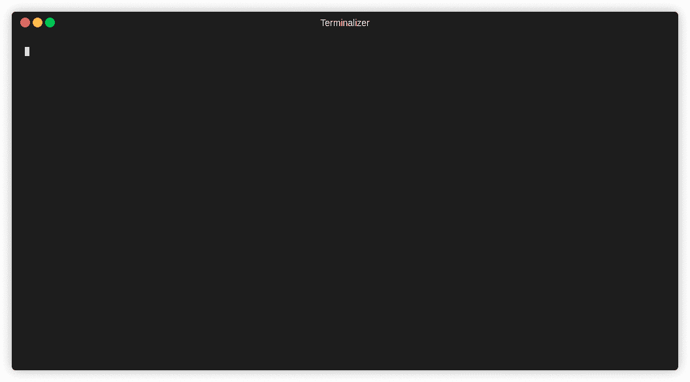

# Reconky:一个伟大的内容发现 Bash 脚本，用于 Bug 赏金猎人，它自动化了许多任务并对其进行了组织

> 原文：<https://kalilinuxtutorials.com/reconky/>

Reconky 是用 bash 编写的一个脚本，用于自动执行侦察和信息收集任务。这个 Bash 脚本允许您收集一些信息，这些信息将帮助您确定下一步做什么以及在哪里寻找所需的目标。

**主要特征**

*   它将收集带有 assetfinder 和 Sublist3r 的子域
*   使用 amass 对子域进行双工检查
*   使用 knockpy 通过字典攻击枚举目标域上的子域
*   使用 Httprobe 搜索活动域
*   调查可行的子域接管
*   使用 nmap 扫描打开的端口
*   提取并组合在 wayback_url 数据中找到的所有可能的参数
*   从 wayback 输出中提取并编译 json/js/php/aspx/文件
*   将目击者与所有已编译的(存活的)域名进行比对

**安装&要求**

*   从 https://github . com/shivamrai 2003/Reconky-Automated _ Bash _ Script/blob/main/Reconky . sh 下载安装脚本

| **#！/usr/bin/bash** |
|  | **#作者:Shivam Rai/** |
|  | **#日期:2021 年 6 月 18 日** |
|  | **#描述:自动侦察工具** |
|  | e **cho "** |
|  | ——— _______ _______ _______ _______ _ _ |
|  | ( ____ )( ____ \( ____ \( ___ )( ( /&#124;&#124; \ /\&#124;\ /&#124; |
|  | &#124; ( )&#124;&#124; ( \/&#124; ( \/&#124; ( ) &#124;&#124; \ ( &#124;&#124; \ / /( \ / ) |
|  | &#124; (____)&#124;&#124; (__ &#124; &#124; &#124; &#124; &#124; &#124;&#124; \ &#124; &#124;&#124; (_/ / \ (_) / |
|  | &#124; __)&#124; __) &#124; &#124; &#124; &#124; &#124; &#124;&#124; (\ \) &#124;&#124; _ ( \ / |
|  | &#124; (\ ( &#124; ( &#124; &#124; &#124; &#124; &#124; &#124;&#124; &#124; \ &#124;&#124; ( \ \ ) ( |
|  | &#124; ) \ \__&#124; (____/\&#124; (____/\&#124; (___) &#124;&#124; ) \ &#124;&#124; / \ \ &#124; &#124; |
|  | &#124;/ \__/(_______/(_______/(_______)&#124;/ )_)&#124;_/ \/ \_/ |
|  | " |
|  | if [[ $(id -u)！= 0 ]];然后 |
|  | echo -e "\n[！] Install.sh 需要 root 权限" |
|  | 出口 0 |
|  | 船方不负担装货费用 |
|  | 目标= 1 美元 |
|  | 如果[！-d " $ target "]；然后 |
|  | mkdir $target |
|  | 船方不负担装货费用 |
|  | 如果[！-d " $ target/reconky "]；然后 |
|  | mkdir $target/reconky |
|  | 船方不负担装货费用 |
|  | 如果[！-d ' $ target/reconky/sublist 3r ']；然后 |
|  | mkdir $target/reconky/sublist3r |
|  | 触摸＄target/reconky/sublist 3r/subdomains . txt |
|  | 船方不负担装货费用 |
|  | 如果[！-d ' $ tag get/re onky/http probe ']；然后 |
|  | mkdir $ target/reconky/http probe |
|  | 船方不负担装货费用 |
|  | 如果[！-d ' $ target/reconky/asset finder ']；然后 |
|  | mkdir $ target/reconky/asset finder |
|  | 触摸＄target/reconky/asset finder/subdomain S1 . txt |
|  | 船方不负担装货费用 |
|  | 如果[！-d ' $ target/reconky/Subdomain _ take over ']；然后 |
|  | mkdir $ target/reconky/Subdomain _ take over |
|  | 船方不负担装货费用 |
|  | 如果[！-d ' $ target/reconky/scans ']；然后 |
|  | mkdir $目标/侦察/扫描 |
|  | 船方不负担装货费用 |
|  | 如果[！-d ' $ target/reconky/way back _ URLs ']；然后 |
|  | mkdir $ target/reconky/way back _ URLs |
|  | mkdir $ target/reconky/way back _ URLs/params |
|  | 触摸＄target/reconky/way back _ URLs/params/params . txt |
|  | mkdir $ target/reconky/way back _ URLs/extensions |
|  | 船方不负担装货费用 |
|  | 如果[！-d ' $ target/reconky/amass ']；然后 |
|  | mkdir $target/reconky/amass |
|  | 触摸＄target/reconky/amass/sub domains 2 . txt |
|  | 船方不负担装货费用 |
|  | 如果[！-d ' $ target/reconky/witness ']；然后 |
|  | 目标/侦察/目击者 |
|  | 船方不负担装货费用 |
|  | 如果[！-d ' $ target/reconky/knockpy ']；然后 |
|  | mkdir $target/reconky/knockpy |
|  | 触摸＄target/reconky/knock py/subdomains 3 . txt |
|  | 船方不负担装货费用 |
|  | 如果[！-f " $ target/re onky/http probe/alivee . txt "]；然后 |
|  | 触摸＄target/re conky/http probe/alivee . txt |
|  | 船方不负担装货费用 |
|  | red = ' t 输出 setaf 1 ' |
|  | green = ' t 输出 setaf 2 ' |
|  | 黄色= ' t 输出 setaf 3 ' |
|  | 回声 |
|  | echo ${yellow} "欢迎使用 Reconky 脚本-一个优秀的 Bug 奖励/测试自动化脚本" ${yellow} |
|  | 回声 |
|  | echo ＄{ red } "[++++]集合具有 assetfinder 和 Sublist3r 的子域…[+++++]"＄{ red } |
|  | 回声 |
|  | echo ${red}"[+++]使用 amass…[+++]"${red}对子域进行双工检查 |
|  | 回声 |
|  | echo ${red}"[+++]通过字典攻击枚举目标域上的子域…[+++]"${red} |
|  | 回声 |
|  | echo ${red}"[+++]使用 Httprobe 搜索活动域…[+++]"${red} |
|  | 回声 |
|  | echo ${red}"[+++]调查可行的子域接管…[+++]"${red} |
|  | 回声 |
|  | echo ${green}"[+++]使用 nmap 扫描打开的端口…[+++]"${green} |
|  | 回声 |
|  | echo $ { green } "[++++]提取并组合在 wayback_url 数据中找到的所有可能的参数…[+++++]" $ { green } |
|  | 回声 |
|  | echo $ { green } "[++++]从 wayback 输出中提取并编译 json/js/php/aspx/文件…[+++++]" $ { green } |
|  | 回声 |
|  | echo $ { green } "[++++]运行 gowtiness(目击者)对所有已编译(活动)域…[+++++]" $ { green } |
|  | 回声 |
|  | echo ＄{ yellow } "[++++]侦察正在进行中请喝杯咖啡或茶；)[+++]"${yellow} |
|  | 回声 |
|  | asset finder $ target > > $ target/reconky/asset finder/subdomain S1 . txt |
|  | cat $ target/reconky/asset finder/subdomains 1 . txt &#124; grep $ 1 > > $ target/reconky/Subdomain _ final . txt |
|  | 回声 |
|  | sublist 3r-d $ target-v-t 100-o $ target/reconky/sublist 3r/subdomains . txt |
|  | cat $ target/reconky/sublist 3r/subdomains . txt &#124; grep $ 1 > > $ target/reconky/Subdomain _ final . txt |
|  | 回声 |
|  | amass enum-d＄target-o＄target/reconky/amass/sub domain S2 . txt |
|  | cat $ target/reconky/amass/subdomains 2 . txt &#124; grep $ 1 > > $ target/reconky/Subdomain _ final . txt |
|  | 回声 |
|  | knockpy $ target > > $ target/reconky/knockpy/sub domains 3 . txt |
|  | awk '/$ target/{ print } ' $ target/reconky/knock py/subdomains 3 . txt &#124; cut-d " "-f 9 > > $ target/reconky/Subdomain _ final . txt |
|  | 回声 |
|  | cat＄target/reconky/subdomain _ final . txt &#124; sort-u &#124; http probe &#124; sed-e 's/^\s*.*:\/\///g ' > > $ target/reconky/http probe/alivee . txt |
|  | 回声 |
|  | 如果[！-f " $ target/reconky/Subdomain _ take over/Subdomain _ take over . txt "]；然后 |
|  | 触摸＄target/reconky/Subdomain _ take over/Subdomain _ take over . txt |
|  | 船方不负担装货费用 |
|  | sub jack-w $ target/reconky/Subdomain _ final . txt-t 70-time out 25-SSL-c/root/go/src/github . com/ha cer/sub jack/fingerprints . JSON-v 3-o $ target/reconky/Subdomain _ take over/Subdomain _ take over . txt |
|  | 回声 |
|  | nmap-iL $ target/reconky/http probe/alivee . txt-T4-oA $ target/reconky/scans/scanned . txt |
|  | 回声 |
|  | 如果[！-f " $ target/re onky/way back _ URLs/way back _ output . txt "]；然后 |
|  | 触摸＄target/reconky/way back _ URLs/way back _ output . txt |
|  | 船方不负担装货费用 |
|  | cat $ target/reconky/Subdomain _ final . txt &#124; way back URLs > > $ target/reconky/way back _ URLs/way back _ output . txt |
|  | sort-u $ target/reconky/way back _ URLs/way back _ output . txt |
|  | cat $ target/reconky/way back _ URLs/way back _ output . txt &#124; grep '？* = ' &#124; cut-d ' = '-f1 &#124; sort-u > > $ target/reconky/way back _ URLs/params/params . txt |
|  | 对于 I in $(cat $ target/re onky/way back _ URLs/params/params . txt)；do echo $ i ' =完成的 |
|  | 回声 |
|  | 对于 I in $(cat $ target/re onky/way back _ URLs/way back _ output . txt)；做 |
|  | ext="${i##*。}" |
|  | if[[" ext " = = " PHP "]]；然后 |
|  | echo $ I > > $ target/reconky/way back _ URLs/extensions/PHP 1 . txt |
|  | sort-u $ target/reconky/way back _ URLs/extensions/PHP 1 . txt > > $ target/reconky/way back _ URLs/extensions/PHP . txt |
|  | RM $ target/reconky/way back _ URLs/extensions/PHP 1 . txt |
|  | 船方不负担装货费用 |
|  | if[[" ext " = = " js "]]；然后 |
|  | echo $ I > > $ target/reconky/way back _ URLs/extensions/js1 . txt |
|  | sort-u $ target/re conky/way back _ URLs/extensions/js1 . txt > > $ target/re conky/way back _ URLs/extensions/js . txt |
|  | RM $ target/re conky/way back _ URLs/extensions/js1 . txt |
|  | 船方不负担装货费用 |
|  | if[[" ext " = = " html "]]；然后 |
|  | echo $ I > > $ target/reconky/way back _ URLs/extensions/html 1 . txt |
|  | sort-u $ target/reconky/way back _ URLs/extensions/html 1 . txt > > $ target/reconky/way back _ URLs/extensions/html . txt |
|  | RM $ target/re conky/way back _ URLs/extensions/html 1 . txt |
|  | 船方不负担装货费用 |
|  | if[[" ext " = = " JSON "]]；然后 |
|  | echo $ I > > $ target/reconky/way back _ URLs/extensions/JSON 1 . txt |
|  | sort-u $ target/re conky/way back _ URLs/extensions/JSON 1 . txt > > $ target/re conky/way back _ URLs/extensions/JSON . txt |
|  | RM $ target/reconky/way back _ URLs/extensions/JSON 1 . txt |
|  | 船方不负担装货费用 |
|  | if[[" ext " = = " aspx "]]；然后 |
|  | echo $ I > > $ target/reconky/way back _ URLs/extensions/aspx 1 . txt |
|  | sort-u $ target/reconky/way back _ URLs/extensions/aspx 1 . txt > > $ target/reconky/way back _ URLs/extensions/aspx . txt |
|  | RM $ target/reconky/way back _ URLs/extensions/aspx 1 . txt |
|  | 船方不负担装货费用 |
|  | 完成的 |
|  | witness-f $ target/re conky/http probe/alivee . txt–we B- d $ target/
re conky/witness–resolve |

**演示**

[**Download**](https://github.com/ShivamRai2003/Reconky-Automated_Bash_Script)