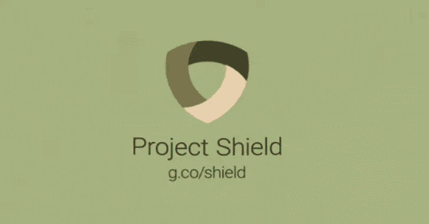

# PoW-Shield:项目致力于打击 DDoS 和垃圾邮件的工作证明，具有额外的 WA

> 原文：<https://kalilinuxtutorials.com/pow-shield/>

**PoW-Shield** 通过充当代理，利用后端服务和最终用户之间的工作证明，在 OSI 应用层提供 DDoS 保护。这个项目旨在提供一种替代一般验证码方法的方法，如谷歌的 ReCaptcha，这一直是一个很难解决的问题。访问受 PoW Shield 保护的 web 服务从未如此简单，只需进入 url，您的浏览器将自动为您完成其余的验证工作。

PoW Shield 旨在提供捆绑在单个 webapp / docker 映像中的以下服务:

*   工作证明认证
*   速率限制和 ip 黑名单
*   web 应用防火墙

媒介上的故事

**工作原理**

所以基本上，PoW Shield 在实际的 web 应用程序/服务面前充当代理。它通过工作证明进行验证，并且只将授权的流量代理到实际的服务器。该代理易于安装，并能够用 WAF 保护低安全性应用。

以下是当用户浏览受 PoW Shield 保护的 web 服务时，在幕后发生的情况:

*   服务器生成一个随机的十六进制编码的“前缀”,并把它和能量护盾页面一起发送给客户端。
*   然后，客户端的浏览器 JavaScript 试图强行使用一个“nonce ”,当添加前缀时，可以生成一个 SHA256 哈希，其前导零位数比服务器指定的“难度”D 多。即 SHA256(前缀+ nonce)=0…0xxxx(二进制，有 D 个以上的前导 0)
*   然后，客户端 JavaScript 将计算出的随机数发送到服务器进行验证，如果验证通过，服务器将为客户端生成一个 cookie 以通过身份验证。
*   服务器开始将现在已通过身份验证的客户端流量代理到启用 WAF 过滤的服务器。

**用法**

nodejs 和 docker

**配置**

环境变量

**特色**

*   Web 服务结构
*   代理功能
*   功率实现
*   码头化
*   IP 黑名单
*   限速
*   单元测试
*   晶片实现
*   多个实例同步(Redis)

[**Download**](https://github.com/RuiSiang/PoW-Shield)