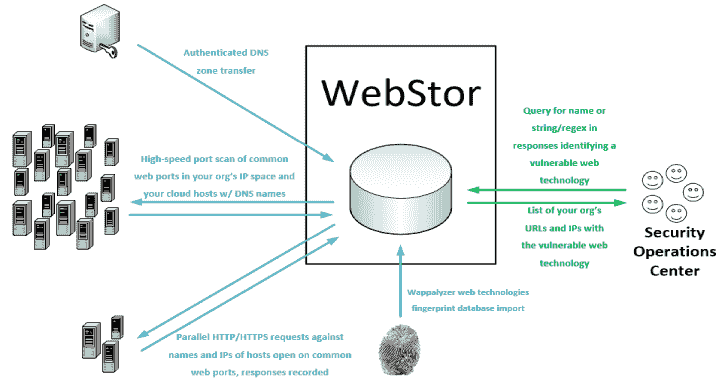

# Webstor:一个脚本，用于快速枚举您组织的所有网络中的所有网站

> 原文：<https://kalilinuxtutorials.com/webstor/>

**Webstor** 是一个在 MIT 许可下用 Python 实现的工具，用于快速枚举您组织的所有网络中的所有网站，存储它们的响应，并查询已知的 web 技术和版本，例如那些具有零日漏洞的技术和版本。它尤其旨在解决在具有分散管理的大中型组织中出现的独特问题，其中几乎不可能跟踪由分布在不同单元和网络上的各种管理员部署的所有 web 技术。

WebStor 通过执行以下操作来实现其目标:

1.  执行 DNS 区域转移以收集组织的 A 和 CNAME 记录。
2.  使用 Masscan 扫描组织网络范围内打开的 HTTP/HTTPS 端口，以及组织的 A 和 CNAME 记录中存在的这些范围之外的任何 IP 地址。
3.  使用 Python 请求库收集所有响应并存储在 MariaDB 数据库中。除了 IP 地址之外，所有与开放 HTTP/HTTPS 端口的 IP 对应的 DNS 名称都将包含在请求中，以便使用不同标题的站点不会导致网站被遗漏。
4.  下载 Wappalyzer web technologies 数据库并存储在 MariaDB 数据库中，使用户能够通过名称查询常见 web 技术的位置。
5.  允许用户查询存储响应中包含自定义正则表达式的位置。

**支持的平台**

WebStor 目前将在 Linux 系统上运行。因为它是用 Python 写的，所以转换到支持 Windows 将是微不足道的，并且很可能在未来发生。

**先决条件**

**申请**

*   Masscan
    *   **如果您将使用 cron 作业来更新数据库(典型),那么为任何通过 WebStor 执行 Masscan 扫描的用户配置 sudo nopasswd 是至关重要的。**
*   MariaDB 10.0.5 或更高版本
    *   WebStor 尝试的默认凭据将是 root 和空白密码。有关配置 WebStor 使用其他用户名和密码连接到数据库的信息，请参见“安全选项”一节。

**Python 库**

*   pip3 安装 dnspython
*   pip3 安装美丽组 4
*   pip3 安装 mysql-connector-python
*   pip3 安装 js-regex
*   pip3 安装 gevent
*   pip3 安装请求

**通过 PyPI 供货**

*   如果您只是想运行 WebStor 而不是编辑它，您可以安装必备的应用程序，然后使用“sudo pip3 install webstor”。
*   通过 PyPI 安装 webstor 后，webstor 将位于路径中，并且可以在命令行中运行，无论工作目录是' WebStor '还是' webstor.py '，例如' webstor -g '。

**基本用法**

**webstor.py [-h] [–ADD-HTTP-PORT HTTPPORTTOADD] [–CLEAR-HTTP]
[–ADD-HTTPS-PORT HTTPSPORTTOADD] [–CLEAR-HTTPS]
[–ADD-CUSTOM-FINGERPRINT FINGERPRINT]
[–DELETE-CUSTOM-FINGERPRINT FINGERPRINTNAMETODELETE]
[–IMPORT-CUSTOM-FINGERPRINT IMPORTFINGERPRINTFILE]
[–CLEAR-CUSTOM-FINGERPRINTS] [–SHOW-CONFIG]
[–SHOW-CONFIG-FULL] [–RUN-MASSCAN]
[–SET-MASSCAN-RANGES SETSCANRANGES]
[–IMPORT-MASSCAN-RANGES IMPORTSCANRANGES]
[–DELETE-RANGE RANGETODELETE] [–ADD-PATH PATHTOADD]
[–DELETE-PATH PATHTODELETE] [–CLEAR-PATHS]
[–REFRESH-RESPONSES] [–SEARCH-PATTERN SEARCHPATTERN]
[–SEARCH-CUSTOM-FINGERPRINT SEARCHFINGERPRINT]
[–SEARCH-WAPPALYZER SEARCHWAPPALYZER] [–NO-TSIG-KEY]
[–TSIG-KEY-IMPORT IMPORTTSIGFILE]
[–TSIG-KEY-REPLACE REPLACEMENTTSIGFILE]
[–DELETE-TSIG TSIGTODELETE]
[–USE-TSIG-FILE-ONLY USETSIGFILEONLY]
[–DOWNLOAD-NEW-WAPPALYZER] [–LIST-WAPPALYZER-TECH-NAMES]
[–ZONE-XFER] [–ADD-DOMAIN DOMAINDETAILS]
[–DELETE-DOMAIN DOMAINTODELETE]
[–IMPORT-ZONE-FILE IMPORTZONEFILE] [–CLEAR-DOMAINS]
[–LIST-DOMAINS] [–LIST-OUTSIDE] [–SQL-CREDS SQLCREDSFILE]
optional arguments:
-h, –help show this help message and exit
–ADD-HTTP-PORT HTTPPORTTOADD, -a HTTPPORTTOADD
Add a custom HTTP port.
–CLEAR-HTTP, -aC Clear any custom HTTP ports and revert to default of
80.
–ADD-HTTPS-PORT HTTPSPORTTOADD, -b HTTPSPORTTOADD
Add a custom HTTPS port.
–CLEAR-HTTPS, -bC Clear any custom HTTPS ports and revert to default of
443.
–ADD-CUSTOM-FINGERPRINT FINGERPRINT, -c FINGERPRINT
Add a custom fingerprint in the form ,.
–DELETE-CUSTOM-FINGERPRINT FINGERPRINTNAMETODELETE, -cD FINGERPRINTNAMETODELETE
Delete a custom fingerprint by name.
–IMPORT-CUSTOM-FINGERPRINT IMPORTFINGERPRINTFILE, -cI IMPORTFINGERPRINTFILE
Import a custom fingerprint file with the path
specified.
–CLEAR-CUSTOM-FINGERPRINTS, -cC
Clears all custom fingerprints stored in DB.
–SHOW-CONFIG, -g Show current WebStor configuration (brief).
–SHOW-CONFIG-FULL, -gF
Show current WebStor configuration (full).
–RUN-MASSCAN, -m Runs a new port scan with Masscan on all configured
TCP ports for HTTP and HTTPS, against all configured
ranges and any IP addresses from DNS records that are
outside those ranges.
–SET-MASSCAN-RANGES SETSCANRANGES, -mR SETSCANRANGES
Scan range or ranges, replaces existing ranges in DB,
comma separated, such as: -s
10.10.0.0/16,10.13.0.0/16,192.168.1.0/24
–IMPORT-MASSCAN-RANGES IMPORTSCANRANGES, -mI IMPORTSCANRANGES
Import scan ranges (CIDR blocks) from a specified
file.
–DELETE-RANGE RANGETODELETE, -mD RANGETODELETE
Delete scan range.
–ADD-PATH PATHTOADD, -p PATHTOADD
Add paths for which to request and store responses
besides ‘/’.
–DELETE-PATH PATHTODELETE, -pD PATHTODELETE
Delete paths for which to request and store responses
besides ‘/’.
–CLEAR-PATHS, -pC Clear any custom URL request paths and revert to
default of ‘/’.
–REFRESH-RESPONSES, -r
Refresh URL responses in DB.
–SEARCH-PATTERN SEARCHPATTERN, -sP SEARCHPATTERN
Search for string or regular expression in WebStor
database.
–SEARCH-CUSTOM-FINGERPRINT SEARCHFINGERPRINT, -sC SEARCHFINGERPRINT
Search for technology by name of user-provided custom
fingerprint.
–SEARCH-WAPPALYZER SEARCHWAPPALYZER, -sW SEARCHWAPPALYZER
Search for technology by name (from Wappalyzer Tech
DB) in WebStor DB.
–NO-TSIG-KEY, -tN Do not use DNSSec TSIG key stored in database or a
file, even if present.
–TSIG-KEY-IMPORT IMPORTTSIGFILE, -tI IMPORTTSIGFILE
Import a specified TSIG key file into the database
–TSIG-KEY-REPLACE REPLACEMENTTSIGFILE, -tR REPLACEMENTTSIGFILE
Replace a TSIG key in the database with a specified
file
–DELETE-TSIG TSIGTODELETE, -dT TSIGTODELETE
Delete a TSIG key from the database by name.
–USE-TSIG-FILE-ONLY USETSIGFILEONLY, -tF USETSIGFILEONLY
Only use tsig file specified (full path), do not use
TSIGs stored in the DB. Applies to all domains,
limiting WebStor to one TSIG for zone transfers in the
current execution.
–DOWNLOAD-NEW-WAPPALYZER, -w
Download a new Wappalyzer fingerprints file directly
from GitHub. Overwrites existing Wappalyzer
fingerprint data.
–LIST-WAPPALYZER-TECH-NAMES, -wL
List the names of all Wappalyzer technologies in the
database.
–ZONE-XFER, -z Forces a new zone transfer using all domains, servers,
and associated TSIG keys in DB
–ADD-DOMAIN DOMAINDETAILS, -zA DOMAINDETAILS
Add a domain in the form ,,.
–DELETE-DOMAIN DOMAINTODELETE, -zD DOMAINTODELETE
Delete a DNS domain from the database by name.
–IMPORT-ZONE-FILE IMPORTZONEFILE, -zI IMPORTZONEFILE
Add domains for zone transfers from a file.
–CLEAR-DOMAINS, -zC Clears all DNS domains stored in DB.
–LIST-DOMAINS, -zL Lists all DNS domains stored in DB.
–LIST-OUTSIDE, -e Prints a list of all names and IPs from our zone
transfers that are outside defined net ranges.
–SQL-CREDS SQLCREDSFILE, -q SQLCREDSFILE
Use SQL credentials in file at specified path.**

**初始配置 WebStor 和填充数据库的步骤**

**注意:**这些步骤假设您的组织只使用一个 TSIG 密钥进行区域转移，并且所有记录都可以从一个 DNS 服务器上查询。如果不是这样，请参见下面的安全/深奥的用例部分。

*   获得一个 TSIG 密钥文件，允许你拉区域转移，把它放在你的工作目录。
*   获取一个以换行符分隔的列表文件，列出您组织的所有网络范围(CIDR 符号)。如果您正在使用大量的私有 RFC1918 空间，尤其是 10。x 空间，不要简单地添加 10.0.0.0/8，因为这将导致 Masscan 花费很长时间。而是使用实际分配的多个更小的块(比如 10.10.3.0/24)。在撰写本文时，对于典型的企业或大学网络，在使用 WebStor 当前限制设置的 masscan 期间，您可以预期每扫描一百万个 IP 地址需要大约 15 分钟。
*   创建一个文本文件，其中包含您将提取区域转移的域名。在文件的顶部，插入两行:第一行是您的 TSIG 密钥的名称(如果您不知道它是什么，它将出现在您的 TSIG 文件的第一行，紧接在“key”之后)，第二行必须是您的 DNS 服务器的名称或 IP 地址。文件的其余部分必须是您组织的每个 DNS 域名，每行一个。对于一个典型的大型大学，这将是像 engineering.stateu.edu 的名字。
*   快跑。/webstor.py -g 显示配置并确认数据库功能。
*   快跑。/webstor . py-tI<tsig file="">-mI<net ranges="" file="">-zI<domains file="">注意:在此过程的 TSIG 导入部分，您将被要求提供一个与 TSIG 关联的域和一个作为该 TSIG 目标的 DNS 服务器。这是因为 TSIG 文件本身不包含此信息。只需提供您的任何一个域，如 stateu.edu，和您的 DNS 服务器的 IP 地址。稍后处理的域导入文件中的信息将取代域关联。</domains></net></tsig>
*   Webstor 现在准备收集数据。快跑。/webstor.py -z -m -r -w。这将通过区域传输收集 DNS 记录，使用 Masscan 扫描打开的 web 端口，对所有打开 web 端口的主机(网络范围内的主机和 DNS 记录不在这些范围内的主机的超集)执行 HTTP/HTTPS 请求，并将响应存储在数据库中。w 选项还从 GitHub 下载最新的 Wappalyzer Web 技术数据库。

**示例用法**

**#搜索与 web 技术相关的字符串/正则表达式:
。/webstor . py-sP " content = \ " WordPress 4。[7-9]"
#带有此正则表达式的站点列表，将返回来自 WordPress v4.7-9 站点的预期响应，
。
#要将上例中的正则表达式保存为自定义指纹，您可以按名称查询
(不需要每次都记住正则表达式):
。/webstor.py -c "wordpress4.7-9，content=\"wordpress 4。[7-9]"
#运行上述命令后，只需使用
即可执行查询。/webstor . py-sC wordpress 4.7-9
#使用 WebStor 通过 Wappalyzer 定义搜索 WordPress 站点:
。/webstor . py-sW wordpress
#将会返回贵组织网络上可访问的 WordPress 站点列表
。注意:由于要验证的查询属性的数量，Wappalyzer 搜索可能比模式/正则表达式搜索
慢。**

**按名称和 IP 显示的结果**

基于对名称和 IP 地址的响应来查询站点。这一点很重要，因为一些 web 服务器以多个名称托管多个站点。其他一些服务器可能在 IP 请求时只提供默认站点或托管提供商的默认响应(例如 https://68.66.216.42)，而在按名称查询时提供实际的业务线站点(例如 https://www.seekerdlp.com)。因此，如果您有一个命名的站点，当 web 服务器的 IP 被请求时，它也提供服务，您将会看到两者的查询结果。

**保持成绩新鲜**

建议您设置一个 cron 作业来每天运行 WebStor，以便您的查询结果将始终反映网络的当前状态。

**安全选项**

如果不想使用默认的 MariaDB 凭据(root，空白密码)，可以使用-q 选项来指定带有凭据的文件的路径。文件的第一行必须是服务器，例如 localhost。第二行必须是 sql 用户名。第三行必须是密码。

如果您不希望将您的 TSIG 存储在 key 数据库中，您可以使用-tF 选项来指定一个 ACLed TSIG 密钥文件的路径。

如果您的组织使用多个 TSIG 键，您需要将它们存储在数据库中。它们都可以使用-tI 选项添加，域可以通过普通选项添加，并指定适当的密钥和服务器。

[**Download**](https://github.com/RossGeerlings/webstor)